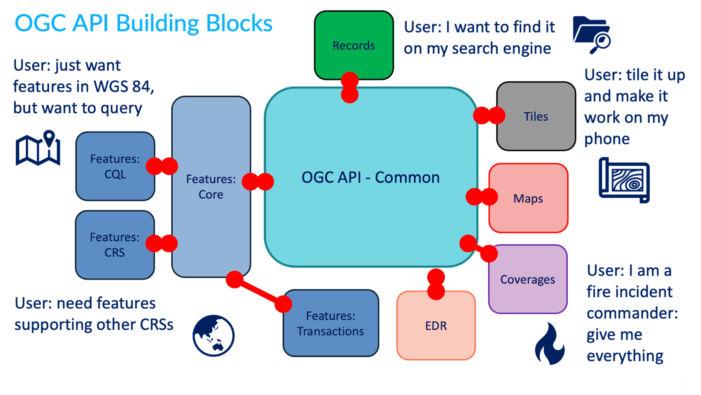

# Achtergrondinformatie

!!! abstract "Leerdoelen"
    Na het afronden van dit onderdeel:

    - Ben je je bewust van de meerwaarde van geo-informatie;
    - Ben je je bewust van de meerwaarde van het ontsluiten van geodata met gestandaardiseerde API's; 
    - Ben je bekend met PDOK en het Kadaster;
    - Weet je wat een OGC API is en wat de mogelijkheden ervan zijn;
    - Ken je voorbeelden van toepassingen met geo-informatie.

OGC API's stellen geodata beschikbaar. Wat is geodata, ook wel **ruimtelijke informatie**, eigenlijk? Deze leermodule gaat over de OGC API's van PDOK; **wat doet PDOK eigenlijk?** En **wat zijn OGC API's** eigenlijk precies? En waarom is het **belangrijk om data op een gestandaardiseerde en generieke manier te ontsluiten?** Dat behandelen we allemaal in dit onderdeel.  

## Wat is geo-informatie ?

Wat is geo-informatie, ook wel ruimtelijke informatie genoemd, en wat kun je ermee? Geodata is overal om ons heen. Vaak hoor je dat 80% van alle data over een plek op aarde gaat. 

!!! warning "TO DO"
    
    Voorbeelden / use cases die de meerwaarde van geodata aantonen. Verschillende vormen van ruimtelijke informatie / geodata 

!!! question "Vraag"

    Welke toepassingen van geo-informatie ken jij? Schrijf een aantal voorbeelden op. 

## Hoe wordt geodata opgeslagen? 

Geodata kan op verschillende manieren worden opgeslagen in een bestand of database. Op welke manier dat is, heeft ook gevolgen voor wat je precies met de data kunt doen. Dit is zeker bij ruimtelijke data het geval, omdat geometrie op heel veel verschillende manier gerepresenteerd kan worden. Dit is heel erg afhankelijk van de beoogde toepassing van de data. 

### Raster of vectordata?

Er worden ruwweg twee vormen van geodata onderscheiden: vectordata en rasterdata. In het geval van rasterdata wordt de informatie opgeslagen als afbeelding. Elke pixel (rastercel) heeft een waarde. Dat kan een kleur zijn in het geval van een luchtfoto, maar die waarde kan ook iets anders voorstellen, zoals hoogte of temperatuur. In het geval van vectordata wordt de informatie opgeslagen in een tabel met een geometrie. De geometrie kan een punt, lijn of vlak zijn. 

Over het algemeen (er zijn uitzonderingen mogelijk) wordt rasterdata gebruikt voor continue fenomenen, zoals hoogte en temperatuur. Dit soort natuurlijke fenomenen hebben geen harde grenzen en lopen continue door. Dit in tegenstelling tot discrete informatie, zoals gebouwen en administratieve grenzen. Die beginnen en eindigen op posities die wij als mensen hebben aangewezen. Voor discrete fenomenen gebruiken we dan ook vooral vectordata. 

Voorbeelden van rasterdatasets bij PDOK zijn:

* [Algemeen Hoogtebestand Nederland (AHN)](https://www.pdok.nl/introductie/-/article/actueel-hoogtebestand-nederland-ahn)  voor hoogtedata
* [Landelijk Grondgebruik Nederland](https://www.pdok.nl/introductie/-/article/landelijk-grondgebruik-nederland-lgn-)
* [Luchtfoto RGB](https://www.pdok.nl/introductie/-/article/pdok-luchtfoto-rgb-open-) en [Luchtfoto Infrarood](https://www.pdok.nl/introductie/-/article/pdok-luchtfoto-infrarood-open-)

Voorbeelden van vectordatasets bij PDOK zijn:

* De [BRT Achtergrondkaart](https://www.pdok.nl/introductie/-/article/basisregistratie-topografie-achtergrondkaarten-brt-a-)
* De [Basisregistratie Adressen en Gebouwen (BAG)](https://www.pdok.nl/introductie/-/article/basisregistratie-adressen-en-gebouwen-ba-1) voor onder andere gebouwen
* [CBS Wijken en Buurten](https://www.pdok.nl/introductie/-/article/cbs-wijken-en-buurten) voor statistische gegevens over buurten, wijken en gemeenten

### Wat zijn coördinaatreferentiesystemen? 

!!! warning "TO DO"

Geodata is altijd opgeslagen in een bepaald coördinaatreferentiesysteem. Het coördinaatreferentiesysteem bepaalt hoe de coördinaten worden opgeslagen. Oftewel: hoe de positie op aarde bepaald wordt. De aarde is niet plat hoewel kaarten dat wel zijn. Helaas is de aarde ook niet perfect rond of ovaal.

    

De aarde lijkt meer op een aardappel, met bergen en valleien. We noemen dit een geoïde. Helaas is die geoïde eindeloos complex, wat het lastig maakt om de exacte vorm in een computer op te slaan. Daarom wordt geprobeerd om de vorm van de geoïde te benaderen met een ellipsoïde (3D ovaal). Dat leidt echter wel tot afwijkingen: de ene plek zal meer afwijken van de ellipsoïde dan de andere plek. Maar voor veel toepassingen op wereldwijde schaal is enige afwijking niet zo erg.

    

Voor veel toepassingen is nauwkeurigheid wel belangrijk. Je hebt dan een ellipsoïde nodig die goed aansluit op het stukje aarde waarin je geïnteresseerd bent. Op andere plekken op de aarde zal die ellipsoïde totaal niet aansluiten. We noemen dat ook wel een lokaal coördinatenstelsel. Het Rijksdriehoeksstelsel, ook wel "RD Amersfoort" genoemd, is zo'n lokaal coördinatenstelsel. RD Amersfoort biedt hoge nauwkeurigheid in Nederland. Buiten Nederland is het echter nutteloos. 

We zijn er nog niet helemaal. Wat als je zo'n ellipsoïde op een plat vlak probeert te projecteren? Stel je voor dat je een mandarijn pelt en de schil in één stuk hebt. Als je die op een plat vlak legt, ontstaat er gaten. Kaartprojecties zijn manieren om de aardbol zodanig te vervormen en uit te rekken, dat die gaten worden opgevuld. Daar zijn veel verschillende manieren voor. Over het algemeen onderscheiden we drie soorten kaartprojecties:

* Hoekgetrouw
* Oppervlaktegetrouw
* Afstandsgetrouw

Vaak gaan projecties en coördinaatstelsels hand in hand. Ze zijn echter wel twee verschillende dingen. Coördinatenstelsels zijn vooral belangrijk voor de correcte **opslag** van geodata. Projecties zijn vooral belangrijk voor de correcte **visualisatie** van geodata. 

Zie ook <https://www.nsgi.nl/coordinatenstelsels-en-transformaties/overzicht-coordinatenstelsels>

## Wat doet het Kadaster / PDOK? 

**:arrow_right: Bekijk eerst dit filmpje:**

  <iframe src="https://hetkadaster.bbvms.com/p/kadaster_player_zakelijk/c/5673069.html"
          title="PDOK promofilm"
          frameborder="0"
          allowfullscreen>
  </iframe>

[PDOK](https://www.pdok.nl/) is hét platform voor hoogwaardige geodata. Op PDOK kunnen overheidsorganisaties hun geodata publiceren en kunnen gebruikers en specialisten deze vinden. PDOK verbindt vraag en aanbod met elkaar. Bij PDOK vind je open datasets van de overheid met actuele geo-informatie. De datasets gaan over allerlei verschillende thema’s, zoals de bodem, mobiliteit en grenzen. En zijn afkomstig van allerlei verschillende overheidsorganisaties, zoals het CBS, ministeries, Rijkswaterstaat en het Kadaster.  

PDOK is in 2013 ontstaan en is een dienst van het Kadaster. Het Kadaster is de Nederlandse overheidsorganisatie die vastlegt wie welke rechten heeft op al het vastgoed in Nederland. En het Kadaster zorgt dat burgers, bedrijven en overheden gebruik kunnen maken van betrouwbare en actuele geo-informatie.  

## Wat zijn OGC API’s? 

**:arrow_right: Bekijk eerst dit filmpje:**

  <iframe src="https://www.youtube-nocookie.com/embed/hNmZJ1itqfM"
          title="OGC APIs"
          frameborder="0"
          allow="accelerometer; autoplay; clipboard-write; encrypted-media; gyroscope; picture-in-picture"
          allowfullscreen>
  </iframe>

Een OGC API is een gestandaardiseerde interface waarmee gebruikers en systemen geodata kunnen bevragen en bekijken via het internet. Een API, een Application Programming Interface, kan door mensen gebruikt worden om data op te vragen. Maar nog vaker worden API’s gebruikt door systemen (machines) om met elkaar te praten. Ontwikkelaars kunnen op die manier op een eenvoudige manier data van andere bronnen in hun eigen software integreren. Een API is dus een stopcontact voor data. Je hebt, in tegenstelling tot vroeger, geen specifieke kennis over geodata meer nodig om dit te kunnen.  

Een OGC API volgt de OGC API standaard. De standaard schrijft precies voor hoe de interface opgebouwd moet zijn. De OGC API standaard is een open standaard die zeer breed omarmd wordt. De standaard wordt gemaakt door het Open Geospatial Consortium (OGC). Dat is een wereldwijde organisatie die open standaarden maakt voor het geo-informatiedomein.  

Een OGC API bestaat altijd uit dezelfde onderdelen. En de OGC API kent verschillende vormen om data beschikbaar te stellen. Welke vorm je kiest, is afhankelijk van wat je precies met de geodata wil gaan doen. En voor de organisatie die de data aanbiedt met een OGC API is het afhankelijk van hoe ze de data precies beschikbaar willen stellen. 

### OGC API onderdelen

!!! warning "TO DO"

Onderstaand overzicht laat zien hoe de OGC API standaard is gebouwd met bouwblokklen. Al deze bouwblokken bevatten één of meerdere specificaties die door OGC zijn opgesteld en door de geocommunity zijn goedgekeurd.

| Onderdeel | Beschrijving | Beschikbaar bij PDOK?* |
| ----- | ---- | :----: |
| **Common** | Het basisbouwblok dat elke OGC API minimnaal nodig heeft. Dit blok bevat de landing page van een API, de API conformancepagina en de API-specificatie. | ✅ |
| **Features** | Bouwblok voor het bevragen en bewerken van featuredata (vectordata). Er is een core die eventueel uitbreidbaar is met:   CQL: filters met Contextual Query Language;   CRS: featuredata opslaan of bevragen in een bepaald coördinaatreferentiesysteem;   Transactions: featuredata toevoegen, verwijderen en updaten. | ✅ |
| **Tiles** | Bouwblok voor het opvragen van geodata als kaarttegels, voor het bekijken van deze data. | ✅ |
| **Records** | Bouwblok voor het doorzoeken en opvragen van metadata over geodata (bijvoorbeeld actualiteit, beschrijvingen, beperkingen, contactpersonen) | ❌ |
| **Maps** | Bouwblok voor het opvragen van geodata als kant-en-klare kaart | ❌ |
| **Coverages** | Bouwblok voor het opvragen van rasterdata, waarmee je ook berekeningen op celniveau kunt doen. | ❌ |
| **EDR** | Bouwblok voor het Environment Data Retrieval: het integraal opvragen van ruimtelijke data die meerdere dimensies integreert: denk aan het opvragen van luchtvochtigheid, temperatuur en neerslag in 3D door de tijd heen. | ❌ |

\* Stand: december 2025

## Belang van standaarden 

Een OGC API volgt de OGC API standaard. Waarom is het belangrijk om geodata op een gestandaardiseerde manier te ontsluiten? Standaarden schrijven voor hoe data uitgewisseld zou moeten worden. Door dit op één en dezelfde manier volgens een vast patroon te doen begrijpen systemen en mensen elkaar. Data kan dan snel stromen en er ontstaat geen verwarring.  

Het gebruiken van de standaard zorgt ervoor dat organisaties weten hoe ze een OGC API kunnen bouwen om data beschikbaar te stellen, en dit niet zelf hoeven uit te vinden. 

Developers weten hoe ze applicaties, zoals web viewers, makkelijk kunnen bouwen op een generieke manier. 

En gebruikers weten altijd hoe ze de OGC API kunnen gebruiken en op welke manier ze de data krijgen, zodat ze niet voor verrassingen komen te staan. 

Het gebruiken van een standaard bespaart zo heel veel tijd, geld en frustratie. 

De beste standaarden zijn open standaarden. Open standaarden zijn standaarden die door iedereen gebruikt kunnen worden en waar iedereen die wil aan kan bijdragen.  

In Nederland is het vaak verplicht voor overheidsorganisaties om gebruik te maken van open standaarden.  
 

