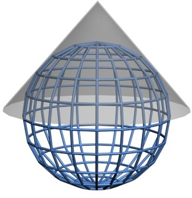
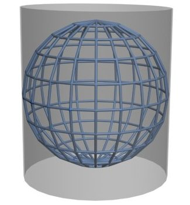
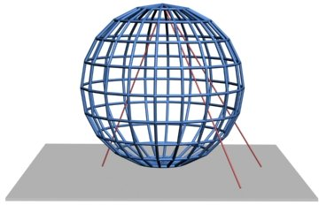

# Wat is geo-informatie?

Wat is geo-informatie? En hoe wordt geo-informatie precies opgeslagen? Hoe worden coördinaten precies opgeslagen? Dit behandelen we allemaal op deze pagina. 

## De kracht van geo-informatie

Wat kun je precies met geo-informatie, ook wel ruimtelijke informatie genoemd? Geodata is overal om ons heen. Vaak hoor je dat 80% van alle data over een plek op aarde gaat. 

!!! warning "TO DO"
    
    Voorbeelden / use cases die de meerwaarde van geodata aantonen. Verschillende vormen van ruimtelijke informatie / geodata 

!!! question "Vraag"

    Welke toepassingen van geo-informatie ken jij? Schrijf een aantal voorbeelden op. 

## Basisregistraties

Veel van de datasets bij PDOK zijn een basisregistratie. Wat is een basisregistratie precies? 

!!! warning "TO DO"

[Hier vind je meer informatie over het stelsel van basisregistraties.](https://www.digitaleoverheid.nl/overzicht-van-alle-onderwerpen/stelsel-van-basisregistraties/10-basisregistraties/) 

## Hoe wordt geodata opgeslagen? 

Geodata kan op verschillende manieren worden opgeslagen in een bestand of database. Op welke manier dat is, heeft ook gevolgen voor wat je precies met de data kunt doen. Dit is zeker bij ruimtelijke data het geval, omdat geometrie op heel veel verschillende manier gerepresenteerd kan worden. Dit is heel erg afhankelijk van de beoogde toepassing van de data. 

## Raster of vectordata?

Er worden ruwweg twee vormen van geodata onderscheiden: vectordata en rasterdata. In het geval van rasterdata wordt de informatie opgeslagen als afbeelding. Elke pixel (rastercel) heeft een waarde. Dat kan een kleur zijn in het geval van een luchtfoto, maar die waarde kan ook iets anders voorstellen, zoals hoogte of temperatuur. In het geval van vectordata wordt de informatie opgeslagen in een tabel met een geometrie. De geometrie kan een punt, lijn of vlak zijn. 

Over het algemeen (er zijn uitzonderingen mogelijk) wordt rasterdata gebruikt voor continue fenomenen, zoals hoogte en temperatuur. Dit soort natuurlijke fenomenen hebben geen harde grenzen en lopen continue door. Dit in tegenstelling tot discrete informatie, zoals gebouwen en administratieve grenzen. Die beginnen en eindigen op posities die wij als mensen hebben aangewezen. Voor discrete fenomenen gebruiken we dan ook vooral vectordata. 

!!! warning "TO DO"

    Afbeelding toevoegen

Voorbeelden van rasterdatasets bij PDOK zijn:

* [Algemeen Hoogtebestand Nederland (AHN)](https://www.pdok.nl/introductie/-/article/actueel-hoogtebestand-nederland-ahn)  voor hoogtedata
* [Landelijk Grondgebruik Nederland](https://www.pdok.nl/introductie/-/article/landelijk-grondgebruik-nederland-lgn-)
* [Luchtfoto RGB](https://www.pdok.nl/introductie/-/article/pdok-luchtfoto-rgb-open-) en [Luchtfoto Infrarood](https://www.pdok.nl/introductie/-/article/pdok-luchtfoto-infrarood-open-)

Voorbeelden van vectordatasets bij PDOK zijn:

* De [BRT Achtergrondkaart](https://www.pdok.nl/introductie/-/article/basisregistratie-topografie-achtergrondkaarten-brt-a-)
* De [Basisregistratie Adressen en Gebouwen (BAG)](https://www.pdok.nl/introductie/-/article/basisregistratie-adressen-en-gebouwen-ba-1) voor onder andere gebouwen
* [CBS Wijken en Buurten](https://www.pdok.nl/introductie/-/article/cbs-wijken-en-buurten) voor statistische gegevens over buurten, wijken en gemeenten

## Wat zijn coördinaatreferentiesystemen? 

!!! warning "TO DO"

Geodata is altijd opgeslagen in een bepaald coördinaatreferentiesysteem. Het coördinaatreferentiesysteem bepaalt hoe de coördinaten worden opgeslagen. Oftewel: hoe de positie op aarde bepaald wordt. De aarde is niet plat hoewel kaarten dat wel zijn. Helaas is de aarde ook niet perfect rond of ovaal.

    

De aarde lijkt meer op een aardappel, met bergen en valleien. We noemen dit een geoïde. Helaas is die geoïde eindeloos complex, wat het lastig maakt om de exacte vorm in een computer op te slaan. Daarom wordt geprobeerd om de vorm van de geoïde te benaderen met een ellipsoïde (3D ovaal). Dat leidt echter wel tot afwijkingen: de ene plek zal meer afwijken van de ellipsoïde dan de andere plek. Maar voor veel toepassingen op wereldwijde schaal is enige afwijking niet zo erg.

    

Voor veel toepassingen is nauwkeurigheid wel belangrijk. Je hebt dan een ellipsoïde nodig die goed aansluit op het stukje aarde waarin je geïnteresseerd bent. Op andere plekken op de aarde zal die ellipsoïde totaal niet aansluiten. We noemen dat ook wel een lokaal coördinatenstelsel. Het Rijksdriehoeksstelsel, ook wel "RD Amersfoort" genoemd, is zo'n lokaal coördinatenstelsel. RD Amersfoort biedt hoge nauwkeurigheid in Nederland. Buiten Nederland is het echter nutteloos. 

We zijn er nog niet helemaal. Wat als je zo'n ellipsoïde op een plat vlak probeert te projecteren? Stel je voor dat je een mandarijn pelt en de schil in één stuk hebt. Als je die op een plat vlak legt, ontstaat er gaten. Kaartprojecties zijn manieren om de aardbol zodanig te vervormen en uit te rekken, dat die gaten worden opgevuld. Daar zijn veel verschillende manieren voor. 

{ width="250" }{ width="250" }{ width="250" }

Over het algemeen onderscheiden we drie soorten kaartprojecties:

* Hoekgetrouw
* Oppervlaktegetrouw
* Afstandsgetrouw

Vaak gaan projecties en coördinaatstelsels hand in hand. Ze zijn echter wel twee verschillende dingen. Coördinatenstelsels zijn vooral belangrijk voor de correcte **opslag** van geodata. Projecties zijn vooral belangrijk voor de correcte **visualisatie** van geodata. 

Dit zijn de meest relevante coördinaatreferentiesystemen:

* **WGS84** is vooral geschikt voor wereldwijde datasets. Het is ook wel bekend als 'lat-long' en is het coördinaatreferentiesysteem dat voor GPS wordt gebruikt. Het is waarschijnlijk het meest bekende en meest gebruikte CRS.
* **ETRS89** is het officiële Europese CRS. 
* **RD New / Amersfoort** is het officiële Nederlandse coördinaatreferentiesysteem. Het gebruikt meters als eenheid voor de X- en Y-coördinaten. 

En dit zijn de bekendste kaartprojecties:

* **UTM**
* **Web Mercator** ook wel bekend als 'Pseudo-Mercator'

Zie ook <https://www.nsgi.nl/coordinatenstelsels-en-transformaties/overzicht-coordinatenstelsels>