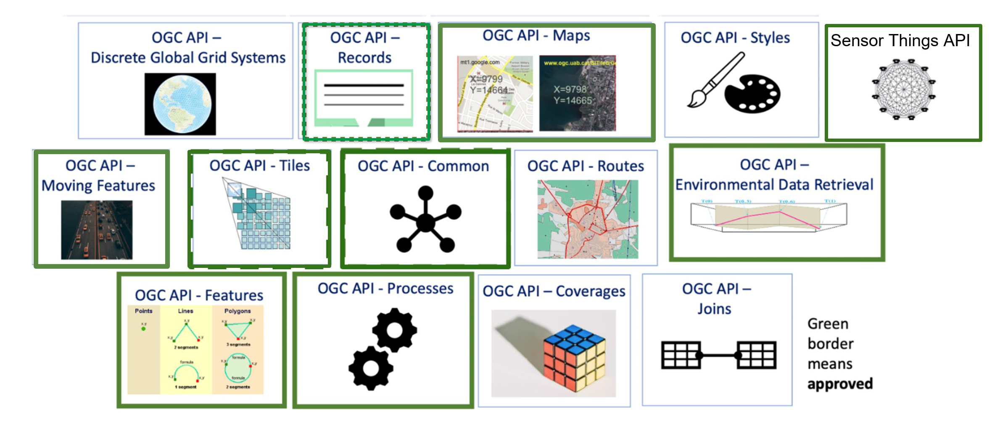

# Wat zijn OGC API’s? 

**:arrow_right: Bekijk eerst dit filmpje:**

  <iframe src="https://www.youtube-nocookie.com/embed/hNmZJ1itqfM"
          title="OGC APIs"
          frameborder="0"
          allow="accelerometer; autoplay; clipboard-write; encrypted-media; gyroscope; picture-in-picture"
          allowfullscreen>
  </iframe>

Een OGC API is een gestandaardiseerde interface waarmee gebruikers en systemen geodata kunnen bevragen en bekijken via het internet. Een API, een Application Programming Interface, kan door mensen gebruikt worden om data op te vragen. Maar nog vaker worden API’s gebruikt door systemen (machines) om met elkaar te praten. Ontwikkelaars kunnen op die manier op een eenvoudige manier data van andere bronnen in hun eigen software integreren. Een API is dus een stopcontact voor data. Je hebt, in tegenstelling tot vroeger, geen specifieke kennis over geodata meer nodig om dit te kunnen.  

Een OGC API volgt de API standaarden opgesteld door het Open Geospatial Consortium. Dat is een wereldwijde organisatie die open standaarden maakt voor het geo-informatiedomein. De standaard schrijft precies voor hoe de interface opgebouwd moet zijn. De OGC API standaard is een open standaard die zeer breed omarmd wordt.  

Een OGC API bestaat altijd uit dezelfde onderdelen. En de OGC API kent verschillende vormen om data beschikbaar te stellen. Welke vorm je kiest, is afhankelijk van wat je precies met de geodata wil gaan doen. En voor de organisatie die de data aanbiedt met een OGC API is het afhankelijk van hoe ze de data precies beschikbaar willen stellen. 

## OGC API onderdelen

!!! warning "TO DO"

Onderstaand overzicht laat zien hoe de OGC API standaard is gebouwd met bouwblokken. Al deze bouwblokken bevatten één of meerdere specificaties die door OGC zijn opgesteld en door de geocommunity zijn goedgekeurd.

Onderstaande tabel toont welke bouwblokken er zijn, toont of dit bouwblok bij PDOK is geïmplementeerd (stand: januari 2026) en waar dit bouwblok in deze leermodule wordt behandeld. 

| Onderdeel                                            | Beschrijving                         | Beschikbaar bij PDOK? |                                   Leermodule                                   |
|------------------------------------------------------|--------------------------------------|:---------------------:|:------------------------------------------------------------------------------:|
| [**Common**](<https://ogcapi.ogc.org/common/>)       | De fundering voor elke OGC API       |           ✅           | [Features](<../features/Introductie.md>) en [Tiles](<../tiles/Introductie.md>) |
| [**Features**](<https://ogcapi.ogc.org/features>)    | Vectordata                           |           ✅           |                    [Features](<../features/Introductie.md>)                    | 
| [**Tiles**](<https://ogcapi.ogc.org/tiles>)          | Kaarttegels (visualisatie)           |           ✅           |                       [Tiles](<../tiles/Introductie.md>)                       |
| [**Styles**](<https://ogcapi.ogc.org/styles>)        | Visualisatieregels                   |           ✅           |                       [Tiles](<../tiles/Introductie.md>)                       |
| [**Records**](<https://ogcapi.ogc.org/records>)      | Metadata                             |           ❌           |                                       ❌                                        |
| [**Maps**](<https://ogcapi.ogc.org/maps>)            | Kant-en-klare kaarten en kaarttegels |           ❌           |                                       ❌                                        |
| [**Coverages**](<https://ogcapi.ogc.org/coverages/>) | Rasterdata                           |           ❌           |                                       ❌                                        |
| [**EDR**](<https://ogcapi.ogc.org/edr>)              | Environment Data Retrieval           |           ❌           |                                       ❌                                        |

Laten we de bouwblokken één voor één eens nader bestuderen. 

### Common

Het basisbouwblok dat elke OGC API minimaal nodig heeft. Dit blok bevat de landing page van een API, de API conformancepagina en de API-specificatie.

### Features

Bouwblok voor het bevragen en bewerken van featuredata (vectordata). Dit bouwblok bestaat uit de volgende onderdelen:

* **Part 1: Core** 
* **Part 2: CRS** voor het opslaan of bevragen van featuredata in een bepaald coördinaatreferentiesysteem;
* **Part 3: Filtering** voor het op basis van een filter bevragen van featuredata; 
* **Part 4: [CRUD](https://nl.wikipedia.org/wiki/CRUD)** voor het toevoegen, vervangen, updaten en verwijderen van featuredata.
* *Draft* Part 5: Schemas
* *Draft* Part 6: Property Selection
* *Draft* Part 7: Geometry Simplification
* *Draft* Part 8: Sorting
* *Draft* Part 9: Text Search
* *Draft* Part 10: Search/Queries

### Tiles

Bouwblok voor het opvragen van geodata als kaarttegels en voor het bekijken van deze data.

### Styles

Bouwblok voor het aanbieden en toepassen van visualisatieregels. 

### Records

Bouwblok voor het doorzoeken en opvragen van metadata over geodata (bijvoorbeeld actualiteit, beschrijvingen, beperkingen, contactpersonen)

### Maps

Bouwblok voor het opvragen van geodata als kant-en-klare kaart

### Coverages

Bouwblok voor het opvragen van rasterdata, waarmee je ook berekeningen op celniveau kunt doen.

### EDR

Bouwblok voor Environment Data Retrieval (EDR): het integraal opvragen van ruimtelijke klimaatdata die meerdere dimensies integreert. Denk aan het opvragen van luchtvochtigheid, temperatuur en neerslag in 3D door de tijd heen.

* Processes
* Moving Features
* Routes
* 3D GeoVolumes
* Joins
* Discrete Global Grid System [(DGGS)](https://ogcapi.ogc.org/dggs/)
* Connected Systems