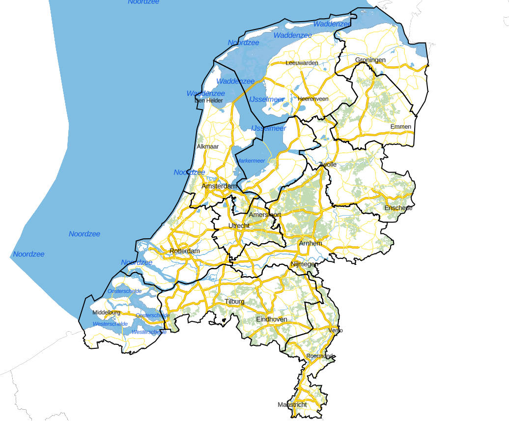
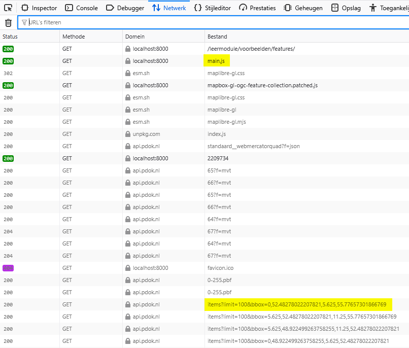
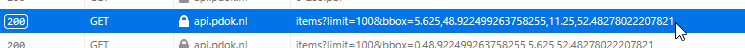
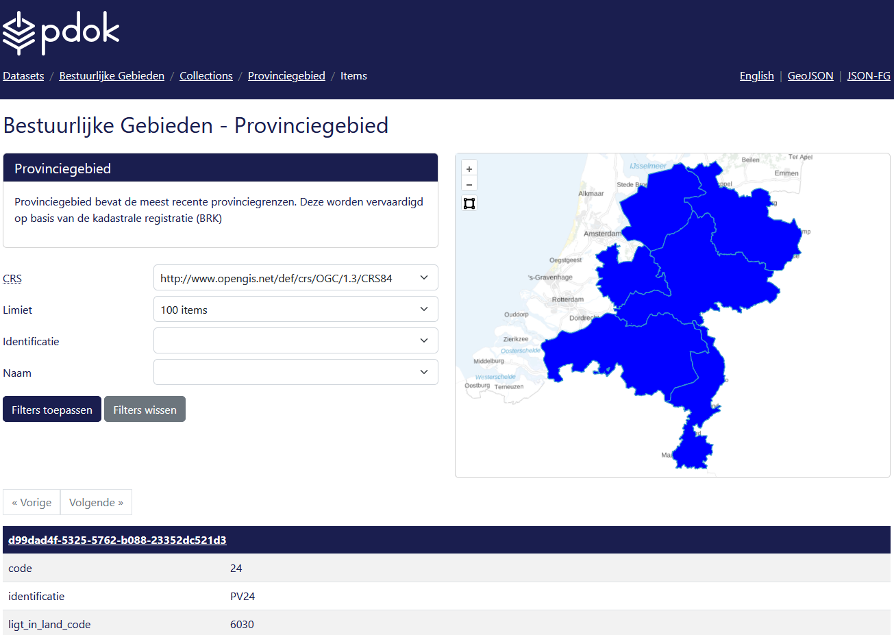
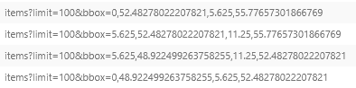

# Analyseer een voorbeeldkaart

Zojuist heb je met behulp van de landing page verkend wat je allemaal met OGC API - Features kunt doen. We bekijken nu een interactieve kaart die gemaakt is met behulp van OGC API - Features. Aan de hand hiervan ontdek je hoe een webmap werkt en hoe de componenten van OGC API - Features met elkaar samenwerken. 

## Bekijk het voorbeeld in een browser

We bekijken nu eerst de voorbeeldwebmap in een webbrowser. 

**:arrow_right: Bekijk de kaart:** [../voorbeelden/features/index.html](../voorbeelden/features/index.html)

Dit is een web viewer die gemaakt is met de library MapLibre. Deze kaart maakt gebruik van de OGC API – Tiles van de BRT Achtergrondkaart: <https://api.pdok.nl/kadaster/brt-achtergrondkaart/ogc/v1> 

!!! info "BRT Achtergrondkaart"

    Kijk voor meer informatie over de BRT Achtergrondkaart en hoe deze wordt ingeladen in [het vorige hoofdstuk](<../tiles/Analyseer een voorbeeldkaart.md/#bekijk-het-voorbeeld-in-een-browser>). 
 


**:arrow_right: Open de developer tools in je browser.** 

**:arrow_right: Refresh de pagina**

**:arrow_right: Open het Netwerk (Network) tabblad**

**:arrow_right: Bekijk de requests die verschijnen in het Netwerktabblad**


Merk op dat er onder andere een `main.js` en `items` worden ingeladen. 



**:arrow_right: Dubbelklik eens op een items URL in het Netwerktabblad:**



!!! question "Vraag"

    Waar kom je nu terecht? Welke collectie is dit en welke dataset?

??? success "Antwoord"

    De HTML-weergave van de collectie 'Provinciegebied' van de 'Bestuurlijke Gebieden' OGC API:

    

    Dit is het items endpoint van die collectie: 

    <https://api.pdok.nl/kadaster/bestuurlijkegebieden/ogc/v1/collections/provinciegebied/items>

!!! question "Vraag"

    Wat zie je in de URL? Welke parameters worden opgegeven en wat doen deze?

    | Parameter | Waarde | Effect |
    | --- | --- | --- |
    | `limit` | ... | ... |
    | `bbox` | ... | ... |

??? success "Antwoord"

    | Parameter | Waarde | Effect |
    | --- | --- | --- |
    | `limit` | `100` | Limiteer het resultaat tot 100 resultaten |
    | `bbox` | `5.625,48.922499263758255,11.25,52.48278022207821` | Geef alleen resultaten tussen deze coördinaten |

**:arrow_right: Ga weer terug naar de webmap en bekijk nog eens de requests die worden afgevuurd bij het laden van de webmap.**

Als het goed is, zie je meerdere requests (URL's) met het woord `item` erin. 

!!! question "Vraag"

    Wat is het verschil tussen deze URL's? Analyseer goed de parameters die worden opgegeven in de URL's.

??? success "Antwoord"

    Je ziet waarschijnlijk vier requests (maar dit is afhankelijk van de viewport):

    

    Het verschil is dat er elke keer een andere bounding box wordt opgegeven. 

Het verzoek aan de API om features terug te geven is dus door MapLibre in vieren geknipt. De collectie met Provinciegebieden is niet zo'n grote collectie (12 items). Maar bij een grotere collectie is het nodig om een request op te knippen, omdat het aantal features dan groter kan zijn dan het aantal features wat je maximaal mag opvragen. 

Zoals je je hopelijk nog weet uit het [vorige hoofdstuk](<./Verken OGC API - Features in de browser.md/#collections>), is de limiet voor het in één keer opvragen 10, 100 of 1000 features. 

Je kunt op twee manieren één te groot request opknippen in kleinere requests:

1. Doe de request en haal de next cursor ID (next page) op. Gebruik dit ID om je volgende request samen te stellen
2. Knip de viewport op in verschillende bboxen zodat in elk request alleen features binnen de bbox, dus een klein stukje van de totale dataset, worden opgehaald. 

!!! question "Vraag"

    Waarom zou je er in een webmap voor kiezen om gebruik te maken van bbox, en niet van next page?

??? hint

    Kijk eens wat er gebeurt als je de viewport veel kleiner maakt (maak bijvoorbeeld het paneel voor de developertools groter) en refresh dan de pagina. Wat valt je op? 

    ??? success "Antwoord"

        Er worden minder requests gedaan en de bbox is aangepast op basis van de viewport. 

!!! success "Antwoord"

    Conclusie: bij een webmap is bbox gebruiken handiger dan cursor pagination: je vraagt dan alleen de features op die de gebruiker in zijn viewport ziet, en niets anders. Dat is veel efficiënter en sneller dan alle features opvragen. 

**:arrow_right: Zoek deze collectie op via de landing page in de browser:** <https://api.pdok.nl/kadaster/bestuurlijkegebieden/ogc/v1>

!!! question "Vraag"

    Waar vind je URL van de collectie die gebruikt is in het voorbeeld?

??? success "Antwoord"

    Er zijn twee manieren om de items URL van de collectie Provinciegebied te vinden:
    1. Ga naar 'Collections', en vervolgens naar 'Provinciegebied', en klik tot slot op 'Features'.
    2. Ga naar de OpenAPI Specification en kopieer de URL van deze collectie onder 'Features'.

Voor een collectie is dus de volgende URL gebruikt:

    https://api.pdok.nl/kadaster/bestuurlijkegebieden/ogc/v1/collections/{collection}/items?limit={limit}&bbox={bbox}

Door MapLibre wordt daar een bbox aan toegevoegd, bijvoorbeeld:

    https://api.pdok.nl/kadaster/bestuurlijkegebieden/ogc/v1/collections/provinciegebied/items?limit=100&bbox=5.625,48.922499263758255,11.25,52.48278022207821

Hoe is deze URL precies opgebouwd?

| Template | Voorbeeld | Beschrijving |
| --- | --- | --- |
| `https://api.pdok.nl/kadaster/bestuurlijkegebieden/ogc/v1/` | `https://api.pdok.nl/kadaster/bestuurlijkegebieden/ogc/v1/` | Landing page |
| `collections` | `collections` | Dataset Feature collections |
| `{collection}` | `provinciegebied` | Naam van de collectie |
| `limit={limit}` | `100` | Hoeveel features er in één keer worden opgevraagd |
| `bbox={bbox}` | `15.625,48.922499263758255,11.25,52.48278022207821` | Bounding box waarbinnen de resultaten moeten vallen |

Kijk nog eens in het [vorige hoofdstuk](<./Verken OGC API - Features in de browser.md/#filters-in-de-url>) als je dit nog niet helemaal begrijpt. 

Zie voor meer informatie [de OGC API workshop](<https://ogcapi-workshop.ogc.org/api-deep-dive/features/>). 

## Bekijk het voorbeeld in een code-editor

We gaan nu de code van dichtbij bekijken. Hiervoor ga je onze git repository clonen. 

!!! info

    Dit onderdeel heeft overlap met [Analyseer een voorbeeldkaart in het OGC API - Tiles onderdeel](<../tiles/Analyseer een voorbeeldkaart.md>). Heb je dit al gedaan, ga dan [hier](<#features>) verder. 

Maak gebruik van een code-editor of IDE naar keuze om code te bekijken en uit te voeren. 

Wij suggereren twee verschillende aanpakken: in een IDE werken of werken met een file manager en een teksteditor. 

Hieronder volgt de uitleg voor Visual Studio Code en de meer klassieke aanpak. Maar uiteraard kun je zelf ook een andere IDE of een andere aanpak gebruiken. 

=== "VSCode"

    1. Open VSCode
    2. Klik op 'Clone Git Repository'

        
    
        Gebruik daarbij de volgende URL: <https://github.com/PDOK/leermodule-ogc-api>

        
    
    3. Kies een locatie op jouw schijf om de repository te downloaden en klik op 'Select as Repository Destination'

    4. Wacht tot de repository is gedownload

    5. Klik op 'Open':

            

    6. Klik op 'Yes, I trust the authors':

         

    7. Bekijk de bestanden in de Explorer (linkertabblad)

        De voorbeeldcode bevindt zich in `docs/voorbeelden/tiles`

    8. Maak in de repository een nieuwe folder aan, en zet daarin een kopie van de voorbeeldcode.

        Op die manier hou je het voorbeeld schoon en kun je daar altijd op teruggrijpen.  

    9. Zet een lokale test web server op in de folder die je zojuist hebt gemaakt:

        Open een Terminal (View -> Terminal) en voer uit:

        ```
        cd %jouwfolder
        python -m http.server
        ```

        Vervang `%jouwfolder` door de locatie van de folder waar jij de voorbeeldcode naartoe hebt gekopieerd

    10. Ga in je webbrowser naar `localhost:8000` om het voorbeeld te bekijken.

=== "Klassieke aanpak met file manager en teksteditor"

    1. Ga naar de repository op GitHub: <https://github.com/PDOK/leermodule-ogc-api>
    2. Klik op 'Code' en vervolgens op Download ZIP

        

    3. Pak de zip uit op jouw schijf

    4. Bekijk de bestanden in een File explorer 

        De voorbeeldcode bevindt zich in de folder `docs/voorbeelden/tiles`

    5. Maak in de repository een nieuwe folder aan, en zet daarin een kopie van de voorbeeldcode.

        Op die manier hou je het voorbeeld schoon en kun je daar altijd op teruggrijpen.  

    6. Open een commandline

    7. Zet een lokale test web server op in de folder die je zojuist hebt gemaakt:

        ```
        cd %jouwfolder
        python -m http.server
        ```

        Vervang `%jouwfolder` door de locatie van de folder waar jij de voorbeeldcode naartoe hebt gekopieerd

    8. Ga in je webbrowser naar localhost:8000 om het voorbeeld te bekijken.

    Je kunt de code vervolgens bewerken in een teksteditor zoals Notepad++ of Sublime Text. 

**:arrow_right: Bekijk nu** [../voorbeelden/features/index.html](../voorbeelden/features/index.html) **in de browser**


Laten we nu eens de code bekijken in een editor:

**:arrow_right: Bekijk** `..\voorbeelden\features\index.html`

**:arrow_right: Bekijk** `..\voorbeelden\features\main.js`

Als het goed is, zie je in de code van `index.html` een `div` met als id `map`.

In `main.js` zie je dat er bij `container` dat er naar diezelfde `map` wordt verwezen. In dit javascript bestand wordt allereerst de `maplibre-gl` library geïmporteerd. Daarna wordt de kaart gedefinieerd:

| Variabele | Beschrijving |
| --------- | ------------ |
| `container` | `map` object in `index.html`
| `style` | verwijst naar een json-bestand, waarin wordt gedefinieerd hoe de tiles gevisualiseerd worden <br> <https://api.pdok.nl/kadaster/brt-achtergrondkaart/ogc/v1/styles/standaard__webmercatorquad?f=json> |
| `center` | bepaalt het startmiddenpunt van de kaart (x- en y-coördinaten) |
| `zoom` | bepaalt het startzoomlevel van de kaart |
| `minZoom`| bepaalt het maximale niveau dat je mag uitzoomen |
| `maxZoom`| bepaalt het maximale niveau dat je mag inzoomen |

!!! info

    Vanaf regel 13, `map.on('load'` behandelen we [verderop(<#features>)]. 

Merk op dat je de URL naar de tegels zelf niet ziet in `main.js`. Die URL wordt namelijk in de `style json` aangeroepen. De `main.js` roept de `style json` aan en die roept vervolgens de bron van de tiles aan. De `style json`  bepaalt ook hoe die tiles weergegeven moeten worden. 
De bron van de tiles is in dit geval dus <https://api.pdok.nl/kadaster/brt-achtergrondkaart/ogc/v1/tiles/WebMercatorQuad/{z}/{y}/{x}?f=mvt>

!!! info "Styles en Tiles"

    Zie voor meer informatie over Styles en Tiles en de precieze werking daarvan het onderdeel [OGC API - Tiles](<../tiles/Introductie.md>)

### Experimenteer met de viewer

Experimenteer eens met de variabelen in `main.js`. Laten we eens wat willekeurige waardes invullen en kijken wat deze variabelen precies doen. 

**:arrow_right: Pas zelf in** `main.js` **de volgende waardes aan en kijk wat er gebeurt in jouw webmap:**

- `center`
- `zoom`
- `minZoom`
- `maxZoom`

??? hint "Hint: wat kun je het beste invullen voor elke variabele?"

    | Variabele | Voorbeeld | Beschrijving |
    |---|---|---|
    | `center` | `[5.9623,52.2118]` voor het hoofdkantoor van het Kadaster | Coördinaten van het middelpunt in Long-Lat coördinaten  (let op de volgorde). Je kunt dit opzoeken met bijvoorbeeld <https://vibhorsingh.com/boundingbox/> |
    | `zoom` | `0` t/m `22` | Het initiële zoomniveau (als de gebruiker de webmap opent) |
    | `minZoom` | `0` t/m `22` | Het maximale zoomlevel dat de gebruiker kan uitzoomen |
    | `maxZoom` | `0` t/m `22` | Het maximale zoomlevel dat de gebruiker kan inzoomen |

Lees hier meer over in [de documentatie van MapLibre](https://maplibre.org/maplibre-gl-js/docs/API/type-aliases/MapOptions).

Hopelijk heb je door te experimenteren ontdekt wat deze parameters precies doen. 

### Features

Laten we nu kijken hoe in het voorbeeld kaartlagen (collecties) uit een OGC API - Features worden toegevoegd. 

In `main.js` wordt op regel 2 de `OGCFeatureCollection` plugin ingeladen. Deze hebben we lokaal opgeslagen in `'./mapbox-gl-ogc-feature-collection.patched.js'`

De oorspronkelijke bron van deze plugin is: <https://github.com/mkeller3/mapbox-gl-ogc-feature-collection>

**:arrow_right: Bekijk** `main.js` **vanaf regel 13**

Met dit stuk code wordt een OGC API - Features collectie toegevoegd en weergegeven in de kaart.

Allereerst wordt met de functie `new OGCFeatureCollection` een bron gedefinieerd en ingeladen vanuit de `url` <https://api.pdok.nl/kadaster/bestuurlijkegebieden/ogc/v1>. De bron noemen we `provinciegebiedsource`. De bron is een OGC API - Features collectie: `'provinciegebied'`

Daarna wordt er met de functie `map.addLayer()` een kaartlaag toegevoegd aan de kaart, op basis van de bron `provinciegebiedsource`. We noemen de kaartlaag `provinciegebied-outline` en geven deze de volgende opmaak:

    'paint': {
            'line-color': '#000000',
            'line-width': 2
        }

Dat betekent: een zwarte omlijning van dikte 2. 

In onderstaande tabel vatten we samen hoe deze code precies werkt:

| Onderdeel | Variabele | Beschrijving |
| --------- | --------- | ------------ |
| `new OGCFeatureCollection()` | `url` | URL van de landing page |
| | `collectionId` | Naam van de collectie die je wilt toevoegen |
| | `limit` | Aantal features dat per request wordt opgevraagd |
| `map.addLayer()` | `id` | Zelfgekozen naam voor de kaartlaag |
| | `source` | Naam van de hierboven gedefinieerde bron |
| | `type` | Type kaartlaag (symbol, line of fill?) |
| | `paint` | Hoe moet de kaartlaag worden gevisualiseerd? |

!!! info "Opmaak / visualisatie van kaartlagen"

    We behandelen het aanpassen van de visualisatie, zoals kleuren en lijndiktes, nu niet. Kijk hiervoor bij [Casus - Maak een kaart met OGC API - Tiles](<../tiles/Casus - Maak een kaart met OGC API - Tiles.md/#optie-3-maak-zelf-een-nieuwe-style-from-scratch>)

**:arrow_right: Experimenteer zelf eens met het veranderen van de waardes en kijk wat er gebeurt.**

!!! hint

    Vul bijvoorbeeld de naam van een andere collectie in uit de [Bestuurlijke Gebieden dataset](<https://api.pdok.nl/kadaster/bestuurlijkegebieden/ogc/v1>), of gebruik een andere dataset als bron. 

Je hebt nu gezien hoe OGC API - Features aan MapLibre webmaps worden toegevoegd. 

## Samenvatting

Je hebt nu een voorbeeldkaart bekeken en de werking ervan geanalyseerd. De voorbeeldkaart maakte gebruik van de BRT Achtergrondkaart met de standaardstijl in WebMercator en de collectie 'Provinciegebied' uit de Bestuurlijke Gebieden OGC API - Features. Je hebt gezien hoe MapLibre features kan renderen. En je hebt gezien welke onderdelen hiervoor nodig zijn:

| Naam | Voorbeeld | Beschrijving |
| --- | --- | --- |
| Index | `index.html` | HTML-code voor basisinformatie. |
| JavaScript | `main.js` | JavaScriptcode voor de functionaliteit van de webmap.  |
| Style | `https://api.pdok.nl/kadaster/brt-achtergrondkaart/ogc/v1/styles/standaard__webmercatorquad?f=json` | Opmaak van de tegels. Roept één of meerdere tilesets op. |
| OGCFeatureCollection plugin | `'./mapbox-gl-ogc-feature-collection.patched.js'` | Voegt functionaliteit toe aan MapLibre om OGC API - Features collections in te laden. |
| OGC API - Features collectie | <https://api.pdok.nl/kadaster/bestuurlijkegebieden/ogc/v1/collections/provinciegebied> | Bron van de featuredata | 