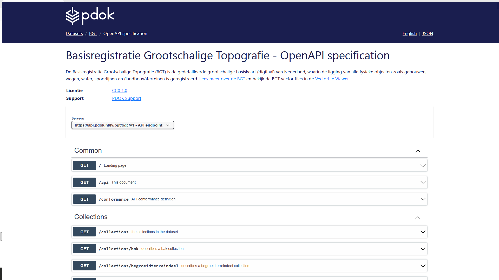
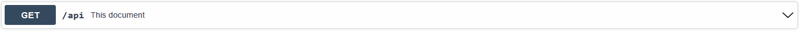
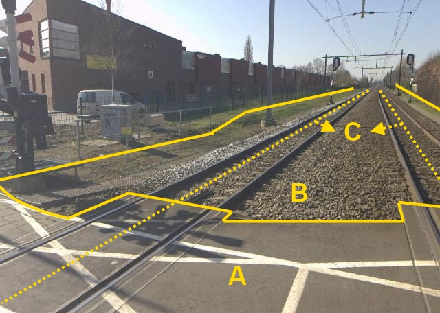
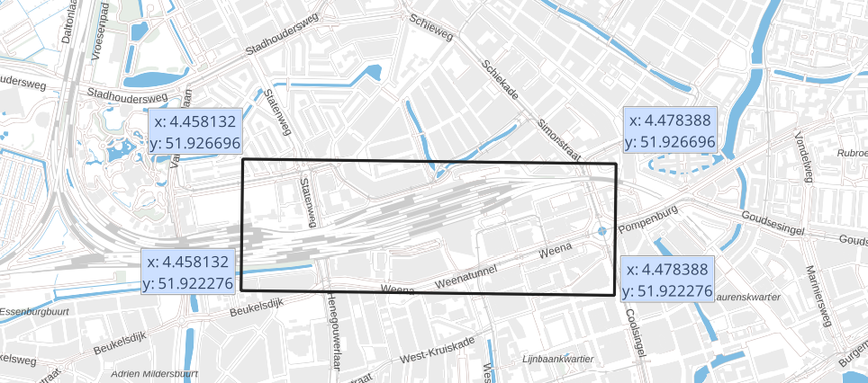

# Bevraag OGC API - Features met curl

We hebben eerder gezien hoe je de API-documentatie in de browser kunt bekijken. Nu is het tijd om echt aan de slag te gaan met de API. 
In de commandline kun je met behulp van de tool `cURL` data opvragen en versturen. Je kunt dit ook gebruiken om API's om data op te vragen en die data vervolgens terug te krijgen. Zo ook de OGC API's van PDOK. Je krijgt het resultaat terug als JSON-bestand. 
Ontwikkelaars gebruiken dit principe om API's te implementeren in hun eigen applicaties. 

In dit deel stel je met behulp van de OpenAPI specification GET requests samen om de OGC API - Features van de Basisregistratie Grootschalige Topografie (BGT) te bevragen. Die requests vuur je vervolgens met `curl` af. Het resultaat ontvang je als `json`. 

## Voorbereiding

**:arrow_right: Open een commandline / terminal venster.** 

!!! warning "Waarschuwing"

    Gebruik niet de PowerShell terminal. Die heeft een ingebouwde eigen versie van `curl` met veel minder mogelijkheden. De voorbeelden zullen daar niet in werken. 

Met de OpenAPI specification pagina kun je heel makkelijk commando's voor `curl` samenstellen. 

**:arrow_right: Ga naar de OpenAPI specification van de BGT.**

Weet je niet meer waar je die kunt vinden? Kijk dan even in één van de vorige onderdelen. 



## OpenAPI specification opvragen

Laten we beginnen met een simpele vraag. We vragen eerst de `OpenAPI specification` zelf op. 

**:arrow_right: Klap** 'GET `/api` This document' **open**:



**:arrow_right: Klik op *Try it out***

**:arrow_right: Klik op *Execute***

Je krijgt nu het `curl` commando dat is afgevuurd en het resultaat (response) te zien:


Er is één parameter meegegeven: geef het resultaat als json. En we krijgen de specificatie inderdaad netjes te zien als json-document. 

We kunnen het `curl` commando kopiëren en zelf uitvoeren in de commandline. 

!!! warning "Waarschuwing"

    Pas voor de Windows commandline (`cmd.exe`) de kant-en-klare `curl` commando's aan: zet alles op één regel en verander de 'enkele quotes' in "dubbele quotes". Anders zullen de voorbeelden niet werken. 

**:arrow_right: Kopieer het** `curl` **commando en plak het in de commandline**

Voor Windows:

```
curl -X "GET" "https://api.pdok.nl/lv/bgt/ogc/v1/api?f=json" -H "accept: */*"
```


**:arrow_right: Druk op Enter en bekijk het resultaat:**


## Vraag collecties op 

We gaan met behulp van `curl` informatie over collecties opvragen. 

### Welke collecties zijn er allemaal? 

Stel dat je wilt weten welke collecties er allemaal zijn. Je kunt dan de `GET /collections` call gebruiken. 

**:arrow_right: Klap** 'GET `/collections`' **open, klik op *Try it out* en klik op *Execute*.**

**:arrow_right: Kopieer het commando en voer het uit in de commandline.** 

Voor Windows:

```
curl -X "GET" "https://api.pdok.nl/lv/bgt/ogc/v1/collections?f=json" -H "accept: */*"
```

**:arrow_right: Bekijk het resultaat.** 

Je krijgt een overzicht te zien van alle collecties in deze OGC API - Features. 

Response body:
```
{
  "links": [
    ...
  ],
  "collections": [
    ...
  ]
}
```

!!! tip 

    Je kunt de URL's ook in je browser plakken en de `json` in je browser bekijken. Browsers maken `json` meestal wat beter leesbaar.

### Informatie over één specifieke collectie

Je kunt ook de informatie van een specifieke collectie opvragen. Laten we als voorbeeld de ['spoor' collectie](https://api.pdok.nl/lv/bgt/ogc/v1/collections/spoor) nemen. 



Voor Windows:

```
curl -X "GET" "https://api.pdok.nl/lv/bgt/ogc/v1/collections/spoor?f=json" -H "accept: */*"
```

**:arrow_right: Voer dit uit en bekijk het resultaat.**

Response body:
```
{
 "id": "spoor",
 "title": "Spoor (SPR)",
 "description": "De as van het spoor, dat wil zeggen het midden van twee stalen staven op een onderling vaste afstand, waarover trein, tram, of sneltram rijdt.",
 "keywords": [
  ...
    ],
 "extent": {
    ...
    }
 ...
}
```

!!! question "Vraag"

    Wat voor informatie geeft dit? 

!!! info "CRS"

    Het zal je opgevallen zijn dat er ook informatie tussen staat over het 'CRS'. Dit is het Coordinate Reference System. Er bestaan veel verschillende CRS'en. Kort gezegd bepaalt het CRS hoe de geografische coördinaten worden opgeslagen en hoe de data op de aardbol wordt geprojecteerd (zie ook [Achtergrondinformatie](../achtergrondinformatie/Wat is geo-informatie.md)). PDOK biedt zijn data in verschillende CRS'en aan. 

!!! question "Vraag"
    
    In welke CRS'en wordt de spoorcollectie aangeboden? Hoe heten die CRS'en? 

??? tip "Hint"

    Klik in <https://api.pdok.nl/lv/bgt/ogc/v1/collections/spoor?f=json> in het `crs` object op de code van een CRS. Je krijgt dan een XML-document te zien op opengis.net. Daarin vind je ook de naam. 

### Bekijk het schema van een collectie

Soms wil je weten welke kolommen een dataset heeft, en wat die kolommen precies betekenen en welk datatype ze zijn. Dit kun je bekijken in het schema. Ook OGC API - Features ondersteunt dit. 

!!! question "Vraag"

    Hoe kun je het schema bekijken? 

??? success "Bekijk het antwoord"
    Voor Windows:
    
    ```
    curl -X "GET" "https://api.pdok.nl/lv/bgt/ogc/v1/collections/spoor/schema?f=json" -H "accept: */*"
    ```

    Response body:

        {
        "$schema": "https://json-schema.org/draft/2020-12/schema",
        "$id": "https://api.pdok.nl/lv/bgt/ogc/v1/collections/spoor/schema",
        "title": "Spoor (SPR)",
        "description": "De as van het spoor, dat wil zeggen het midden van twee stalen staven op een onderling vaste afstand, waarover trein, tram, of sneltram rijdt.",
        "type": "object",
        "required": [
        "id",
        "version"
        ],
        "properties": {
            "id"
            ...
        }

**:arrow_right: Voer dit uit en bekijk het resultaat.**

!!! question "Vraag"
    In welke attributen vind je een datum/tijd? 

## Vraag items op

Laten we ook eens ín de collecties kijken. 

### Vraag de items van een collectie op

Door `items` toe te voegen aan de call voor een specifieke collectie, kunnen we de items zelf opvragen. 

Voor Windows:
```
curl -X "GET" "https://api.pdok.nl/lv/bgt/ogc/v1/collections/spoor/items?f=json" -H "accept: */*"
```

**:arrow_right: Voer dit uit en bekijk het resultaat.**

!!! question "Vraag"
    Hoeveel items heb je gekregen? 

Er is standaard een limiet op het aantal items. We kunnen ook zelf expliciet een limiet opgeven, die iets ruimer is.

!!! question "Vraag"

    Hoe kun je een limiet instellen op het aantal items? Zoek het antwoord op in de OpenAPI specification. 

??? success "Bekijk het antwoord"
    Voor Windows:

    ```
    curl -X "GET" "https://api.pdok.nl/lv/bgt/ogc/v1/collections/spoor/items?limit=100&f=json" -H "accept: */*"
    ```

**:arrow_right: Voer dit uit en bekijk het resultaat.**

### Vraag één specifiek item op

Stel dat je geïnteresseerd bent in één specifiek item, dan kun je die door middel van een filter op het `id` van dat item opvragen. Je moet dan wel dat specifieke `id` weten. 

Voor Windows:
```
curl -X "GET" "https://api.pdok.nl/lv/bgt/ogc/v1/collections/spoor/items/7022ff26-12e4-5dc8-9a33-56db2da7e607?f=json" -H "accept: */*"
```

**:arrow_right: Voer dit uit en bekijk het resultaat.**

Response body:
```
{
    "type": "Feature",
    "properties": {
        ...
    },
    "geometry": {
        ...
    }
... 
}
```

### Vraag items op binnen een bounding box

Laten we het ruimtelijk maken. Met een extra parameter kun je items opvragen binnen een specifiek gebied: een bounding box (ook wel `bbox`). Je vraagt dit gebied op met het x- en y-coördinaat van de linkeronderhoek, gevolgd door het x- en y-coördinaat van de rechterbovenhoek. Bijvoorbeeld: `4.458132,51.922276,4.478388,51.926696`



Voor Windows:
```
curl -X "GET" "https://api.pdok.nl/lv/bgt/ogc/v1/collections/spoor/items?bbox=4.458132,51.922276,4.478388,51.926696&f=json" -H "accept: */*"
```

**:arrow_right: Zoek zelf de coördinaten op van de bounding box van jouw woonplaats met behulp van** <http://bboxfinder.com>

**:arrow_right: En vraag de spoorlijnen op binnen die bbox met behulp van** `curl`.

### Vraag items op in een bepaald CRS

Standaard worden de features uitgeleverd in CRS84 coördinaatreferentiesysteem (CRS). Je kunt de features ook in andere CRS'en opvragen. Dit is handig wanneer je de data wilt combineren met datasets met een ander CRS, of voor projectie op een kaart. Met een parameter kun je aangeven in welk CRS je de data wilt terugkrijgen. 

**:arrow_right: Vraag op in welke CRS'en de spoorcollectie beschikbaar is**

??? success "Bekijk het antwoord"

    Voor Windows:

    ```
    curl -X "GET" "https://api.pdok.nl/lv/bgt/ogc/v1/collections/put?f=json"  -H "accept: */*"
    ```

    Response body:

        ...
        "crs": [
        "http://www.opengis.net/def/crs/OGC/1.3/CRS84",
        "http://www.opengis.net/def/crs/EPSG/0/28992",
        "http://www.opengis.net/def/crs/EPSG/0/3857",
        "http://www.opengis.net/def/crs/EPSG/0/4258"
        ]
        ...

**:arrow_right: Vraag de items op in de RD/Amersfoort CRS**

Voeg de parameter toe voor het crs en de URL van RD/Amersfoort toe. Kijk in de API specification als je er niet meteen uitkomt. 

??? success "Bekijk het antwoord"

    Voor Windows:

    ```
    curl -X "GET" "https://api.pdok.nl/lv/bgt/ogc/v1/collections/spoor/items?crs=http://www.opengis.net/def/crs/EPSG/0/28992&f=json"  -H "accept: */*"
    ```

    Response body:

        ...
        {"type":"FeatureCollection",
        ...
        "features":[
            ...
        ]
        ...
        }
        ...

## Samenvatting

Je hebt in de oefeningen hierboven de OpenAPI-specificatie opgevraagd waarmee je zelf API calls kunt samenstellen en voorbeelden van calls en responses kunt bekijken. Daarna heb je informatie over collecties opgevraagd en de items in die collecties opgevraagd. En dat allemaal in de commandline. Je kunt je voorstellen dat je dit soort calls in elk soort applicatie zou kunnen integreren. Hopelijk geeft dit onderdeel een goede basis voor de volgende onderdelen. 