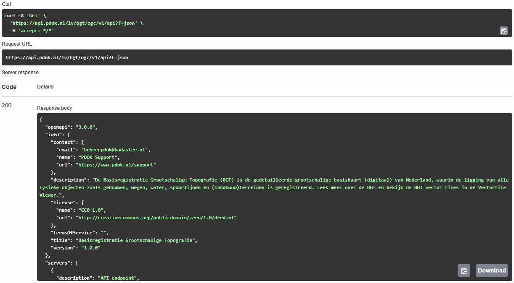
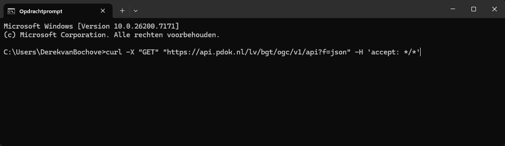
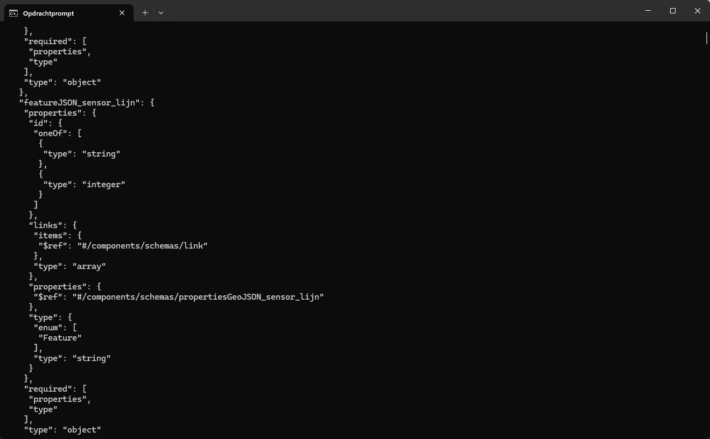

# Bevraag OGC API - Features met curl

We hebben eerder gezien hoe je de API-documentatie in de browser kunt bekijken. Nu is het tijd om echt aan de slag te gaan met de API. 
In de commandline kun je met behulp van de tool `cURL` data opvragen en versturen. Je kunt dit ook gebruiken om API's om data op te vragen en die data vervolgens terug te krijgen. Zo ook de OGC API's van PDOK. Je krijgt het resultaat terug als json-bestand. 
Ontwikkelaars gebruiken dit principe om API's te implementeren in hun eigen applicaties. 

In dit deel stel je met behulp van de OpenAPI specification GET requests samen om de de OGC API - Features van de Basisregistratie Grootschalige Topografie (BGT) te bevragen. Die requests vuur je vervolgens met curl af. Het resultaat ontvang je als `json`. 

## Voorbereiding

- **Open een commandline / terminal venster.** 

!!! warning "Waarschuwing"

    Gebruik niet de PowerShell terminal. Die heeft een ingebouwde eigen versie van curl met veel minder mogelijkheden. De voorbeelden zullen daar niet in werken. 

Met de OpenAPI specification pagina kun je heel makkelijk commando's voor curl samenstellen. 

- **Ga naar de OpenAPI specification van de BGT.**

Weet je niet meer waar je die kunt vinden? Kijk dan even in één van de vorige onderdelen. 

## OpenAPI specification opvragen

Laten we beginnen met een simpele vraag. We vragen eerst de `OpenAPI specification` zelf op. 

- **Klap 'GET** `/api` This document' **open**:

- **Klik op *Try it out***
- **Klik op *Execute***

Je krijgt nu het `curl` commando dat is afgevuurd en het resultaat (response) te zien:

Er is één parameter meegegeven: geef het resultaat als json. En we krijgen de specificatie inderdaad netjes te zien als json-document. 

We kunnen het curl commando kopiëren en zelf uitvoeren in de command line. 

!!! warning "Waarschuwing"

    Pas voor de Windows commandline (`cmd.exe`) de kant-en-klare curl commando's aan: zet alles op één regel en verander de 'enkele quotes' in "dubbele quotes". 

- **Kopieer het curl commando en plak het in de commandline**

Voor Windows:

`curl -X "GET" "https://api.pdok.nl/lv/bgt/ogc/v1/api?f=json" -H 'accept: */*'`

- **Druk op Enter en bekijk het resultaat:**

## Vraag collecties op 

!!! warning "TO DO"

- GET collections
- GET collections/spoor
- GET collections/spoor/schema
- CRS

## Vraag items op

- GET collections/spoor/items
- GET collections/spoor/items/{featureId}
- bounding box
- limit