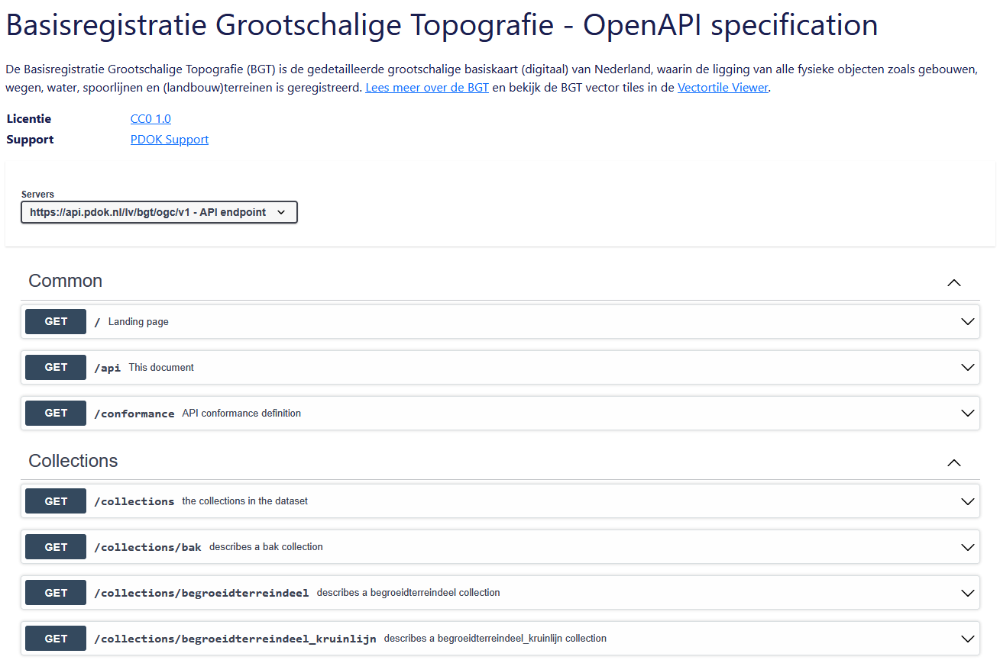
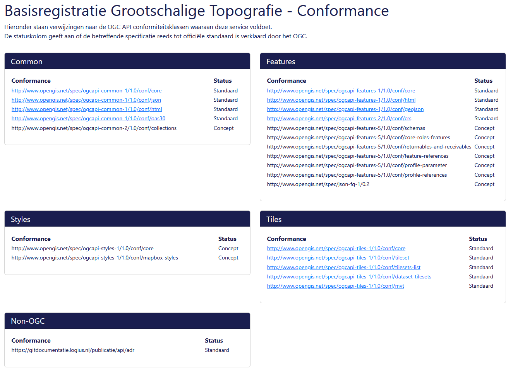
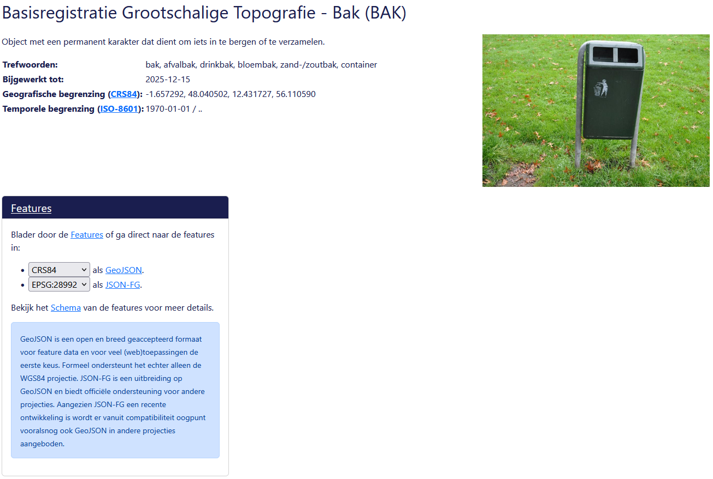
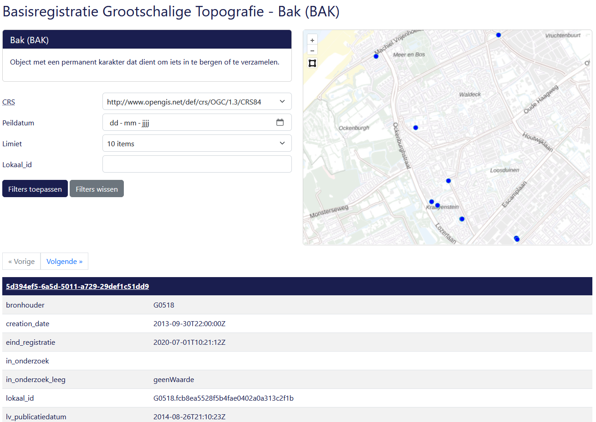
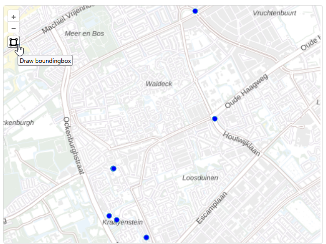
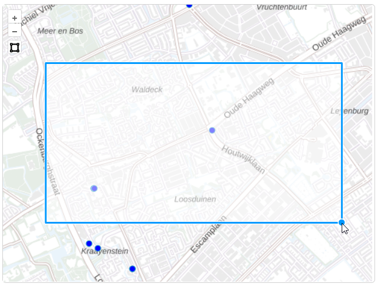

# Verken OGC API - Features in de browser

Laten we eerst in de browser verkennen wat je allemaal met OGC API - Features kunt doen. We doen dit met behulp van de landing page. We gaan één voor één de onderdelen af, demonstreren de mogelijkheden en bekijken voorvertoningen van de data. 

## api.pdok.nl

**:arrow_right: Ga naar <https://api.pdok.nl>**

Je vind hier een overzicht van alle API’s van PDOK.  

**:arrow_right: Scan de hele pagina eens.**

!!! question "Vraag"

    Zijn dit allemaal OGC API’s of ook andere soorten API’s?

**:arrow_right: Zoek de volgende API op en klik deze aan: *Basisregistratie Grootschalige Topografie (OGC API)***

## Landing page

Je bent nu op de landing page van de BGT OGC API terecht gekomen. 


De BGT (Basisregistratie Grootschalige Topografie) is een landelijke dataset, met objecten in de openbare ruimte die meestal door overheden beheerd worden, zoals wegen, water en groen. We gebruiken de OGC API van deze dataset als voorbeeld. De BGT is op dit moment de meest complete OGC API implementatie bij PDOK, want de BGT heeft alle bouwblokken die we bij PDOK hebben geïmplementeerd. 

??? info "Wat is de Basisregistratie Grootschalige Topografie?"

    De Basisregistratie Grootschalige Topografie is een landsdekkende dataset met *grootschalige* topografie. Dit zijn geografische objecten bedoeld om te gebruiken op een groot schaalniveau: schaal 1:500 tot 1:5000. *Grootschalig* zegt in dit geval dus niets over de omvang of reikwijdte van de dataset, hoewel het wel een grote dataset is. De BGT bevat onder andere wegen, waterlichamen, groenvlakken en gebouwen. De BGT wordt bijgehouden door onder andere gemeenten, provincies en verschillende rijksoverheden. De BGT wordt onder andere gebruikt om het beheer en onderhoud van de openbare ruimte te ondersteunen. [Hier vind je meer informatie over de BGT.](https://www.digitaleoverheid.nl/overzicht-van-alle-onderwerpen/stelsel-van-basisregistraties/10-basisregistraties/bgt/) 

    De BGT is een basisregistratie. Dat wil zeggen dat wettelijk is vastgelegd hoe overheden de dataset moeten beheren (o.a. up to date houden) en gebruiken en wat de kwaliteit van de data is. Een basisregistratie heeft altijd één of meerdere bronhouders. Zij beheren de basisregistratie, maken daar afspraken over en zijn de eigenaar van de data. Er zijn nog meer basisregistraties. Een groot deel van de basisregistraties bevatten voornamelijk geodata. Bijvoorbeeld de BAG, de BRT en de BRK. [Hier vind je meer informatie over het stelsel van basisregistraties.](https://www.digitaleoverheid.nl/overzicht-van-alle-onderwerpen/stelsel-van-basisregistraties/10-basisregistraties/) 

De landing page is een voor mensen leesbare beschrijving en toegangspunt van de API. Door mensen leesbaar? Ja wel, want er is ook een beschrijving die vooral voor machines is gemaakt.  

!!! question "Vraag"

    Waar vind je de beschrijving die voor machines is bedoeld?

**:arrow_right: Bekijk de beschrijving voor machines ook eens.**

**:arrow_right: En ga daarna terug naar de HTML-weergave (de leesbare variant)**

Een landing page bevat een beschrijving van de dataset met eventueel verwijzingen naar andere bronnen, de trefwoorden en metadata. 

De BGT wordt beschikbaar gesteld als OGC API – Features en als OGC API – Tiles. Daarom bestaat de landing page uit 6 onderdelen. De landing page bestaat niet altijd uit 6 onderdelen. Een aantal onderdelen is altijd verplicht en zul je dus altijd tegenkomen. Maar een aantal onderdelen zie je alleen wanneer er een OGC API – Features is of een OGC API – Tiles. Is de dataset beschikbaar gesteld als features, dan is er een Collections pagina. Worden er ook tiles beschikbaar gesteld, dan is er ook een Tiles, Styles en Tile Matrix Sets pagina. 

Hieronder een handig overzicht van welke pagina bij welke API hoort. 

| Pagina                                          | Toelichting                                                       | Wanneer?                  |
|-------------------------------------------------|-------------------------------------------------------------------|---------------------------|
| [OpenAPI specification](#openapi-specification) | Beschrijving van de verschillende API calls die deze API aanbiedt | Altijd (OGC API - Common) |
| [Conformance](#conformance)                     | Aan welke OGC standaarden voldoet deze API?                       | Altijd (OGC API - Common) |
| [Collections](#collections)                     | Featuredata                                                       | OGC API – Features        |
| [Tiles](#ogc-api-tiles-onderdelen)              | Vector tiles (visualisatie)                                       | OGC API – Tiles           |
| [Styles](#ogc-api-tiles-onderdelen)             | Stijlen (opmaak)                                                  | OGC API – Styles          |
| [Tile Matrix Sets](#ogc-api-tiles-onderdelen)   | Opbouw van de tegels                                              | OGC API – Tiles           |

Laten we de verschillende pagina’s eens gaan verkennen.

## OGC API - Common onderdelen

### OpenAPI specification

**:arrow_right: Klik op de landing page op 'OpenAPI specification'**



Hier zie je de Swagger UI van deze API. Deze toont alle API calls die deze API ondersteunt. Daarmee toont de API specification dus alle mogelijkheden van de API, en hoe je deze mogelijkheden kunt benutten. De Swagger UI geeft voorbeeldrequests en je kunt zelf requests samenstellen. Die kun je direct in de browser testen. Je krijgt direct het antwoord. 

!!! info "Swagger UI"

    Swagger UI is een veelgebruikte manier voor het documenteren van API's op een dusdanige manier dat dit voor mensen leesbaar is. Lees meer op <https://swagger.io/>

Waarom heet deze pagina 'OpenAPI specification'? Omdat deze API aan de specificatie van de OGC API voldoet, voldoet deze API automatisch ook aan de 'OpenAPI specification'. 

!!! info "OpenAPI specification"

    De OpenAPI specification is een standaard voor het formeel beschrijven van API's op een manier die leesbaar is voor machines. Een OpenAPI specificatiedocument (deze pagina) is een YAML- of JSON-document en de OpenAPI standaard schrijft voor welke informatie dit document moet bevatten. Lees meer op <https://swagger.io/specification/>

Laten we meteen gebruik maken van de Swagger UI en zelf eens iets testen. 

**:arrow_right: Klap** 'GET `/api` This document' **open**:


Dit is de API call die je nodig hebt om de OpenAPI specification (deze pagina dus) op te vragen. 

**:arrow_right: Klik op *Try it out***

**:arrow_right: Klik op *Execute***

Je krijgt nu het `curl` commando dat is afgevuurd en het resultaat (response) te zien:


Er is één parameter meegegeven: geef het resultaat als json. En we krijgen de specificatie inderdaad netjes te zien als json-document. 

Daaronder zie je nog de mogelijke response calls: de codes en wat die codes betekenen. 

!!! question "Wat is het versienummer van deze specifieke API?"

??? success "Antwoord"

    Het versienummer van de BGT OGC API is 1.0.0. Dacht je dat het 3.0.0 was? Dit is het versienummer van de gebruikte OpenAPI specification: `"OpenAPI"`. Het versienummer van deze specifieke API vind je in `"info"."version"`

Je hebt nu in het kort gezien wat je met de OpenAPI specification (de Swagger UI) kunt doen. Developers kunnen hiermee snel werkende API-calls samenstellen die ze in applicaties kunnen gebruiken, om op die manier de API te implementeren. 

!!! info "OpenAPI specification Swagger UI"

    We gaan hier in [één van de volgende onderdelen](<../features/Bevraag OGC API - Features met curl.md>) van deze leermodule nog veel meer gebruik van maken. 

**:arrow_right: Ga weer terug naar de landing page (klik bovenaan in de breadcrumb op BGT)**

### Conformance

**:arrow_right: Klik op de landing page op 'Conformance'**



De Conformance pagina toont welke OGC-standaarden deze API implementeert. We kunnen hier dus precies zien aan welke bouwblokken en versies van de OGC API-standaarden de BGT OGC API voldoet. 

We zien ook dat sommige standaarden nog niet vastgesteld zijn, en nog in concept zijn. 

**:arrow_right: Ga weer terug naar de landing page**

## OGC API - Features onderdelen

### Collections

**:arrow_right: Klik op de landing page op 'Collections'**


Je ziet nu welke collecties de BGT OGC API aanbiedt. Dat zijn er nogal wat, want de BGT is een rijke basisregistratie. 

Een collectie is een verzameling objecten (*features*) van een bepaald type. Je kunt een collectie ook wel zien als een tabel met rijen en kolommen. In een WFS zou dit een *featureType* heten. Elke collectie kun je los opvragen. 

Elke collectie is voorzien van een beschrijving, trefwoorden en een afbeelding. Ook zie je de datum dat de collectie voor het laatst is bijgewerkt, de geografische begrenzing en de temporele begrenzing. 

Laten we de collectie 'Bak' als voorbeeld nemen. 

**:arrow_right: Klik op 'Bekijk schema' bij de collectie 'Bak'**

Je krijgt nu het schema te zien. 

Elke collectie heeft een eigen schema: welke velden c.q. kolommen c.q. attributen de collectie heeft, van welk datatype die kolommen zijn, of de kolom altijd ingevuld is en een omschrijving van de kolom. 

!!! info "Kolommen, attributen of velden?"

    De termen kolom, attribuut en veld worden door elkaar heen gebruikt en betekenen in de praktijk hetzelfde: een eigenschap van een object (één rij) met een bepaald datatype. 

    De term 'feature' kan ook verwarrend zijn. 'Feature' is letterlijk vertaald 'Eigenschap', maar in de GIS-wereld bedoelen we hier één object (één rij) mee. 

Het schema geeft op die manier informatie over welke informatie (data) een collectie precies geeft en wat je met die informatie kunt doen. 

!!! question "Vraag"

    In welke kolom worden de coördinaten van de collectie opgeslagen? Bestaat de Bakcollectie uit punten, lijnen of vlakken?

??? success "Antwoord"

    De coördinaten, oftewel de geometrie van deze collectie, wordt opgeslagen in het attribuut `geometry`. Dit is een `point`

**:arrow_right: Ga weer terug naar de pagina 'Collections'**

We gaan nu de collectie 'Bak' verder bekijken. 

**:arrow_right: Klik op 'Bak (BAK)'**



Ook hier vind je weer de beschrijving, trefwoorden en andere metadata over deze collectie. 

En we vinden een link om door de Features te bladeren. Je hebt hier drie opties:

1. Blader in de user interface door de features
2. Bekijk de features in GeoJSON-formaat in een bepaald CRS (dropdownmenu)
3. Bekijk de features in JSON-FG-formaat in een bepaald CRS (dropdownmenu)

!!! info "GeoJSON en JSON-FG"

    GeoJSON is een uitbreiding op het JSON-formaat dat het mogelijk maakt om geometrie op te slaan. Het is een open en breed geaccepteerd formaat voor featuredata voor webtoepassingen. Het ondersteunt echter *formeel gezien* alleen het WGS84 coördinaatreferentiesysteem (CRS). Het uitleveren van andere CRS'en is technisch gezien wel mogelijk, maar wordt niet door iedere client ondersteund.  

    JSON-FG is een uitbreiding op GeoJSON en biedt officieel ondersteuning voor alle CRS'en. Het is echter nog een recente ontwikkeling. 

    Om zoveel mogelijk clients te kunnen ondersteunen en zo veel mogelijk compatibiliteit te bieden, leveren we zowel JSON-FG als GeoJSON in verschillende CRS'en. 

    Kijk voor meer informatie over CRS'en bij [Achtergrondinformatie](<../achtergrondinformatie/Wat is geo-informatie.md/#wat-zijn-coordinaatreferentiesystemen>)

Laten we eerst in de browser door de Features bladeren.

**:arrow_right: Klik op ['Features'](https://api.pdok.nl/lv/bgt/ogc/v1/collections/bak/items)**

Je komt nu op de pagina terecht waarmee je door de features (c.q. 'items') in deze collectie kunt bladeren. 



Je kunt hier filters toepassen: 

- In welk **CRS** wil je de features bekijken?
- Op welke **peildatum** wil je de features bekijken? In deze collectie hebben alle features namelijk een begin- en een einddatum. Met de peildatum kun je alle features bekijken die op de peildatum bestonden (*begindatum < peildatum < einddatum*).
- Hoeveel items wil je in één keer ophalen (**limiet**)?
- Als je het **Lokaal_id** van één feature hebt, kun je die opzoeken met deze filter.

**:arrow_right: Stel de volgende filters in:**

- **CRS: http://www.opengis.net/def/crs/EPSG/0/28992**
- **Peildatum: 01-01-2026**
- **Limiet: 10 items**
- **Lokaal_id: leeg**

**:arrow_right: Klik op 'Filters toepassen'**

Na het toepassen van de filters krijg je de features rechts in de kaart te zien en onderin in tabelvorm onder elkaar, met de attributen in een tabel per feature. 

**:arrow_right: Bekijk de kaart en de tabellen aandachtig**

!!! question "Vraag"

    Wanneer is de bak 'G0518.fcb8ea5528fbb4fae0402a0a313c2f1b' ontstaan? 

??? hint

    Je kunt ook de 'Lokaal_id' filter gebruiken. 

??? success "Antwoord"

    `creation_date` = `2013-09-30T22:00:00Z`

Wellicht zijn de 'Vorige' en 'Volgende' knoppen je al opgevallen. 

!!! question "Vraag"

    Wat doet de knop 'Volgende'?

??? success "Antwoord"

    De knop 'Volgende' haalt de volgende 10 resultaten op. Zet je de limiet op 100 of 1000, dan haal je de volgende 100 of 1000 resultaten op. 

Klik de volgende infobox open voor meer uitleg over het antwoord. 

??? info "Paginering"

    De resultaten worden verdeeld over pagina's. Dit noemen we ook wel pagination. Zo wordt voorkomen dat je in één keer alle resultaten binnenhaalt, wat erg langzaam zou zijn. De limiet bepaalt hoeveel items een pagina bevat. 

**:arrow_right: Bekijk de URL in de adresbalk van je browser.** 

!!! question "Vraag"

    Wat is er in de URL in de adresbalk van je browser bijgekomen toen je naar de volgende pagina ging?

??? hint

    Klik nogmaals op 'Filters toepassen' en vervolgens op 'Volgende' en let op het verschil in de URL in de adresbalk. 

??? success "Antwoord"

    `cursor=Ww|Mhj0MA` is er bijgekomen. Dit is een manier om naar de volgende pagina te gaan. Elke pagina toont het aantal resultaten van de limiet. 

Klik de volgende infobox open voor meer uitleg over het antwoord. 

??? info "Cursor pagination en offset pagination"

    Grofweg zijn er twee soorten pagination. Offset pagination werkt met een *offset* in het request. Met de offset geef je aan vanaf welk aantal je de resultaten wilt ophalen. Voor grotere datasets is dit echter niet schaalbaar. Een cursor is een identificatie voor een bepaalde batch items. Elke response geeft de cursor van de vorige en de volgende batch mee. Daarmee kun je vervolgens door de resultaten bladeren.  

Je hebt nu gezien hoe je in de browser kunt filteren en de resultaten (de features) in een collectie kunt bekijken. 

#### Filteren op basis van een bounding box

Nu je een aantal basic filters hebt gezien, moeten we de belangrijkste ruimtelijke filter niet vergeten: filteren op basis van een bounding box. Een bounding box, ook wel een bbox, is een rechthoek op een kaart bestaande uit het x- en y-coördinaat van de linkeronderhoek, gevolgd door het x- en y-coördinaat van de rechterbovenhoek. Door deze als filter op te geven, krijg je alleen features terug die zich binnen deze rechthoek bevinden. 

!!! info

    Zie [het volgende onderdeel](<./Bevraag OGC API - Features met curl.md/#vraag-items-op-binnen-een-bounding-box>) voor meer informatie over de bounding box. 

**:arrow_right: Klik in de kaart op het vierkantje**



**:arrow_right: Teken in de kaart een rechthoek**

- **Klik in de linkerbovenhoek en klik in de rechteronderhoek.**
- **Ondertussen kun je door te klikken de kaart verslepen.**



Vervolgens verschijnen de resultaten binnen deze rechthoek in de kaart en in tabelvorm.

#### Filters in de URL

Eerder zagen we dat er een parameter werd toegevoegd in de URL in de adresbalk (cursor). Wellicht is het je opgevallen dat er nog meer in de URL te vinden is. 

Die URL ziet er waarschijnlijk ongeveer zo uit:

```
https://api.pdok.nl/lv/bgt/ogc/v1/collections/bak/items?crs=http%3A%2F%2Fwww.opengis.net%2Fdef%2Fcrs%2FEPSG%2F0%2F28992&datetime=2026-01-01T00%3A00%3A00.000Z&f=html&limit=10&bbox=4.2272271035977065%2C52.04836512237336%2C4.265429015995505%2C52.06308825720682
```

Laten we het eens opschonen, want de HTML encoding maakt het wat minder leesbaar:

```
https://api.pdok.nl/lv/bgt/ogc/v1/collections/bak/items?
crs=http://www.opengis.net/def/crs/EPSG/0/28992&
datetime=2026-01-01T00:00:00.000Z&
f=html&
limit=10&
bbox=4.2272271035977065,52.04836512237336,4.265429015995505,52.06308825720682
```

Het is je hopelijk opgevallen dat de filters onderdeel zijn van de URL! 

!!! question "Wat zou je met deze URL kunnen doen?"

??? success "Antwoord"

    Je zou de URL kunnen bewaren om de resultaten op een later moment te bekijken. Je zou ook de URL in een andere applicatie kunnen gebruiken. 

Laten we de verschillende onderdelen van de URL eens bekijken. 

| Parameter | Waarde | Toelichting |
| --- | --- | --- |
| `https://api.pdok.nl/lv/bgt/ogc/v1/collections/bak/items` |  | Items endpoint van de collectie |
| `crs` | `http://www.opengis.net/def/crs/EPSG/0/28992` | CRS waarin de (coördinaten van de) items worden teruggegeven |
| `cursor` | `Ww\|Mhj0MA` | ID van de pagina die wordt gegeven |
| `datetime` | `2026-01-01T00:00:00.000Z` | Peildatum |
| `f` | `html` | Formaat waarin het response wordt gegeven |
| `limit` | `10` | Limiet op het aantal items per response |
| `bbox` | `4.2272271035977065,52.04836512237336,4.265429015995505,52.06308825720682` | Ruimtelijk filter, bounding box waarin de items zich bevinden die worden gegeven |

Je hebt nu gezien hoe je kunt filteren in de HTML-weergave.

Je kunt de resultaten ook bekijken in GeoJSON en in JSON-FG. 

**:arrow_right: Bekijk de GeoJSON-weergave en de JSON-FG-weergave en vergelijk deze met elkaar. Wat zijn de verschillen?**

??? hint

    Klik rechtsboven op 'GeoJSON' en op 'JSON-FG'. 

    Verschillen zijn onder andere:

    - GeoJSON heeft geen `coordRefSys` object
    - Hoe de geometrie wordt opgeslagen is verschillend opgebouwd 

Je hebt nu gezien hoe je OGC API - Features Collecties kunt bekijken in de web browser. Je hebt gezien dat een API uit verschillende collecties bestaat. Je weet nu hoe je door de features kunt bladeren en bovendien hoe je in de browser kunt filteren en de resultaten terug krijgt. 

:material-lightbulb: Een dataset kan in één of meerdere collecties beschikbaar worden gesteld.

:material-lightbulb: Een collectie is een op zich zelf staand onderdeel.

:material-lightbulb: Een collectie heeft een eigen schema.

:material-lightbulb: Met parameters kun je de collectie opvragen in een bepaald formaat of alleen items opvragen die aan een bepaalde voorwaarde voldoen.

**:arrow_right: Ga weer terug naar de landing page**

## OGC API - Tiles onderdelen

We verkennen deze pagina nu niet. We doen dit in het onderdeel [OGC API - Tiles](../tiles/Introductie.md):

* Tiles
* Styles
* Tile Matrix Sets

## Samenvatting

In dit onderdeel heb je in de browser de landing page (HTML weergave) van een OGC API verkend. Hopelijk heb je hiermee een beeld van wat een OGC API allemaal kan en hoe je snel kunt zien wat voor data er in een OGC API zit, specifiek voor OGC API - Features. We deden dat aan de hand van de dataset Basisregistratie Grootschalige Topografie. We hebben de volgende onderdelen van de OGC API besproken:

| Onderdeel | Toelichting |
| --------- | ----------- |
| OpenAPI specification | Swagger UI die de mogelijkheden van de API toont. |
| Conformance | Overzicht van de standaarden waaraan deze API voldoet. |
| Collections | De verschillende collecties (tabellen/kaartlagen) die in deze OGC API ontsloten worden. |