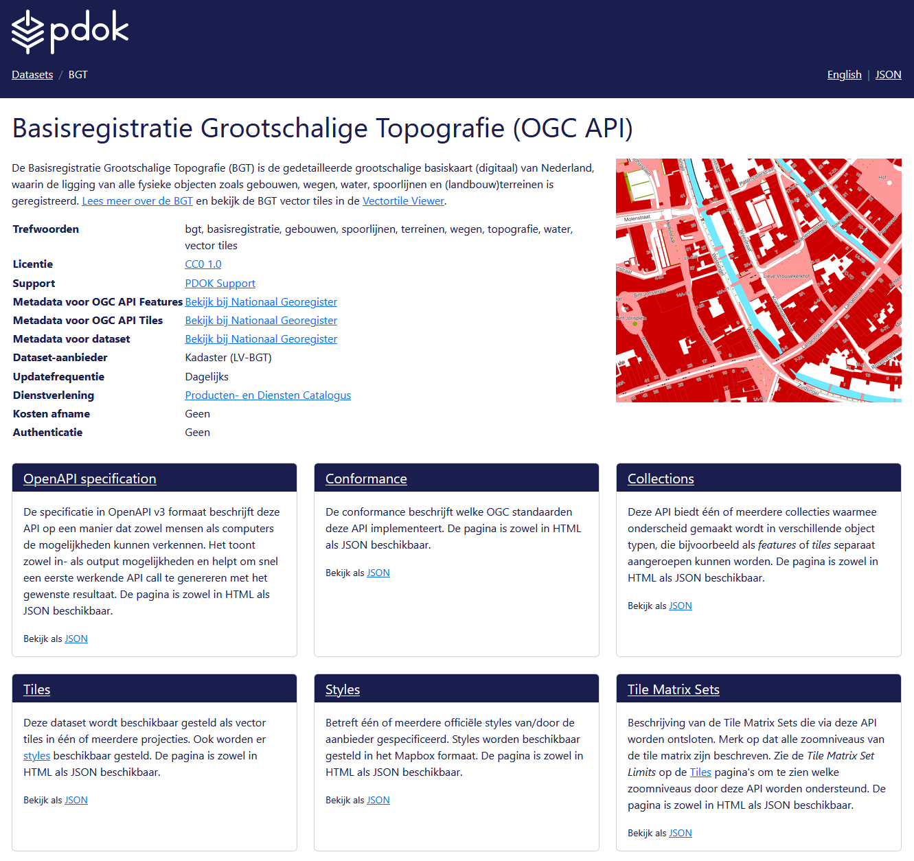
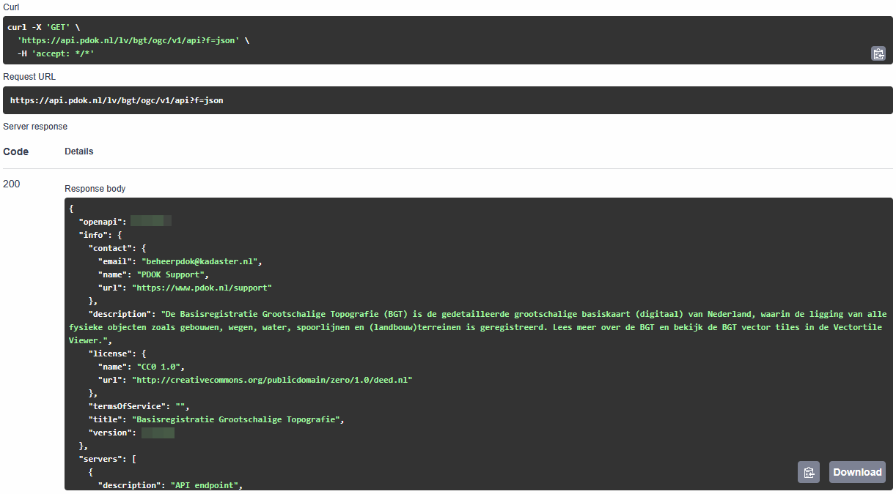
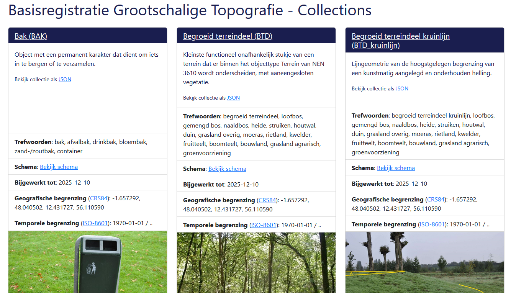

# Verken OGC API - Features in de browser

Laten we eerst in de browser verkennen wat je allemaal met OGC API - Features kunt doen. We doen dit met behulp van de landing page. We gaan één voor één de onderdelen af, demonstreren de mogelijkheden en bekijken voorvertoningen van de data. 

## api.pdok.nl

**:arrow_right: Ga naar <https://api.pdok.nl>**

Je vind hier een overzicht van alle API’s van PDOK.  

**:arrow_right: Scan de hele pagina eens.**

!!! question "Vraag"

    Zijn dit allemaal OGC API’s of ook andere soorten API’s?

**:arrow_right: Zoek de volgende API op en klik deze aan: *Basisregistratie Grootschalige Topografie (OGC API)***

## Landing page

Je bent nu op de landing page van de BGT OGC API terecht gekomen. 

De BGT (Basisregistratie Grootschalige Topografie) is een landelijke dataset, met objecten in de openbare ruimte die meestal door overheden beheerd worden, zoals wegen, water en groen. We gebruiken de OGC API van deze dataset als voorbeeld. De BGT is op dit moment de meest complete OGC API implementatie bij PDOK, want de BGT heeft alle bouwblokken die we bij PDOK hebben geïmplementeerd. 

??? info "Wat is de Basisregistratie Grootschalige Topografie?"

    De Basisregistratie Grootschalige Topografie is een landsdekkende dataset met *grootschalige* topografie. Dit zijn geografische objecten bedoeld om te gebruiken op een groot schaalniveau: schaal 1:500 tot 1:5000. *Grootschalig* zegt in dit geval dus niets over de omvang of reikwijdte van de dataset, hoewel het wel een grote dataset is. De BGT bevat onder andere wegen, waterlichamen, groenvlakken en gebouwen. De BGT wordt bijgehouden door onder andere gemeenten, provincies en verschillende rijksoverheden. De BGT wordt onder andere gebruikt om het beheer en onderhoud van de openbare ruimte te ondersteunen. [Hier vind je meer informatie over de BGT.](https://www.digitaleoverheid.nl/overzicht-van-alle-onderwerpen/stelsel-van-basisregistraties/10-basisregistraties/bgt/) 

    De BGT is een basisregistratie. Dat wil zeggen dat wettelijk is vastgelegd hoe overheden de dataset moeten beheren (o.a. up to date houden) en gebruiken en wat de kwaliteit van de data is. Een basisregistratie heeft altijd één of meerdere bronhouders. Zij beheren de basisregistratie, maken daar afspraken over en zijn de eigenaar van de data. Er zijn nog meer basisregistraties. Een groot deel van de basisregistraties bevatten voornamelijk geodata. Bijvoorbeeld de BAG, de BRT en de BRK. [Hier vind je meer informatie over het stelsel van basisregistraties.](https://www.digitaleoverheid.nl/overzicht-van-alle-onderwerpen/stelsel-van-basisregistraties/10-basisregistraties/) 

De landing page is een voor mensen leesbare beschrijving en toegangspunt van de API. Door mensen leesbaar? Ja wel, want er is ook een beschrijving die vooral voor machines is gemaakt.  

!!! question "Vraag"

    Waar vind je de beschrijving die voor machines is bedoeld?

**:arrow_right: Bekijk de beschrijving voor machines ook eens.**

**:arrow_right: En ga daarna terug naar de HTML-weergave (de leesbare variant)**

Een landing page bevat een beschrijving van de dataset met eventueel verwijzingen naar andere bronnen, de trefwoorden en metadata. 

De BGT wordt beschikbaar gesteld als OGC API – Features en als OGC API – Tiles. Daarom bestaat de landing page uit 6 onderdelen. De landing page bestaat niet altijd uit 6 onderdelen. Een aantal onderdelen is altijd verplicht en zul je dus altijd tegenkomen. Maar een aantal onderdelen zie je alleen wanneer er een OGC API – Features is of een OGC API – Tiles. Is de dataset beschikbaar gesteld als features, dan is er een Collections pagina. Worden er ook tiles beschikbaar gesteld, dan is er ook een Tiles, Styles en Tile Matrix Sets pagina. 

Hieronder een handig overzicht van welke pagina bij welke API hoort. 

| Pagina | Toelichting | Wanneer? |
| ----------- | ----------- | ----------- |
| [OpenAPI specification](#openapi-specification)  | Beschrijving van de verschillende API calls die deze API aanbiedt  | Altijd (OGC API - Common)  |
| [Conformance](#conformance) | Aan welke OGC standaarden voldoet deze API? | Altijd (OGC API - Common) |
| [Collections](#collections) | Featuredata | OGC API – Features |
| [Tiles](#tiles) | Vector tiles (visualisatie)  | OGC API – Tiles |
| [Styles](#styles) | Stijlen (opmaak) | OGC API – Styles |
| [Tile Matrix Sets](#tile-matrix-sets) | Opbouw van de tegels | OGC API – Tiles |

Laten we de verschillende pagina’s eens gaan verkennen.

## OGC API - Common onderdelen

### OpenAPI specification

**:arrow_right: Klik op de landing page op 'OpenAPI specification'**

Hier zie je de Swagger UI van deze API. Deze toont alle API calls die deze API ondersteunt. Daarmee toont de API specification dus alle mogelijkheden van de API, en hoe je deze mogelijkheden kunt benutten. De Swagger UI geeft voorbeeldrequests en je kunt zelf requests samenstellen. Die kun je direct in de browser testen. Je krijgt direct het antwoord. 

!!! info "Swagger UI"

    Swagger UI is een veelgebruikte manier voor het documenteren van API's op een dusdanige manier dat dit voor mensen leesbaar is. Lees meer op <https://swagger.io/>

Waarom heet deze pagina 'OpenAPI specification'? Omdat deze API aan de specificatie van de OGC API voldoet, voldoet deze API automatisch ook aan de 'OpenAPI specification'. 

!!! info "OpenAPI specification"

    De OpenAPI specification is een standaard voor het formeel beschrijven van API's op een manier die leesbaar is voor machines. Een OpenAPI specificatiedocument (deze pagina) is een YAML- of JSON-document en de OpenAPI standaard schrijft voor welke informatie dit document moet bevatten. Lees meer op <https://swagger.io/specification/>

Laten we meteen gebruik maken van de Swagger UI en zelf eens iets testen. 

**:arrow_right: Klap** 'GET `/api` This document' **open**:

Dit is de API call die je nodig hebt om de OpenAPI specification (deze pagina dus) op te vragen. 

**:arrow_right: Klik op *Try it out***

**:arrow_right: Klik op *Execute***

Je krijgt nu het `curl` commando dat is afgevuurd en het resultaat (response) te zien:

Er is één parameter meegegeven: geef het resultaat als json. En we krijgen de specificatie inderdaad netjes te zien als json-document. 

Daaronder zie je nog de mogelijke response calls: de codes en wat die codes betekenen. 

!!! question "Wat is het versienummer van deze specifieke API?"

??? success "Antwoord"

    Het versienummer van de BGT OGC API is 1.0.0. Dacht je dat het 3.0.0 was? Dit is het versienummer van de gebruikte OpenAPI specification: `"OpenAPI"`. Het versienummer van deze specifieke API vind je in `"info"."version"`

Je hebt nu in het kort gezien wat je met de OpenAPI specification (de Swagger UI) kunt doen. Developers kunnen hiermee snel werkende API-calls samenstellen die ze in applicaties kunnen gebruiken, om op die manier de API te implementeren. 

!!! info "OpenAPI specification Swagger UI"

    We gaan hier in [één van de volgende onderdelen](<../features/Bevraag OGC API - Features met curl.md>) van deze leermodule nog veel meer gebruik van maken. 

**:arrow_right: Ga weer terug naar de landing page (klik bovenaan in de breadcrumb op BGT)**

### Conformance

**:arrow_right: Klik op de landing page op 'Conformance'**

De Conformance pagina toont welke OGC-standaarden deze API implementeert. We kunnen hier dus precies zien aan welke bouwblokken en versies van de OGC API-standaarden de BGT OGC API voldoet. 

We zien ook dat sommige standaarden nog niet vastgesteld zijn, en nog in concept zijn. 

**:arrow_right: Ga weer terug naar de landing page**

## OGC API - Features onderdelen

### Collections

**:arrow_right: Klik op de landing page op 'Collections'**

Je ziet nu welke collecties de BGT OGC API aanbiedt. Dat zijn er nogal wat, want de BGT is een rijke basisregistratie. 

Een collectie is een verzameling objecten (*features*) van een bepaald type. Je kunt een collectie ook wel zien als een tabel met rijen en kolommen. In een WFS zou dit een *featureType* heten. Elke collectie kun je los opvragen. 

Elke collectie is voorzien van een beschrijving, trefwoorden en een afbeelding. Ook zie je de datum dat de collectie voor het laatst is bijgewerkt, de geografische begrenzing en de temporele begrenzing. 

!!! question "Vraag"

    to do

Laten we de collectie 'Bak' als voorbeeld nemen. 

**:arrow_right: Klik op Bekijk schema**

Je krijgt nu het schema te zien. 

Een collectie heeft een eigen schema: kolommen van een bepaald datatype. Via *Bekijk schema* kun je dit schema bekijken. 

!!! warning "TO DO"

Samenvatting

:material-lightbulb: 

**:arrow_right: Ga weer terug naar de landing page**

## OGC API - Tiles onderdelen

We verkennen deze pagina nu niet. We doen dit in het onderdeel [OGC API - Tiles](../tiles/Introductie.md):

* Tiles
* Styles
* Tile Matrix Sets

## Samenvatting

In dit onderdeel heb je in de browser de landing page (HTML weergave) van een OGC API verkend. Hopelijk heb je hiermee een beeld van wat een OGC API allemaal kan en hoe je snel kunt zien wat voor data er in een OGC API zit, specifiek voor OGC API - Features. We deden dat aan de hand van de dataset Basisregistratie Grootschalige Topografie. We hebben de volgende onderdelen van de OGC API besproken:

| Onderdeel | Toelichting |
| --------- | ----------- |
| OpenAPI specification | Swagger UI die de mogelijkheden van de API toont. |
| Conformance | Overzicht van de standaarden waaraan deze API voldoet. |
| Collections | De verschillende collecties (tabellen/kaartlagen) die in deze OGC API ontsloten worden. |