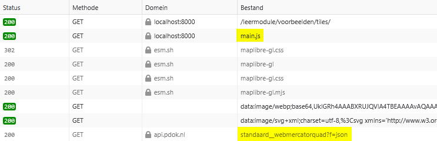
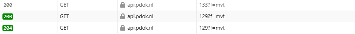

# Analyseer een voorbeeldkaart

Zojuist heb je met behulp van de landing page verkend wat je allemaal met OGC API - Tiles kunt doen. We bekijken nu een voorbeeldwebmap die gemaakt is met behulp van OGC API - Tiles. Aan de hand hiervan ontdek je hoe een webmap werkt en hoe de componenten van OGC API - Tiles met elkaar samenwerken. 

## Bekijk het voorbeeld in een browser

We bekijken nu eerst de voorbeeldwebmap in een webbrowser. 

**:arrow_right: Bekijk** [../voorbeelden/tiles/index.html](../voorbeelden/tiles/index.html)

**:arrow_right: Bekijk de kaart zelf, zoom eens in en uit**


Dit is een web viewer die gemaakt is met de library MapLibre. Deze kaart maakt gebruik van de OGC API – Tiles van de BRT Achtergrondkaart: <https://api.pdok.nl/kadaster/brt-achtergrondkaart/ogc/v1> 

??? info "Wat is de BRT?"

    BRT staat voor: Basisregistratie Topografie. Niet te verwarren met de BGT: Basisregistratie *Grootschalige* Topografie. De BRT is bedoeld voor kleinschalige topografie: schaal 1:250.000 tot schaalniveau 1:10.000. Dat maakt de BRT ideaal om te gebruiken als achtergrondkaart. 

    De BRT is een basisregistratie. [Hier vind je meer informatie over basisregistraties](<../achtergrondinformatie/Wat is geo-informatie.md/#basisregistraties>). 


 
!!! question "Vraag"

    Wat verandert er als je in- en uitzoomt op de kaart? 

??? success "Antwoord"

    Bij het inzoomen worden er nieuwe kaarttegels ingeladen. Als het goed is, zie je de tegels heel snel één voor één verschijnen. 

**:arrow_right: Open de developer tools in je browser.** 

**:arrow_right: Refresh de pagina**

**:arrow_right: Open het Netwerk (Network) tabblad**

**:arrow_right: Bekijk de requests die verschijnen in het Netwerktabblad**


Merk op dat er onder andere een `main.js` en `https://api.pdok.nl/kadaster/brt-achtergrondkaart/ogc/v1/styles/standaard__webmercatorquad?f=json` worden ingeladen.



**:arrow_right: Zoom eens in en uit**

Merk op dat er nu veel bestanden worden ingeladen, bijvoorbeeld `262?f=mvt`. Dit bestand is 1 tile (kaarttegel). De volledige URL van deze tile is: <https://api.pdok.nl/kadaster/brt-achtergrondkaart/ogc/v1/tiles/WebMercatorQuad/9/168/262?f=mvt> 



Je kunt nu zien dat deze web viewer de BRT Achtergrondkaart gebruikt, en meer specifiek de WebMercatorQuad TileMatrixSet. Dat zie je aan de URL’s van de tiles. En je ziet dat de standaard style wordt gebruikt voor deze tilematrixset. Dat zie je aan de style URL die na `main.js` werd ingeladen: <https://api.pdok.nl/kadaster/brt-achtergrondkaart/ogc/v1/styles/standaard__webmercatorquad?f=json>

**:arrow_right: Zoek deze TileMatrixSet en Style ook op via de landing page in de browser:** <https://api.pdok.nl/kadaster/brt-achtergrondkaart/ogc/v1> 

!!! question "Vraag"

    Waar vind je de URL van de TileMatrixSet en de Style die gebruikt zijn in het voorbeeld?

??? success "Antwoord"

    Je vind de URL van de TileMatrixSet op de [Tiles pagina](<https://api.pdok.nl/kadaster/brt-achtergrondkaart/ogc/v1/tiles>) achter 'URL template', door 'WebMercatorQuad' aan te klikken in het dropdownmenu. 

    De URL van de Style vind je op de [Styles pagina](<https://api.pdok.nl/kadaster/brt-achtergrondkaart/ogc/v1/styles>) achter 'URL', door 'BRT Achtergrondkaart Standaard (WebMercatorQuad)' aan te klikken in het dropdownmenu. 
 
Voor de bron van de tegels is dus de volgende 'sjabloon URL' gebruikt: 

```
https://api.pdok.nl/kadaster/brt-achtergrondkaart/ogc/v1/tiles/WebMercatorQuad/
{z}/{y}/{x}?f=mvt
```

Door MapLibre wordt deze vertaald naar een request voor elke tegel. Zo'n request ziet er bijvoorbeeld zo uit: 

```
https://api.pdok.nl/kadaster/brt-achtergrondkaart/ogc/v1/tiles/WebMercatorQuad/
9/168/262?f=mvt
```

Hoe is deze URL precies opgebouwd?

| Template                                                    | Voorbeeld                                                   | Beschrijving                                                                          |
|-------------------------------------------------------------|-------------------------------------------------------------|---------------------------------------------------------------------------------------|
| `https://api.pdok.nl/kadaster/brt-achtergrondkaart/ogc/v1/` | `https://api.pdok.nl/kadaster/brt-achtergrondkaart/ogc/v1/` | Landing page                                                                          |
| `tiles`                                                     | `tiles`                                                     | Dataset tileset                                                                       |
| `{tileMatrixSetId}`                                         | `WebMercatorQuad`                                           | Naam van de TileMatrixSet                                                             |
| `{tileMatrix}`                                              | `9`                                                         | Nummer van de matrix (zoomlevel)                                                      |
| `{tileRow}`                                                 | `168`                                                       | Tile rijnummer (positie in de matrix)                                                 |
| `{tileCol}`                                                 | `262`                                                       | Tile kolomnummer (positie in de matrix)                                               |
| `f=mvt`                                                     | `f=mvt`                                                     | Formaat waarin de tile moet worden uitgeleverd. In dit geval Mapbox vector tile (mvt) |

Kijk nog eens in het [vorige hoofdstuk](<./Verken OGC API - Tiles in de browser.md/#tile-matrix-sets>) als je dit nog niet helemaal begrijpt. 

Zie voor meer informatie [de OGC API workshop](<https://ogcapi-workshop.ogc.org/api-deep-dive/tiles/>). 

## Bekijk het voorbeeld in een code-editor

We gaan nu de code van dichtbij bekijken. Maak gebruik van een code-editor of IDE naar keuze om code te bekijken en uit te voeren. Hieronder een uitleg voor Visual Studio Code, maar je kunt natuurlijk zelf een keuze maken. 

**:arrow_right: Fork de Git repository**

**:arrow_right: Clone de Git repository**

**:arrow_right: Open de repository**

Laten we deze code runnen zodat we de applicatie eerst in de browser kunnen bekijken:

**:arrow_right: Start lokaal een web server, bijvoorbeeld met python:**

```
> python -m http.server
Serving HTTP on 0.0.0.0 port 8000 (http://0.0.0.0:8000/) ...
```
**:arrow_right: Bekijk nu** [../voorbeelden/tiles/index.html](../voorbeelden/tiles/index.html) **in de browser**


Laten we nu eens de code bekijken in een editor:

**:arrow_right: Bekijk** `..\voorbeelden\tiles\index.html`

**:arrow_right: Bekijk** `..\voorbeelden\tiles\main.js`

**:arrow_right: Bekijk** <https://api.pdok.nl/kadaster/brt-achtergrondkaart/ogc/v1/styles/standaard__webmercatorquad?f=json>

Als het goed is, zie je in de code `index.html` een `div` met als id `map`.

In `main.js` zie je dat er bij `container` dat er naar diezelfde `map` wordt verwezen. In dit javascript bestand wordt allereerst de `mmplibre-gl` library geïmporteerd. Daarna wordt de kaart gedefinieerd:

| Variabele   | Beschrijving                                                                                                                                                                                          |
|-------------|-------------------------------------------------------------------------------------------------------------------------------------------------------------------------------------------------------|
| `container` | `map` object in `index.html`                                                                                                                                                                          |
| `style`     | verwijst naar een json-bestand, waarin wordt gedefinieerd hoe de tiles gevisualiseerd worden <br> <https://api.pdok.nl/kadaster/brt-achtergrondkaart/ogc/v1/styles/standaard__webmercatorquad?f=json> |
| `center`    | bepaalt het startmiddenpunt van de kaart (x- en y-coördinaten)                                                                                                                                        |
| `zoom`      | bepaalt het startzoomlevel van de kaart                                                                                                                                                               |
| `minZoom`   | bepaalt het maximale niveau dat je mag uitzoomen                                                                                                                                                      |
| `maxZoom`   | bepaalt het maximale niveau dat je mag inzoomen                                                                                                                                                       |

Merk op dat je de URL naar de tegels zelf niet ziet in `main.js`. Die URL wordt namelijk in de `style json` aangeroepen. De `main.js` roept de `style json` aan en die roept vervolgens de bron van de tiles aan. De `style json`  bepaalt ook hoe die tiles weergegeven moeten worden. 
De bron van de tiles is in dit geval dus <https://api.pdok.nl/kadaster/brt-achtergrondkaart/ogc/v1/tiles/WebMercatorQuad/{z}/{y}/{x}?f=mvt>

**:arrow_right: Zoek in de** `style json` **de URL van de tiles op (de source).**

!!! note "Wil je hier meer over weten?"

    Kijk voor een deep dive op <https://ogcapi-workshop.ogc.org/api-deep-dive/tiles/> 

**:arrow_right: Bekijk nog eens** de `style json`: <https://api.pdok.nl/kadaster/brt-achtergrondkaart/ogc/v1/styles/standaard__webmercatorquad?f=json>

Dit is een erg omvangrijke stijl en dus een erg groot JSON-bestand. Hoe is dit bestand opgebouwd? 

Allereerst wordt de bron gedefinieerd. Op welke URL staan de tegels? In dit geval is de URL van de tileset <https://api.pdok.nl/kadaster/brt-achtergrondkaart/ogc/v1/tiles/WebMercatorQuad/{z}/{y}/{x}?f=mvt>, maar dit kan elke locatie zijn. Een `style json` kan één of meerdere tilesets als bron aanroepen. 

Vervolgens worden layers in die tileset gedefinieerd. Dit zijn kaartlagen zoals waterdeel of wegdeel. 

Tot slot schrijft het bestand voor hoe die layers getoond moeten worden (kleuren, diktes, etc.). Dit wordt gelezen door MapLibre en gerenderd. 

**:arrow_right: Bekijk nog eens** `main.js`

In dit geval staat de `style json` op een externe locatie, maar het kan ook een bestand op je eigen server zijn. 
In dit geval is de `style json` beschikbaar gesteld door PDOK, maar je kunt ook zelf een `style json` bestand maken. Het voorbeeld is een erg groot stijlbestand, maar er zijn ook simpelere stijlen mogelijk. 

### Experimenteer met de viewer

Experimenteer eens met de variabelen in `main.js`. Laten we eens wat willekeurige waardes invullen en kijken wat deze variabelen precies doen. 

**:arrow_right: Pas zelf in** `main.js` **de volgende waardes aan en kijk wat er gebeurt in jouw webmap:**

- `center`
- `zoom`
- `minZoom`
- `maxZoom`

??? hint "Hint: wat kun je het beste invullen voor elke variabele?"

    | Variabele | Voorbeeld | Beschrijving |
    |---|---|---|
    | `center` | `[5.9623,52.2118]` voor het hoofdkantoor van het Kadaster | Coördinaten van het middelpunt in Long-Lat coördinaten  (let op de volgorde). Je kunt dit opzoeken met bijvoorbeeld <https://vibhorsingh.com/boundingbox/> |
    | `zoom` | `0` t/m `22` | Het initiële zoomniveau (als de gebruiker de webmap opent) |
    | `minZoom` | `0` t/m `22` | Het maximale zoomlevel dat de gebruiker kan uitzoomen |
    | `maxZoom` | `0` t/m `22` | Het maximale zoomlevel dat de gebruiker kan inzoomen |

Lees hier meer over in [de documentatie van MapLibre](https://maplibre.org/maplibre-gl-js/docs/API/type-aliases/MapOptions).

Hopelijk heb je door te experimenteren ontdekt wat deze parameters precies doen. 

## Samenvatting

Je hebt nu een voorbeeldkaart bekeken en de werking ervan geanalyseerd. De voorbeeldkaart maakte gebruik van de BRT Achtergrondkaart met de standaardstijl in WebMercator. Je hebt gezien hoe MapLibre OGC API vectortiles kan renderen. En je hebt gezien welke onderdelen hiervoor nodig zijn:

| Naam       | Voorbeeld                                                                                           | Beschrijving                                             |
|------------|-----------------------------------------------------------------------------------------------------|----------------------------------------------------------|
| Index      | `index.html`                                                                                        | HTML-code voor basisinformatie.                          |
| JavaScript | `main.js`                                                                                           | JavaScript code voor de functionaliteit van de webmap.   |
| Style      | <https://api.pdok.nl/kadaster/brt-achtergrondkaart/ogc/v1/styles/standaard__webmercatorquad?f=json> | Opmaak van de tegels. Roept één of meerdere tilesets op. |
| Tileset    | `https://api.pdok.nl/kadaster/brt-achtergrondkaart/ogc/v1/tiles/WebMercatorQuad/{z}/{y}/{x}?f=mvt`  | Bron van de tegels.                                      | 