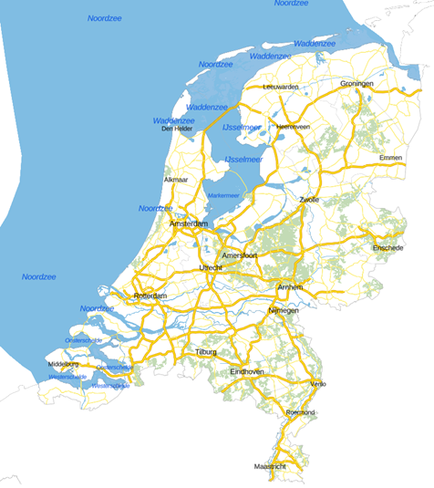
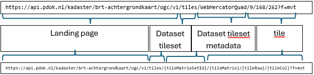

# Analyseer een voorbeeldkaart

Zojuist heb je met behulp van de landing page verkend wat je allemaal met OGC API - Tiles kunt doen. We bekijken nu een voorbeeld web map die gemaakt is met behulp van OGC API - Tiles. Aan de hand hiervan ontdek je hoe een web map werkt en hoe de componenten van OGC API - Tiles met elkaar samenwerken. 

## Bekijk het voorbeeld in een browser

We bekijken nu eerst de voorbeeldwebmap in een webbrowser. 

**:arrow_right: Bekijk** [../voorbeelden/tiles/index.html](../voorbeelden/tiles/index.html)

**:arrow_right: Bekijk de kaart zelf, zoom eens in en uit**


Dit is een web viewer die gemaakt is met de library MapLibre. Deze kaart maakt gebruik van de OGC API – Tiles van de BRT Achtergrondkaart: <https://api.pdok.nl/kadaster/brt-achtergrondkaart/ogc/v1> 


 
!!! question "Vraag"

    Wat verandert er als je in- en uitzoomt op de kaart? 

**:arrow_right: Open de developer tools in je browser.** 

**:arrow_right: Refresh de pagina**

**:arrow_right: Open het Netwerk (Network) tabblad**

**:arrow_right: Bekijk de requests die verschijnen in het Netwerktabblad**


Merk op dat er onder andere een `main.js` en `https://api.pdok.nl/kadaster/brt-achtergrondkaart/ogc/v1/styles/standaard__webmercatorquad?f=json` worden ingeladen.

**:arrow_right: Zoom eens in en uit**

Merk op dat er nu veel bestanden worden ingeladen, bijvoorbeeld `262?f=mvt`. Dit bestand is 1 tile (kaarttegel). De volledige URL van deze tile is: <https://api.pdok.nl/kadaster/brt-achtergrondkaart/ogc/v1/tiles/WebMercatorQuad/9/168/262?f=mvt> 

Je kunt nu zien dat deze web viewer de BRT Achtergrondkaart gebruikt, en meer specifiek de WebMercatorQuad TileMatrixSet. Dat zie je aan de URL’s van de tiles. En je ziet dat de standaard style wordt gebruikt voor deze tilematrixset. Dat zie je aan de style URL die na `main.js` werd ingeladen: <https://api.pdok.nl/kadaster/brt-achtergrondkaart/ogc/v1/styles/standaard__webmercatorquad?f=json>

**:arrow_right: Zoek deze TileMatrixSet en Style ook op via de landing page in de browser:** <https://api.pdok.nl/kadaster/brt-achtergrondkaart/ogc/v1> 

!!! question "Vraag"

    Waar vind je de URL van de TileMatrixSet en de Style die gebruikt zijn in het voorbeeld?
 
De URL is als volgt opgebouwd:



## Bekijk het voorbeeld in een code-editor

We gaan nu de code van dichtbij bekijken. Maak gebruik van een code editor of IDE naar keuze om code te bekijken en uit te voeren. Hieronder een uitleg voor VSCode, maar je kunt natuurlijk zelf een keuze maken. 

**:arrow_right: Fork de Git repository**

**:arrow_right: Clone de Git repository**

**:arrow_right: Open de repository**

Laten we deze code runnen zodat we de applicatie eerst in de browser kunnen bekijken:

**:arrow_right: Start lokaal een web server, bijvoorbeeld met python:**

```
> python -m http.server
Serving HTTP on 0.0.0.0 port 8000 (http://0.0.0.0:8000/) ...
```
**:arrow_right: Bekijk nu** [../voorbeelden/tiles/index.html](../voorbeelden/tiles/index.html) **in de browser**


Laten we nu eens de code bekijken in een editor:

**:arrow_right: Bekijk** `..\voorbeelden\tiles\index.html`

**:arrow_right: Bekijk** `..\voorbeelden\tiles\main.js`

**:arrow_right: Bekijk** <https://api.pdok.nl/kadaster/brt-achtergrondkaart/ogc/v1/styles/standaard__webmercatorquad?f=json>

Als het goed is, zie je in de code `index.html` een `div` met als id `map`.

In `main.js` zie je dat er bij `container` dat er naar diezelfde `map` wordt verwezen. In dit javascript bestand wordt allereerst de `mmplibre-gl` library geïmporteerd. Daarna wordt de kaart gedefinieerd:

- `container`: `map` object in `index.html`
- `style`: verwijst naar een json-bestand: <https://api.pdok.nl/kadaster/brt-achtergrondkaart/ogc/v1/styles/standaard__webmercatorquad?f=json>. Hierin wordt gedefinieerd hoe de tiles gevisualiseerd worden
- `center`: bepaalt het startmiddenpunt van de kaart (x- en y-coördinaten)
- `zoom`: bepaalt het startzoomlevel van de kaart
- `minZoom`: bepaalt het maximale niveau dat je mag uitzoomen
- `maxZoom`: bepaalt het maximale niveau dat je mag inzoomen

Merk op dat je de URL naar de tegels zelf niet ziet in `main.js`. Die URL wordt namelijk in de `style json` aangeroepen. De `main.js` roept de `style json` aan en die roept vervolgens de bron van van de tiles aan. De `style json`  bepaalt ook hoe die tiles weergegeven moeten worden. 
De bron van de tiles is in dit geval dus <https://api.pdok.nl/kadaster/brt-achtergrondkaart/ogc/v1/tiles/WebMercatorQuad/{z}/{y}/{x}?f=mvt>

**:arrow_right: Zoek in de** `style json` **de URL van de tiles op.**

!!! note "Wil je hier meer over weten?"

    Kijk voor een deep dive op <https://ogcapi-workshop.ogc.org/api-deep-dive/tiles/> 

**:arrow_right: Bekijk nog eens** de `style json`: <https://api.pdok.nl/kadaster/brt-achtergrondkaart/ogc/v1/styles/standaard__webmercatorquad?f=json>


Dit is een erg omvangrijke stijl. Hoe is dit opgebouwd? Dit is een json waarin de bron gedefinieerd wordt en de layers die daar in zitten en hoe die layers getoond moeten worden (kleuren, diktes, etc.).

**:arrow_right: Bekijk nog eens** `main.js`

In dit geval staat de `style json` op een externe locatie, maar het kan ook een bestand op je eigen server zijn. 
In dit geval is de `style json` beschikbaar gesteld door PDOK, maar je kunt ook zelf `style json` bestanden maken. Het voorbeeld is een erg groot stijlbestand, maar er zijn ook simpelere stijlen mogelijk.

## Samenvatting

!!! warning "TO DO"