# Maak een kaart met OGC API – Tiles
We gaan zelf een kaart maken met vector tiles met behulp van de library MapLibre. Dit is een JavaScript library voor het maken van interactieve webmaps. Het doel is niet om MapLibre zelf te leren; we gebruiken MapLibre alleen om de werking van OGC API aan te tonen. 

Je maakt deze kaart aan de hand van een casus. Eerst introduceren we deze casus. Hierna maak je je eigen kaart. En tot slot voeg je een OGC API - Tiles toe aan jouw eigen kaart. 

## Introductie casus

Hoe is de leefbaarheid in jouw buurt of wijk? Dat gaan we onderzoeken in deze opdracht. Je gaat een kaart maken die inzicht geeft in de kwaliteit van de leefomgeving van jouw buurt. 

Hoe kun je inzicht geven in de leefbaarheid? Dat kan met verschillende kaartlagen. Zijn er bijvoorbeeld voldoende bomen? Zijn er voldoende scholen in de buurt? Je gaat dit in kaart brengen voor de buurt waar jij woont. 

Met geodata kun je inzicht geven in dit soort vraagstukken. PDOK ontsluit allerlei data over de leefomgeving (maar ook andere thema's) middels OGC API's. En specialisten en ontwikkelaars kunnen met behulp van die API's kaarten en viewers maken om beleidsmakers, analisten en inwoners inzicht te geven in de leefomgeving. 

In deze casus nemen we jou stap voor stap mee:

1. **Maak een ontwerp voor jouw webmap:** voor wie maak je deze webmap? Wat is het doel en welke data is daarvoor nodig en in welke vorm?
2. **Zet een ontwikkelomgeving op:** zet code klaar om mee te werken.
3. **Maak een kaartviewer die als basis kan dienen:** begin met een onderlegger. 
4. **Vind geschikte tiledata:** zoek en vind databronnen.
5. **Voeg de tiledata toe aan jouw kaart:** voeg de kaartlagen toe aan jouw webmap. 
6. **Evalueer het eindresultaat:** komt de webmap overeen met jouw ontwerp?

Je gaat nu aan de hand van bovenstaande stappen jouw eigen webmap maken met OGC API - Tiles. Stapje voor stapje en met behulp van voorbeelden kom je steeds verder. 

Laten we beginnen! 

## Ontwerp jouw webmap

Een goed informatieproduct is nergens zonder een goed ontwerp. Dat geldt zeker voor een webmap. Het is goed om van tevoren na te denken over het doel van de kaart, wie de doelgroep is en wat die doelgroep precies nodig heeft. Anders wordt het een onbruikbare webmap. 

Laten we een ontwerp maken voor de webmap aan de hand van de volgende vragen:

- **Doelgroep:** voor wie is de webmap bedoeld?
- **Doel en scope:** welk doel wil de doelgroep bereiken met de webmap?
- **Benodigde informatie:** welke data is daarvoor nodig en in welke vorm?
- **Geografische afbakening en schaal:** voor welk gebied maak je de webmap en wat is het schaalniveau?

Maak een kort en bondig *ontwerpdocument* waarin je deze vragen beantwoord. 

Voor elk aspect doen we een suggestie. Voor deze fictieve casus kun je de suggestie volgen, maar je bent natuurlijk vrij om zelf iets te bedenken. 

### Doelgroep

Het is belangrijk om te weten wie de doelgroep van de webmap is. Want elke doelgroep heeft weer andere wensen en heeft andere informatie nodig. 

Stel jezelf de vragen: wie is de doelgroep van de kaart? Voor wie moet de kaart inzicht geven? En bestaat die doelgroep uit experts of een breder publiek? Experts zullen waarschijnlijk gedetailleerde informatie nodig hebben. Het is niet erg als er jargon gebruikt wordt. Een breed publiek heeft waarschijnlijk meer behoefte aan meer algemene informatie. Vaktermen moeten dan vermeden worden. 

!!! warning "Toegankelijkheid"

    Hou ook rekening met toegankelijkheid: moet de webmap ook geschikt zijn voor doelgroepen met minder digitale vaardigheden of met visuele beperkingen?

!!! tip

    Normaal gesproken is dit natuurlijk een belangrijke overweging. 
    
    Wij raden aan om voor deze fictieve opdracht de 'geïnteresseerde burger' als doelgroep te nemen. Met deze brede doelgroep voorkom je het risico dat je geen geschikte data kunt vinden, en haal je toch de leerdoelen.

    Natuurlijk mag je zelf ook iets anders kiezen. 

**:arrow_right: Noteer de doelgroep in jouw ontwerpdocument.**

### Doel en scope

Het is belangrijk om een doel voor ogen te hebben voor de webmap.

Stel jezelf de volgende vragen: Welk doel wil de doelgroep bereiken met jouw webmap? Welke vragen worden ermee beantwoord? En wat is de vraag achter de vraag? Met andere woorden: wat wil de gebruiker doen met de informatie in de kaart?

Stel dat we als doel nemen: *inzicht bieden in de leefbaarheid van jouw buurt*. Wat versta je precies onder *inzicht*? En wat versta je precies onder het begrip *leefbaarheid*? 

Een zekere afbakening is ook handig. Waar is de kaart voor bedoeld en waar is de kaart vooral niet voort bedoeld? Met één kaart kun je helaas geen wereldvrede stichten. Met andere woorden: wat is de scope van deze webmap? 

!!! tip

    Normaal gesproken is dit natuurlijk een belangrijke overweging. 
    
    Wij raden aan om voor deze fictieve opdracht 'inzicht bieden in de kwaliteit van de leefomgeving van een buurt' te nemen als doel. Met dit brede doel voorkom je het risico dat je geen geschikte data kunt vinden, en haal je toch de leerdoelen. 

    Natuurlijk mag je zelf ook iets anders kiezen.

**:arrow_right: Noteer het doel en de scope in jouw ontwerpdocument.**

### Benodigde informatie

De doelgroep wil een bepaald doel bereiken met behulp van jouw webmap.

Wat voor soort informatie is er nodig om de doelgroep te helpen met het bereiken van hun doel? Welke informatie/data is daar voor nodig? En in welke vorm moet de data worden aangeboden? 

- **Wat voor informatiebehoefte:** Is er behoefte aan operationele informatie, of informatie die vooral wordt gebruikt voor besluiten op tactisch of strategisch niveau?
- **Aggregatieniveau:** op welk niveau moet de data geaggregeerd zijn? Is er vooral detail nodig of abstracte informatie (bijvoorbeeld gemiddeldes)?
- **Tijdschaal:** op welke tijdschaal is er informatie nodig? Actuele data of bijvoorbeeld gemiddeldes over de afgelopen jaren?
- **Visualisatie:** hoe moet de data worden gevisualiseerd? 

Welke informatie benodigd is en in welke vorm bepaalt welke datasets je gebruikt voor je webmap.

!!! warning "Toegankelijkheid"

    Hou ook rekening met toegankelijkheid bij de visualisatie: moet de webmap ook geschikt zijn voor bijvoorbeeld kleurenblinden? 

**:arrow_right: Noteer de benodigde informatie en vorm in jouw ontwerpdocument.**

### Geografische afbakening en schaal

Op welk schaalniveau wil jouw doelgroep de informatie hebben? Is dit op landelijk niveau? Op gemeentelijk niveau? Of bijvoorbeeld op wijkniveau?

Het geografische schaalniveau bepaalt ook of de data gedetailleerd of abstract moet zijn. 

En hoe baken je het gebied af? Je kan de kaart maken voor de plek waar jij woont, maar dit mag ook een andere plek in Nederland zijn. 

!!! tip

    Normaal gesproken is dit natuurlijk een belangrijke overweging. 
    
    Wij raden aan om voor deze fictieve opdracht jouw eigen buurt te gebruiken. 

    Natuurlijk mag je zelf ook iets anders kiezen.

**:arrow_right: Noteer de geografische afbakening en de schaal in jouw ontwerpdocument.**

Als het goed is, heb je nu een ontwerp met de volgende aspecten:

- **Doelgroep:** voor wie is de webmap bedoeld?
- **Doel en scope:** welk doel wil de doelgroep bereiken met de webmap?
- **Benodigde informatie:** welke data is daarvoor nodig en in welke vorm?
- **Geografische afbakening en schaal:** voor welk gebied maak je de webmap en wat is het schaalniveau?

## Maak jouw eigen webmap

Nu het ontwerp gereed is, is het tijd om aan de slag te gaan. Allereerst zet je een ontwikkelomgeving op om in te werken en te testen. Vervolgens maak je op basis van het voorbeeld, dat we beschikbaar hebben gesteld in deze repo, een webmap die als basis dient voor de rest van je project. Tot slot zoek je tiledata die geschikt is voor jouw web map en voeg je deze toe.

### Zet een ontwikkelomgeving op

Zet een ontwikkelomgeving op waarin je de webmap kunt ontwikkkelen en testen. 

Als eerste heb je de voorbeeldcode nodig die wij hebben gemaakt en die te vinden is in deze repository. In de casus ga je voortborduren op het voorbeeld, zodat je niet het wiel opnieuw uit hoeft te vinden.

Als het goed is heb je in het onderdeel [Analyseer een voorbeeldkaart](<./Analyseer een voorbeeldkaart.md/#bekijk-het-voorbeeld-in-een-code-editor>) deze GitHub repository al gecloned. Maar mocht je dit nog niet gedaan hebben: hier volgt de uitleg. 

Wij suggereren twee verschillende aanpakken: in een IDE werken of werken met een file manager en een teksteditor. 

Hieronder volgt de uitleg voor Visual Studio Code en de meer klassieke aanpak. Maar uiteraard kun je zelf ook een andere IDE of een andere aanpak gebruiken. 

=== "VSCode"

    1. Open VSCode
    2. Klik op 'Clone Git Repository'

        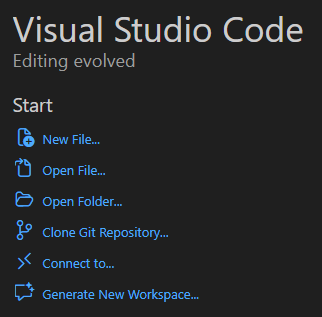
    
        Gebruik daarbij de volgende URL: <https://github.com/PDOK/leermodule-ogc-api>

        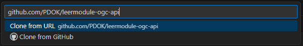
    
    3. Kies een locatie op jouw schijf om de repository te downloaden en klik op 'Select as Repository Destination'

    4. Wacht tot de repository is gedownload

    5. Klik op 'Open':

        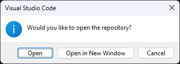    

    6. Klik op 'Yes, I trust the authors':

        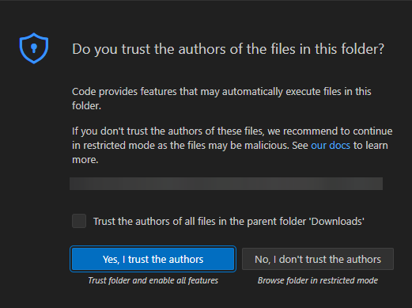 

    7. Bekijk de bestanden in de Explorer (linkertabblad)

        De voorbeeldcode bevindt zich in `docs/voorbeelden/tiles`

    8. Maak in de repository een nieuwe folder aan, en zet daarin een kopie van de voorbeeldcode.

        Op die manier hou je het voorbeeld schoon en kun je daar altijd op teruggrijpen.  

    9. Zet een lokale test web server op in de folder die je zojuist hebt gemaakt:

        Open een Terminal (View -> Terminal) en voer uit:

        ```
        cd %jouwfolder
        python -m http.server
        ```

        Vervang `%jouwfolder` door de locatie van de folder waar jij de voorbeeldcode naartoe hebt gekopieerd

    10. Ga in je webbrowser naar `localhost:8000` om het voorbeeld te bekijken.

=== "Klassieke aanpak met file manager en teksteditor"

    1. Ga naar de repository op GitHub: <https://github.com/PDOK/leermodule-ogc-api>
    2. Klik op 'Code' en vervolgens op Download ZIP

        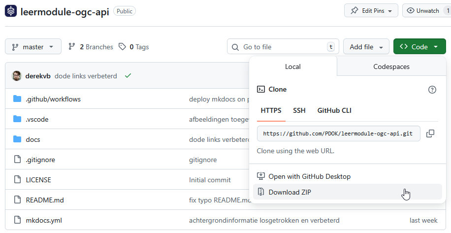

    3. Pak de zip uit op jouw schijf

    4. Bekijk de bestanden in een File explorer 

        De voorbeeldcode bevindt zich in de folder `docs/voorbeelden/tiles`

    5. Maak in de repository een nieuwe folder aan, en zet daarin een kopie van de voorbeeldcode.

        Op die manier hou je het voorbeeld schoon en kun je daar altijd op teruggrijpen.  

    6. Open een commandline

    7. Zet een lokale test web server op in de folder die je zojuist hebt gemaakt:

        ```
        cd %jouwfolder
        python -m http.server
        ```

        Vervang `%jouwfolder` door de locatie van de folder waar jij de voorbeeldcode naartoe hebt gekopieerd

    8. Ga in je webbrowser naar localhost:8000 om het voorbeeld te bekijken.

    Je kunt de code vervolgens bewerken in een teksteditor zoals Notepad++ of Sublime Text. 

### Maak een basiskaart

In deze stap maak je op basis van het voorbeeld een webmap die als basis dient voor de rest van het project. 

Voordat we echt aan de slag gaan met data, moet er een goede basis liggen. In `index.html` en `main.js` ga je zelf de volgende zaken aanpassen op basis van jouw ontwerp:

- Titel van de webmap
- Achtergrondkaart en bijbehorende stijl
- Geografisch:
    - Initieel zoomniveau
    - Initieel center
    - De 'bounds' van de kaart

#### Pas index.html aan

**:arrow_right: Open `index.html`**

**:arrow_right: Pas de titel aan:**

    <title>Jouw titel</title>

**:arrow_right: Vergeet je wijzigingen niet op te slaan**

#### Pas main.js aan

**:arrow_right: Open `main.js`**

    const map = new maplibregl.Map({
    container: 'map', // container id
    style: 'https://api.pdok.nl/kadaster/brt-achtergrondkaart/ogc/v1/styles/standaard__webmercatorquad?f=json', // style URL
    center: [5.44, 52.05], // starting position [lng, lat]
    zoom: 7, // starting zoomlevel
    minZoom: 6, // minimum zoomlevel zoom out
    maxZoom: 14 // maximum zoomlevel zoom in

In het voorbeeld hebben we gekozen voor de BRT Achtergrondkaart met de standaard stijl in WebMercator. We raden sterk aan om in jouw eigen web map ook de WebMercator BRT Achtergrondkaart te gebruiken. Wel zou je een andere stijl dan de standaard stijl kunnen gebruiken:

**:arrow_right: Ga naar <https://api.pdok.nl/kadaster/brt-achtergrondkaart/ogc/v1/styles>**

**:arrow_right: Kies met behulp van de voorbeeldweergave een WebMercatorQuad style**

**:arrow_right: Plak de URL in jouw code**

Standaard krijg je heel Nederland te zien wanneer je de kaart opent. Het is handiger als de kaart meteen is ingezoomd op jouw eigen interessegebied. 

**:arrow_right: Ga naar <https://vibhorsingh.com/boundingbox/>**

**Zoom in naar jouw interessegebied**

**Gebruik het Center in jouw `main.js`:**

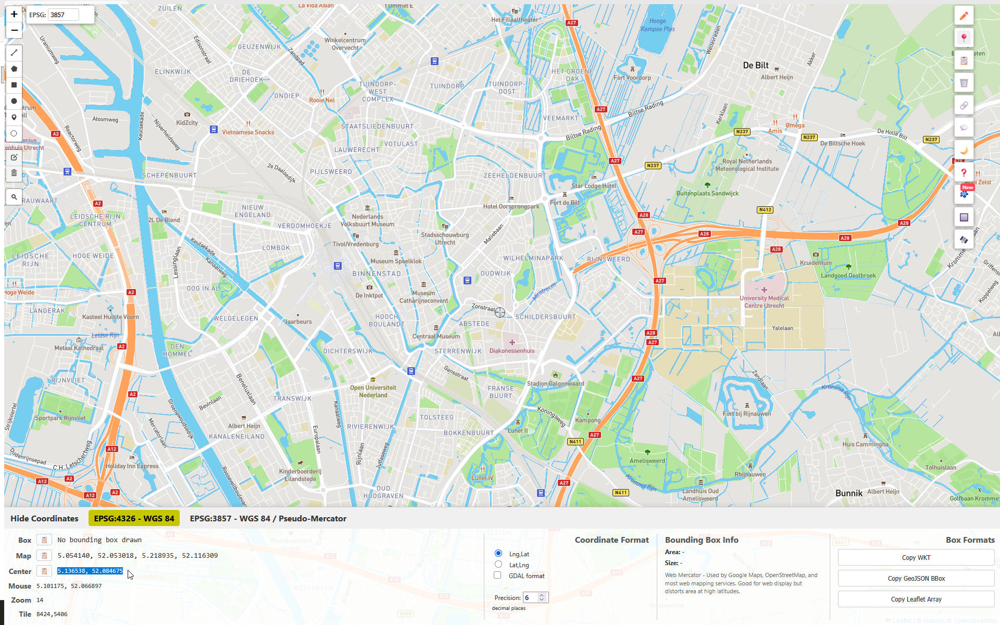

    center: [5.44, 52.05]

Wellicht wil je ook dat gebruikers alleen jouw interessegebied kunnen bekijken en de kaart niet daar buiten kunnen verplaatsen. Je kunt dit bereiken door 'maxBounds' in te stellen. 

In combinatie met de 'maxBounds' is het ook handig om het initiële, maximale en minimale zoomniveau te beperken. Laten we dat eerst doen.

**:arrow_right: Open jouw eigen webmap in een webbrowser**

**:arrow_right: Open het netwerk-tabblad in de developer tools**

**:arrow_right: Zoom in naar het gewenste:**

- **Initiële zoomniveau**
- **Zoomniveau dat de gebruiker maximaal mag uitzoomen**
- **Zoomniveau dat de gebruiker maximaal mag inzoom**

**:arrow_right: Noteer/kopieer hierbij de zoomlevels die je ziet in de URL's van de tegelrequests:**

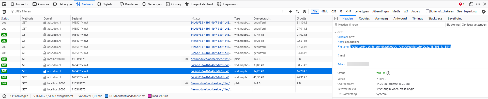

Voeg deze zoomlevels toe in je code:

    zoom: 7, // starting zoomlevel
    minZoom: 6, // minimum zoomlevel zoom out
    maxZoom: 14 // maximum zoomlevel zoom in

Je hebt nu de zoomlevels afgedwongen voor de gebruiker. Laten we nu het `maxBounds` opzoeken. De `maxBounds` zijn coördinaten die als het ware de begrenzing van het kaartvenster vormen. Om die coördinaten te bepalen kunnen we weer de Bounding box online tool gebruiken. 

**:arrow_right: Kijk nogmaals op <https://vibhorsingh.com/boundingbox/>**

**:arrow_right: Zoom zo ver mogelijk uit op jouw interessegebied, zodat het nét in het kaartvenster past**

**:arrow_right: Kopieer de coördinaten achter 'Map':**

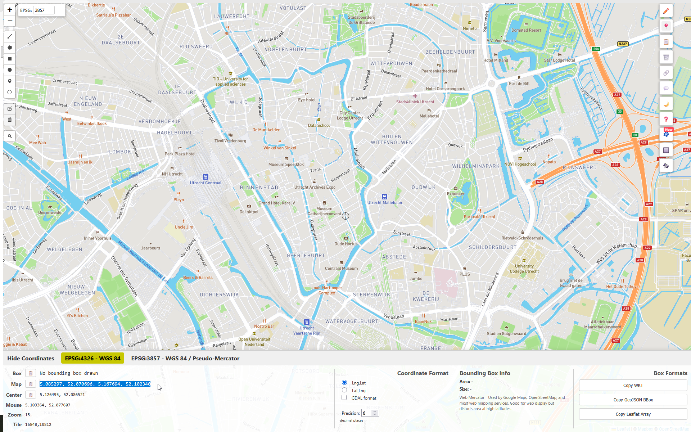

!!! tip

    Let op dat de `maxBounds`, `maxZoom` en `minZoom` in overeenstemming met elkaar moeten zijn. Wanneer de ingestelde `maxBounds` zich buiten het gebied bevinden dat je initieel ziet, zal het niet goed werken. Dit vraagt wat trial-and-error. 

**:arrow_right: Voeg de volgende code toe aan jouw `main.js`:**

    maxBounds: [5.08530, 52.07246], [5.16769, 52.10060] //vervang de coördinaten door jouw eigen coördinaten. 

**:arrow_right: Test jouw web map: Werkt het goed en is jouw interessegebied volledig zichtbaar?**

Als het goed is, heeft jouw kaart nu een goed initieel zoomlevel, minimum zoomlevel, maximum zoomlevel en is de view beperkt tot jouw interessegebied. 

!!! info "Zoomlevel"

    Wellicht is het je opgevallen dat je op <https://vibhorsingh.com/boundingbox/> ook het zoomlevel kunt zien. Toch gebruiken we het netwerktabblad in onze eigen webmap om de zoomlevels te achterhalen. Er is namelijk een verschil tussen het zoomlevel in de tool en het zoomlevel in onze eigen webmap. 

!!! question "Vraag"

    Waar wordt het verschil tussen het zoomlevel in <https://vibhorsingh.com/boundingbox/> en het zoomlevel in je eigen webmap door veroorzaakt?

??? success "Antwoord"

    De boundingbox tool gebruikt 'XYZ' tiles van Mapbox. Die gebruiken een ander tiling scheme: de tegelgrootte is bijvoorbeeld 512x512 pixels ipv 256x256 pixels. 

### Vind geschikte vector tiledata

De basis staat! Nu is het tijd om kaartlagen toe te voegen. Als het goed is, heb je in de ontwerpfase geïdentificeerd welke informatie je wilt tonen. Nu ga je hier geschikte databronnen voor zoeken. 

!!! info "(Vector) tiles?"

	We richten ons in dit onderdeel specifiek op vector tiles. Met OGC API - Tiles kunnen in principe ook raster tiles beschikbaar worden gesteld: bijvoorbeeld een luchtfoto. Maar we behandelen nu alleen vector tiles. 

Er zijn veel verschillende plekken waar je geodatasets kunt vinden. We beperken ons voor nu tot het [Nationaal Georegister](https://www.nationaalgeoregister.nl/) en [PDOK.nl](https://www.pdok.nl/). 

!!! info "Nationaal Georegister"

    Het Nationaal Georegister (NGR) is een vindplek voor geodatasets. Organisaties kunnen hun data kenbaar maken via het NGR. De data wordt niet gehost op het NGR, er wordt slechts een verwijzing opgenomen naar de databron. Daarnaast vind je voor elke dataset een beschrijving en gegevens over de contactpersoon, actualiteit en nog veel meer. Het NGR is dus een metadataregister: het bevat data over data. 

    PDOK daarentegen is een databron: op het PDOK-platform hosten organisaties hun data. Data van PDOK is vindbaar op [de website van PDOK](<https://www.pdok.nl/datasets>), maar ook op het NGR. 

Er zijn veel verschillende soorten geodatasets. Je kunt data downloaden in verschillende bestandsformaten, zoals Geopackage, maar ook via verschillende soorten web services en API's. Voor dit onderdeel van de leermodule beperken we ons tot de **vector tiles van PDOK**. 

Vector tiles is dan ook een zeer geschikte vorm van data voor ontsluiting via een webmap. 

We gaan nu naar het Nationaal Georegister en stellen daar filters in zodat we alleen vector tiles van PDOK te zien krijgen:

**:arrow_right: Ga naar <https://www.nationaalgeoregister.nl/>**

**:arrow_right: Laat de zoekbalk leeg en klik op 'Zoeken'**

We krijgen nu alle datasets op het NGR te zien (hoeveel zijn het er?) maar we kunnen nu wel de zoekopdracht verder verfijnen met de filters aan de linkerkant. 

**:arrow_right: Vink bij Organisaties alleen 'Beheer PDOK' aan**

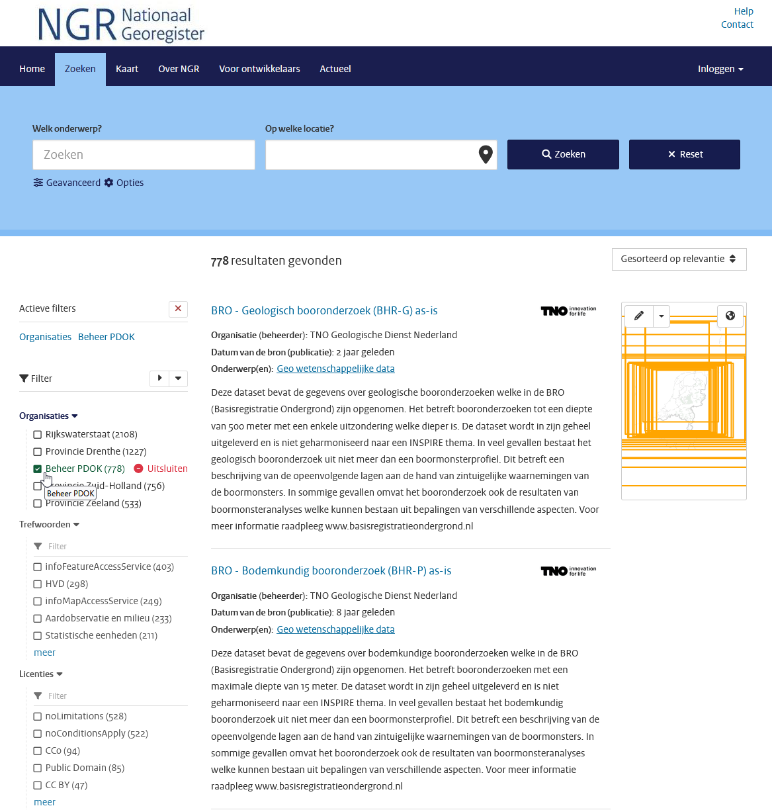

**:arrow_right: Vink nu bij Brontype alleen 'service' aan**

!!! info

    In het NGR wordt onderscheid gemaakt tussen Datasets en Services. Een Dataset wordt ontsloten via 1 of meerdere services. Een Dataset record gaat over de dataset zelf en bevat voor inhoudelijke informatie over die dataset. Een Service record gaat over de verschillende ontsluitingen van een dataset, zoals WFS, WMS of Atom. 

    Bijvoorbeeld: de dataset BGT heeft meerdere services: download API, OGC API - Tiles, OGC API - Features en WMTS. 
    
    En in dit geval zijn we op zoek naar alle OGC API - Tiles ontsluitingen. 

**:arrow_right: Vink nu bij Online Bronnen alleen 'OGC:API tiles' aan**

(waarschijnlijk moet je op 'meer' klikken voordat je deze te zien krijgt)

Nu krijg je alle OGC API - Tiles van PDOK te zien:

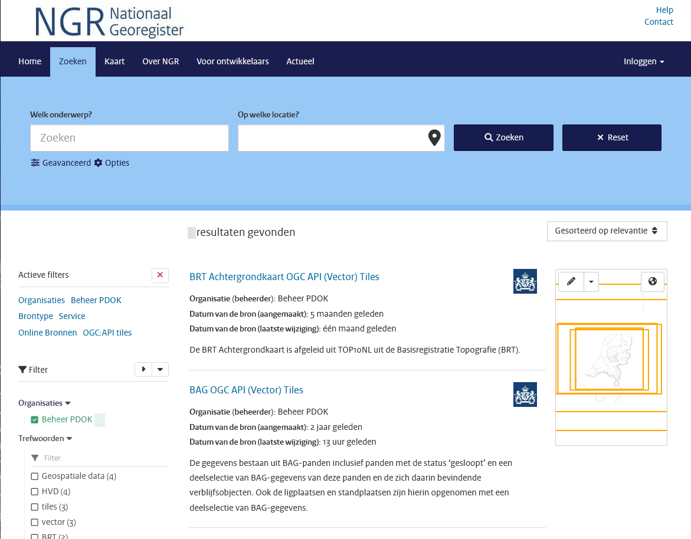

!!! question "Vraag"

    Hoeveel OGC API - Tiles services krijg je nu te zien?

??? success "Antwoord"

    Momenteel (december 2025) zijn er 7 datasets met een OGC API - Tiles:

    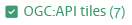

!!! info

    Alle datasets van PDOK zijn ook vindbaar via [pdok.nl/datasets](<https://www.pdok.nl/datasets>). De API's van PDOK (onder andere download API's en OGC API's) zijn bovendien vindbaar via [api.pdok.nl](<https://api.pdok.nl/>). Echter, het Nationaal Georegister heeft betere mogelijkheden om het aanbod te doorzoeken (bijvoorbeeld met de filters die je zojuist hebt gebruikt)

Nu je weet hoe je op NGR alle beschikbare OGC API - Tiles kunt vinden, is het tijd om te onderzoeken welke tilesets geschikt zijn voor jouw casus. 

!!! info

    Het aanbod vector tiles is op dit moment (december 2025) nog wat beperkt. Wellicht heb je daar last van voor het uitvoeren van jouw casus. We hopen het aanbod spoedig uit te breiden!

!!! question "Vraag"

    Welke OGC API - Tiles herken je al uit de eerdere oefeningen? 

Ga op ontdekkingstocht in het beschikbare aanbod. Doe dit aan de hand van jouw ontwerp. 

**:arrow_right: Verken de verschillende datasets op NGR en onderzoek de geschiktheid voor jouw casus:**

- **Lees de beschrijvingen**
- **Bekijk de landing pages: welke collecties zijn er? Wat bevatten die collecties? Welke tilesets zijn er beschikbaar?**

**:arrow_right: Kijk nog eens naar jouw ontwerp:**

- **Is de dataset geschikt voor jouw doelgroep?**
- **Bevat de dataset informatie die relevant is voor jouw doel?**
- **Bevat de dataset informatie in een geschikte vorm?**
- **Is de geografische afbakening en schaal geschikt voor jouw doel?**

Voer vervolgens de volgende stappen uit (we leggen hierna uit hoe je dit precies doet aan de hand van een voorbeeld). 

**:arrow_right: Zoek de URL van de Tile Set of de URL van de Style op.**

**:arrow_right: Voeg de Tile Set toe aan jouw web map.**

We laten nu zien hoe je één kaartlaag toevoegt. We doen dit met de 'BRT TOP10NL OGC API (Vector) Tiles'. 

Daarna is het aan jou om dit zelf te doen met andere kaartlagen. 

**:arrow_right: Ga weer terug naar NGR, naar de OGC API - Tiles resultaten:**


**:arrow_right: Zoek en klik op 'BRT TOP10NL OGC API (Vector) Tiles'**

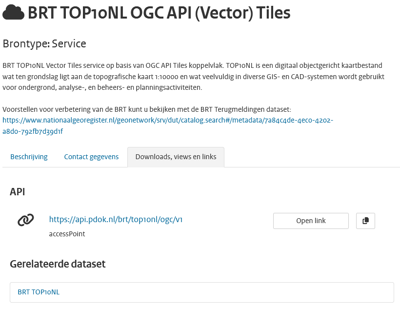

**:arrow_right: Lees de beschrijving en bekijk de gerelateerde dataset BRT TOP10NL (dit is het het bijbehorende dataset record)**

**:arrow_right: Klik onder 'Downloads, views en links' op de API URL**

Je gaat nu naar de inmiddels welbekende landing page!

### Voeg de vector tiledata toe aan jouw kaart

Je kunt vector tiledata op twee manieren toevoegen aan jouw webmap: 1) voeg losse kaartlagen toe of 2) maak gebruik van een style. 

Beide methodes hebben zo hun voor- en nadelen. 

Wanneer je losse kaartlagen toevoegt, moet je wel weten hoe deze kaartlagen precies heten. We lichten dit verderop toe. Daarnaast is het toevoegen van heel veel kaartlagen is niet erg efficiënt. 

Je kunt ook gebruik maken van een style. Je kunt gebruik maken van een styling die door PDOK wordt aangeboden, een bestaande style aanpassen of helemaal zelf een style maken. Je kunt echter maar van één style tegelijk gebruik maken. 

We demonstreren beide methodes. 

#### Vector tiledata als losse kaartlagen toevoegen

Ga op de landing page naar Tiles

**:arrow_right: Klik in het dropdownmenu bij 'Tile Matrix Set' op 'WebMercatorQuad'**

!!! info "Gebruik altijd één en dezelfde Tile Matrix Set in MapLibre"

    Je kunt niet meerdere verschillende CRS'en met elkaar combineren, namelijk. 

**:arrow_right: Klik op 'Bekijk metadata'**

**:arrow_right: Klik op 'JSON'**

**:arrow_right: Kopieer de URL**

Je hebt nu de URL van de tileset die je kunt gebruiken in je code. 

Door de volgende code toe te voegen aan `main.js`, kun je de `gebouw_vlak` layer uit de BRT TOP10NL toevoegen aan je webmap.

**:arrow_right: Voeg onderstaande code toe aan main.js:**

    map.on('load', () => {
        map.addSource('top10nl', {
            type: 'vector',
            url:
                'https://api.pdok.nl/brt/top10nl/ogc/v1/tiles/WebMercatorQuad?f=tilejson'
        });
        map.addLayer({
            'id': 'gebouw_vlak',
            'type': 'fill',
            'source': 'top10nl',
            'source-layer': 'gebouw_vlak',
            'paint': {
                'fill-color': '#ff0000ff'
            }
        });
    });

!!! info "Zoomlevel"

    Let op in welke zoomlevels de tileset beschikbaar is. Dit kun je vinden in de metadata, bijvoorbeeld: <https://api.pdok.nl/brt/top10nl/ogc/v1/tiles/WebMercatorQuad>

    Wellicht moet je dus inzoomen voordat de zojuist toegevoegde kaartlaag zichtbaar wordt. 

Wat doet de code in het voorbeeld precies? 

Wanneer de kaart is ingeladen, wordt er allereerst een bron toegevoegd. Hiervoor wordt de [WebMercatorQuad tileset](<https://api.pdok.nl/brt/top10nl/ogc/v1/tiles/WebMercatorQuad>) van de BRT TOP10NL gebruikt. 

Vervolgens wordt de kaartlaag `gebouw_vlak` uit deze `source` (`brt`) toegevoegd. Het type kaartlaag is `fill` (een opgevulde polygon). Deze krijgt de zelfgekozen id `gebouw_vlak` maar heet in de `source` ook `gebouw_vlak`. 

Tot slot wordt de kaartlaag opgemaakt met een `fill-color` (opvulkleur). 

We gebruiken dus de kaartlaag `gebouw_vlak` uit deze tileset. Hoe weet je nou welke kaartlagen er in de tileset zitten en hoe die kaartlagen precies heten?

Je kunt hier op drie verschillende manieren achterkomen: 

1. Kijk welke feature collections er zijn en hoe die heten (mits deze dataset is voorzien van OGC API - Features).
2. Bekijk een style json, kijk welke kaartlagen hierin genoemd worden
3. Open de style in een client zoals QGIS

##### Optie 1: Kijk welke feature collections er zijn

Via de landing page kun je zien of de dataset is voorzien van een OGC API - Features. Als dit het geval is, zijn er collections. De namen van de collections komen als het goed is overeen met de namen van layers in de tiles. Deze namen kun je vervolgens gebruiken om een source-layer aan te roepen in je code. 

Deze optie werkt alleen als er een OGC API - Features is voor de dataset, en wanneer de namen van de kaartlagen overeen komen. 

##### Optie 2: Bekijk een style json, kijk welke kaartlagen hierin genoemd worden

Via de landing page kun je via de pagina Styles en vervolgens de JSON weergave van een specifieke style bekijken welke kaartlagen er gebruikt worden door de style uit dezelfde `source`. 

Bijvoorbeeld in <https://api.pdok.nl/brt/top10nl/ogc/v1/styles/brt_top10nl__webmercatorquad?f=json>. De namen van de kaartlagen vind je onder `"layers": []` . Deze namen kun je vervolgens gebruiken om een source-layer aan te roepen in jouw code.

##### Optie 3: Open de style in een client zoals QGIS

In een GIS-client, zoals QGIS, kun je ook tiles en styles inladen. Je kunt dan in de UI bekijken welke kaartlagen in de style in de source zitten. Die namen kun je vervolgens in jouw eigen code aanroepen.

#### Vector tiledata door middel van een style toevoegen

Een alternatief voor het toevoegen van losse kaartlagen is om gebruik te maken van een style. In `main.js` wordt als volgt een style aangeroepen:

    style: 'https://api.pdok.nl/kadaster/brt-achtergrondkaart/ogc/v1/styles/standaard__webmercatorquad?f=json', // style URL

Je kunt deze URL vervangen door een andere kant-en-klare style van PDOK, een andere style ergens op internet of een eigen lokaal stylebestand. Je kunt echter maar van één style tegelijk gebruik maken. Een style bevat één of meerdere sources en kan heel veel layers bevatten.

Je hebt drie opties voor de styling:

1. Gebruik een kant-en-klare bestaande style
2. Pas een kant-en-klare style aan
3. Maak zelf een nieuwe style *from scratch*

##### Optie 1: Gebruik een kant-en-klare bestaande style

Je kunt één van de kant-en-klare stijlen die door PDOK worden aangeboden gebruiken. Je kunt dit doen door naar de Styles pagina op de landing page te gaan, met het dropdownmenu een style te kiezen en de URL te kopiëren van een JSON-weergave van een stijl. Plak de URL in jouw `main.js` bij `style`.

##### Optie 2: Pas een kant-en-klare style aan

Je kunt de inhoud van één van de bestaande PDOK styles (zie hierboven) kopiëren en zelf aanpassen. Immers, beter goed gejat dan slecht bedacht! Pas bijvoorbeeld de kleuren aan of laat kaartlagen die je niet interessant vind weg. Vervolgens host je dit JSON-bestand zelf en verwijs je hiernaar in je `main.js`:

    style: './jouwstyle.json', // style URL

We hebben een simpele voorbeeldstyle gemaakt op basis van de TOP10NL OGC API - Tiles. Deze vind je in [style_voorbeeld.json](../voorbeelden/tiles/style_voorbeeld.json) en hieronder:

??? tip "Style voorbeeld"

		{
		  "version": 8,
		  "metadata": {
			"ol:webfonts": "https://api.pdok.nl/brt/top10nl/ogc/v1/resources/fonts/{font-family}/{fontweight}{-fontstyle}.css",
			"gokoala:title-items": "id"
		  },
		  "name": "",
		  "center": [
			5.3878,
			52.1561
		  ],
		  "pitch": 0,
		  "sources": {
			"top10nl": {
			  "type": "vector",
			  "tiles": [
				"https://api.pdok.nl/brt/top10nl/ogc/v1/tiles/WebMercatorQuad/{z}/{y}/{x}?f=mvt"
			  ],
			  "minzoom": 14,
			  "maxzoom": 17
			}
		  },
		  "sprite": "https://api.pdok.nl/brt/top10nl/ogc/v1/resources/standaardsprites/sprite@1",
		  "glyphs": "https://api.pdok.nl/brt/top10nl/ogc/v1/resources/fonts/{fontstack}/{range}.pbf",
		  "layers": [
			{
			  "id": "functioneel_gebied_vlak",
			  "type": "fill",
			  "source": "top10nl",
			  "source-layer": "functioneel_gebied_vlak",
			  "paint": {
				"fill-color": "#ffffff",
				"fill-opacity": 0,
				"fill-outline-color": "#38A800"
			  }
			},
			{
			  "id": "grasland_terrein_vlak",
			  "type": "fill",
			  "source": "top10nl",
			  "source-layer": "terrein_vlak",
			  "filter": ["in", "visualisatiecode", 14130, 14132, 14133],
			  "paint": {
				"fill-color": "#C3DBB5"
			  }
			},
			{
			  "id": "waterdeel_vlak",
			  "type": "fill",
			  "source": "top10nl",
			  "source-layer": "waterdeel_vlak",
			  "paint": {
				"fill-color": "#80BDE3"
			  }
			},
			{
			  "id": "waterdeel_lijn",
			  "type": "fill",
			  "source": "top10nl",
			  "source-layer": "waterdeel_lijn",
			  "paint": {
				"fill-color": "#80BDE3"
			  }
			},
			{
			  "id": "gebouw_vlak",
			  "type": "fill",
			  "source": "top10nl",
			  "source-layer": "gebouw_vlak",
			  "paint": {
				"fill-color": "#8f8f8fff",
				"fill-outline-color": "#9c9c9cff"
			  }
			},
			{
			  "id": "hoofdweg wegdeel_vlak",
			  "type": "fill",
			  "source": "top10nl",
			  "source-layer": "wegdeel_vlak",
			  "filter": [
				"in",
				"visualisatiecode",
				10302,
				10300,
				10301,
				10310,
				10311,
				10312
			  ],
			  "paint": {
				"fill-color": "#E60000"
			  }
			}
		  ]
		}

!!! info "Zoomlevel"

    Let bij het gebruiken van deze voorbeeldstyle weer op het minimale en maximale zoomlevel van deze tileset. Deze vind je ook hier: <https://api.pdok.nl/brt/top10nl/ogc/v1/tiles/WebMercatorQuad>

    Pas het initiële zoomlevel van jouw webmap aan, wanneer je niks ziet. 

##### Optie 3: Maak zelf een nieuwe style *from scratch*

Je kunt ook helemaal uit het niets zelf een nieuwe style maken. Dit bestand host je vervolgens zelf en in `main.js` verwijs je hiernaar. 

Je kunt hiervoor de documentatie van de MapLibre style spec gebruiken: <https://maplibre.org/maplibre-style-spec/>

En je kunt natuurlijk slim gebruik maken van voorbeelden, om te leren hoe dit moet. 

Hoe kun je punten, lijnen en vlakken toevoegen en opmaken? We geven drie korte voorbeelden:

###### Punt toevoegen

Om een puntenkaartlaag te visualiseren kun je in de MapLibre style spec `symbol` of `circle` gebruiken. In een style json kun je deze als volgt toevoegen en opmaken:

    "layers": [
        {
            "id": "windmolen", // vervang door een zelfgekozen naam
            "type": "symbol",
            "source": "top10nl", // vervang door de naam van jouw bron
            "source-layer": "windmolen", // vervang door de naam van een bestaande kaartlaag
            "layout": {
                "icon-image": "windmolen" // vervang door de naam van een bestaande afbeelding in "sprite"
            }
        }
    ]

Of een circle:

    "layers": [
		{
			"id": "functioneel_gebied_punt", // vervang door een zelfgekozen naam
			"type": "circle",
			"source": "top10nl", // vervang door de naam van jouw bron
			"source-layer": "functioneel_gebied_punt", // vervang door de naam van een bestaande kaartlaag
			"paint": {
				"circle-radius": 3.3, // straal van de cirkel
				"circle-stroke-color": "#38A800" // kleur van de cirkel
			}
		}
    ]

Je kunt symbol ook voor tekstlabels gebruiken. Bijvoorbeeld zo:

    "layers": [
		{
			"id": "hoogte_punt", // vervang door een zelfgekozen naam
			"type": "symbol",
			"source": "top10nl", // vervang door de naam van jouw bron
			"source-layer": "hoogte_punt", // vervang door de naam van een bestaande kaartlaag
			"layout": {
				"text-field": "{hoogte}",  // vervang door de tekst die je wilt tonen of een attribuut dat de tekst bevat
				"text-size": 10.4, // tekstgrootte
				"text-font": [ // lettertypes die gebruikt mogen worden (als er een lettertype niet aanwezig is, wordt teruggevallen op het lettertype eronder)
					"Liberation Sans Bold Italic",
					"system-ui",
					"Roboto",
					"Arial",
					"Noto Sans",
					"Liberation Sans",
					"sans-serif",
					"Noto Color Emoji"
				]
			},
			"paint": {
				"text-color": "#0000FF" // tekstkleur
			}
		}
    ]

###### Lijn toevoegen

Een lijn heet in de MapLibre style spec simpelweg `line`. In een style json kun je deze als volgt toevoegen en opmaken:

    "layers": [
        {
			"id": "waterdeel_lijn", // vervang door een zelfgekozen naam
			"type": "fill",
			"source": "top10nl", // vervang door de naam van jouw bron
			"source-layer": "waterdeel_lijn", // vervang door de naam van een bestaande kaartlaag
			"paint": {
			    "fill-color": "#80BDE3"
			}
		}
    ]

###### Vlak toevoegen

Een vlak heet in de MapLibre style spec `fill`. In een style json kun je deze als volgt toevoegen en opmaken:

    "layers": [
        {
			"id": "gebouw_vlak", // vervang door een zelfgekozen naam
			"type": "fill",
			"source": "top10nl", // vervang door de naam van jouw bron
			"source-layer": "gebouw_vlak", // vervang door de naam van een bestaande kaartlaag
			"paint": {
			    "fill-color": "#8f8f8fff",
				"fill-outline-color": "#9c9c9cff"
			}
		}
    ]

!!! info "Vlak toevoegen"

	Wil je alleen de omlijning van een vlak tonen, en niet de binnenkant van het vlak inkleuren (dus een transparante invulling)? Dan kun je het vlak het beste als `line` visualiseren. 

Hieronder vatten we samen welk `type` je nodigt hebt voor de geometrietypen:

| Geometrietype | MapLibre style spec naam |
| --- | --- |
| Point | met een symbool: `symbol`. Als een simpele cirkel: `circle` |
| LineString | `line` | 
| Polygon | Transparante vulling: `line`. Gekleurde vulling: `fill` |


#### Samenvatting kaartlagen toevoegen

Je hebt nu gezien dat je kaartlagen kunt toevoegen op twee manieren: 1) voeg losse kaartlagen toe in `main.js` en 2) voeg kaartlagen toe via een style. In onderstaande tabel vatten we het nog eens samen:

| Methode | Optie | Beschrijving |
| --- | --- | --- |
| Losse kaartlagen toevoegen | | Voeg in `main.js` een source toe en kaartlagen. Je kunt dit bovenop een bestaande style doen |
| Voeg kaartlagen toe via een style | Kant-en-klare style | Gebruik de URL van een bestaande style |
| | Pas een bestaande style aan | Kopieer een bestaande style, pas deze aan, host deze zelf en verwijs hiernaar in `main.js` |
| | Maak een nieuwe style | Maak een nieuwe style, host deze zelf en verwijs hiernaar in `main.js` | 


!!! question "Vraag"

    Wat zijn de voor- en nadelen van de verschillende methodes om kaartlagen toe te voegen? Wat vind jij de beste methode en waarom? 

#### Opdracht: voeg zelf kaartlagen toe

Je hebt nu gezien dat je kaartlagen op meerdere manieren kunt toevoegen en stylen. We hebben dit aan de hand van voorbeelden voor gedaan.  

Het is nu aan jou om verschillende extra kaartlagen toe te voegen. Je mag zelf bepalen op welke manier je dit doet, maar:

**:arrow_right: Voeg minimaal 4 extra kaartlagen toe**

**:arrow_right: Waarvan minimaal:**

- **1 kaartlaag met punten (van het type `symbol` of `circle`)**
- **1 kaartlaag met lijnen (van het type `line`)**
- **1 kaartlaag met polygonen (van het type `fill`)**

**:arrow_right: Gebruik minimaal 3 verschillende kleuren**

Grijp terug op je ontwerp om te bepalen welke kaartlagen je het beste kunt toevoegen. 

### Optioneel: extra functionaliteit

!!! info "Dit onderdeel is optioneel"

Voeg extra functionaliteit aan de webmap toe. Kijk hiervoor in de officiële documentatie van MapLibre:

- [MapLibre GL JS API](<https://maplibre.org/maplibre-gl-js/docs/API/>)
- [MapLibre GL JS voorbeelden](<https://maplibre.org/maplibre-gl-js/docs/examples/>)
- [Plugins voor MapLibre GL JS](<https://maplibre.org/maplibre-gl-js/docs/plugins/>)

Je kunt denken aan extra functionaliteit zoals:

- [Een legenda, zodat het voor de gebruiker duidelijk is wat de kleuren betekenen](<https://github.com/watergis/maplibre-gl-legend>);
- [Pop-ups met extra informatie over de objecten in de kaart](<https://maplibre.org/maplibre-gl-js/docs/examples/attach-a-popup-to-a-marker-instance/>);
- [Controls, zoals knoppen om in te zoomen](<https://github.com/korywka/mapbox-controls>).

## Evalueer het eindresultaat

Pak het ontwerp van jouw webmap er weer bij. En vergelijk het ontwerp met het eindresultaat aan de hand van de volgende criteria:

- **Doelgroep:** is jouw webmap geschikt voor de doelgroep die je voor ogen had?
- **Doel en scope:** is de doelgroep in staat om het doel dat je voor ogen had te bereiken?
- **Benodigde informatie:** bevat jouw webmap de informatie die nodig is om het doel te bereiken in een geschikte vorm?
- **Geografische afbakening en schaal:** is de data in jouw webmap geschikt voor het beoogde schaalniveau?

Samenvattend: stelt jouw webmap de doelgroep in staat om hun vragen te beantwoorden? Biedt het meerwaarde voor de gebruiker? 

**:arrow_right: Evalueer jouw eindproduct.**

**:arrow_right: Pas jouw eindproduct zonodig aan.**

## Conclusie

Je hebt als het goed is een prachtige webmap met vector tiles gemaakt. Gefeliciteerd! Laten we eens nagaan wat we allemaal gedaan hebben:

| Onderdeel | Beschrijving |
| --- | --- |
| Maak een ontwerp voor jouw webmap | Aan de hand van doelgroep, doel, benodigde informatie en geografische afbakening. |
| Zet een ontwikkelomgeving op | Code kopiëren en klaarzetten. |
| Maak een basiskaart | De onderlegger (`index.html` en `main.js`) voor de rest van het product. |
| Vind geschikte vector tiledata | Geschikte datasets vinden via het Nationaal Georegister. |
| Voeg de vector tiledata toe aan jouw kaart | Toevoegen losse kaartlagen en maken van een style. |
| Evalueer het eindresultaat | Voldeed het eindproduct aan het ontwerp? |