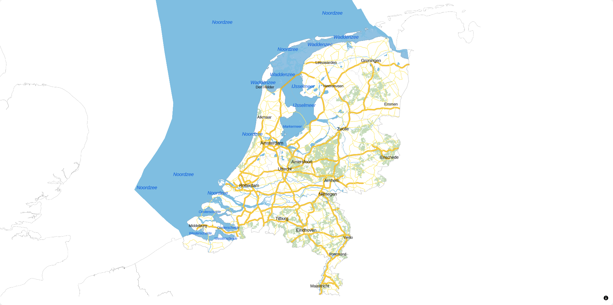

# Maak een kaart met OGC API – Tiles
We gaan zelf een kaart maken met behulp van de library MapLibre. Dit is een JavaScript library voor het maken van interactieve web maps. Het doel is niet om MapLibre zelf te leren; we gebruiken MapLibre alleen om de werking van OGC API aan te tonen. 

Je maakt deze kaart aan de hand van een casus. Eerst introduceren we deze casus. Daarna bekijken we een voorbeeld. Hierna maak je je eigen kaart. En tot slot voeg je een OGC API - Tiles toe aan jouw eigen kaart. 

## Introductie casus
Je gaat een kaart maken van jouw buurt die inzicht geeft in de kwaliteit van de leefomgeving. Hoe is het in jouw buurt of wijk bijvoorbeeld gesteld met het aantal bomen? Zijn er voldoende scholen in de buurt? 
Met data kun je inzicht geven in dit soort vraagstukken. PDOK ontsluit dit soort data middels OGC API's. En specialisten en ontwikkelaars kunnen met behulp van die API's kaarten en viewers maken. 

In deze casus nemen we jou stap voor stap mee:

1. Bekijk een voorbeeldkaart
2. Voeg een achtergrondkaart toe aan jouw kaart (OGC API - Tiles)
3. Vind geschikte data (OGC API - Features)
4. Voeg OGC API - Features toe aan jouw kaart
5. Evalueer het eindresultaat

## Bekijk een voorbeeld
Leerdoelen: 

- Je leert uit welke componenten een web map bestaat en hoe die samenwerken. 
- Je leert uit welke componenten een OGC API – Tiles bestaat en hoe die componenten samenwerken. 

We gaan eerst een voorbeeld bekijken. 

- **Bekijk** [../voorbeelden/tiles/index.html](../voorbeelden/tiles/index.html)
- **Bekijk de kaart zelf, zoom eens in en uit**

Dit is een web viewer die gemaakt is met de library MapLibre. Deze kaart maakt gebruik van de OGC API – Tiles van de BRT Achtergrondkaart: <https://api.pdok.nl/kadaster/brt-achtergrondkaart/ogc/v1> 


 
!!! question "Vraag"

    Wat verandert er als je in- en uitzoomt op de kaart? 

- **Open de developer tools in je browser.** 
- **Refresh de pagina**
- **Open het Netwerk (Network) tabblad**
- **Bekijk de requests die verschijnen in het Netwerktabblad**

Merk op dat er onder andere een `main.js` en `https://api.pdok.nl/kadaster/brt-achtergrondkaart/ogc/v1/styles/standaard__webmercatorquad?f=json` worden ingeladen.

- **Zoom eens in en uit**

Merk op dat er nu veel bestanden worden ingeladen, bijvoorbeeld `262?f=mvt`. Dit bestand is 1 tile (kaarttegel). De volledige URL van deze tile is: <https://api.pdok.nl/kadaster/brt-achtergrondkaart/ogc/v1/tiles/WebMercatorQuad/9/168/262?f=mvt> 

Je kunt nu zien dat deze web viewer de BRT Achtergrondkaart gebruikt, en meer specifiek de WebMercatorQuad TileMatrixSet. Dat zie je aan de URL’s van de tiles. En je ziet dat de standaard style wordt gebruikt voor deze tilematrixset. Dat zie je aan de style URL die na `main.js` werd ingeladen: <https://api.pdok.nl/kadaster/brt-achtergrondkaart/ogc/v1/styles/standaard__webmercatorquad?f=json>

- **Zoek deze TileMatrixSet en Style ook op via de landing page in de browser:** <https://api.pdok.nl/kadaster/brt-achtergrondkaart/ogc/v1> 

!!! question "Vraag"

    Waar vind je de URL van de TileMatrixSet en de Style die gebruikt zijn in het voorbeeld?

Dit is een visuele weergave van een Tile Matrix Set:
  

 
De URL is als volgt opgebouwd:


### Bekijk nu de code van dichtbij

Maak gebruik van een code editor of IDE naar keuze om code te bekijken en uit te voeren. Hieronder een uitleg voor VSCode, maar je kunt natuurlijk zelf een keuze maken. 

- **Fork de Git repository**
- **Clone de Git repository**
- **Open de repository**

Laten we deze code runnen zodat we de applicatie eerst in de browser kunnen bekijken:

- **Start lokaal een web server, bijvoorbeeld met python:**

```
> python -m http.server
Serving HTTP on 0.0.0.0 port 8000 (http://0.0.0.0:8000/) ...
```
- **Bekijk nu** [../voorbeelden/tiles/index.html](../voorbeelden/tiles/index.html) **in de browser**



Laten we nu eens de code bekijken in een editor:

- **Bekijk** `..\voorbeelden\tiles\index.html`
- **Bekijk** `..\voorbeelden\tiles\main.js`
- **Bekijk** <https://api.pdok.nl/kadaster/brt-achtergrondkaart/ogc/v1/styles/standaard__webmercatorquad?f=json>

Als het goed is, zie je in de code `index.html` een `div` met als id `map`.

In `main.js` zie je dat er bij `container` dat er naar diezelfde `map` wordt verwezen. In dit javascript bestand wordt allereerst de `mmplibre-gl` library geïmporteerd. Daarna wordt de kaart gedefinieerd:

- `container`: `map` object in `index.html`
- `style`: verwijst naar een json-bestand: <https://api.pdok.nl/kadaster/brt-achtergrondkaart/ogc/v1/styles/standaard__webmercatorquad?f=json>. Hierin wordt gedefinieerd hoe de tiles gevisualiseerd worden
- `center`: bepaalt het startmiddenpunt van de kaart (x- en y-coördinaten)
- `zoom`: bepaalt het startzoomlevel van de kaart
- `minZoom`: bepaalt het maximale niveau dat je mag uitzoomen
- `maxZoom`: bepaalt het maximale niveau dat je mag inzoomen

Merk op dat je de URL naar de tegels zelf niet ziet in `main.js`. Die URL wordt namelijk in de `style json` aangeroepen. De `main.js` roept de `style json` aan en die roept vervolgens de bron van van de tiles aan. De `style json`  bepaalt ook hoe die tiles weergegeven moeten worden. 
De bron van de tiles is in dit geval dus <https://api.pdok.nl/kadaster/brt-achtergrondkaart/ogc/v1/tiles/WebMercatorQuad/{z}/{y}/{x}?f=mvt>

- **Zoek in de** `style json` **de URL van de tiles op.**

!!! note "Wil je hier meer over weten?"

    Kijk voor een deep dive op <https://ogcapi-workshop.ogc.org/api-deep-dive/tiles/> 

- **Bekijk nog eens** de `style json`: <https://api.pdok.nl/kadaster/brt-achtergrondkaart/ogc/v1/styles/standaard__webmercatorquad?f=json>


Dit is een erg omvangrijke stijl. Hoe is dit opgebouwd? Dit is een json waarin de bron gedefinieerd wordt en de layers die daar in zitten en hoe die layers getoond moeten worden (kleuren, diktes, etc.).

- **Bekijk nog eens** `main.js`

In dit geval staat de `style json` op een externe locatie, maar het kan ook een bestand op je eigen server zijn. 
In dit geval is de `style json` beschikbaar gesteld door PDOK, maar je kunt ook zelf `style json` bestanden maken. Het voorbeeld is een erg groot stijlbestand, maar er zijn ook simpelere stijlen mogelijk.  

## Maak een kaart 
We gaan nu onze eigen web map met een OGC API Tiles achtergrondkaart (BRT) maken, aan de hand van het voorbeeld. 

!!! warning "TO DO"


