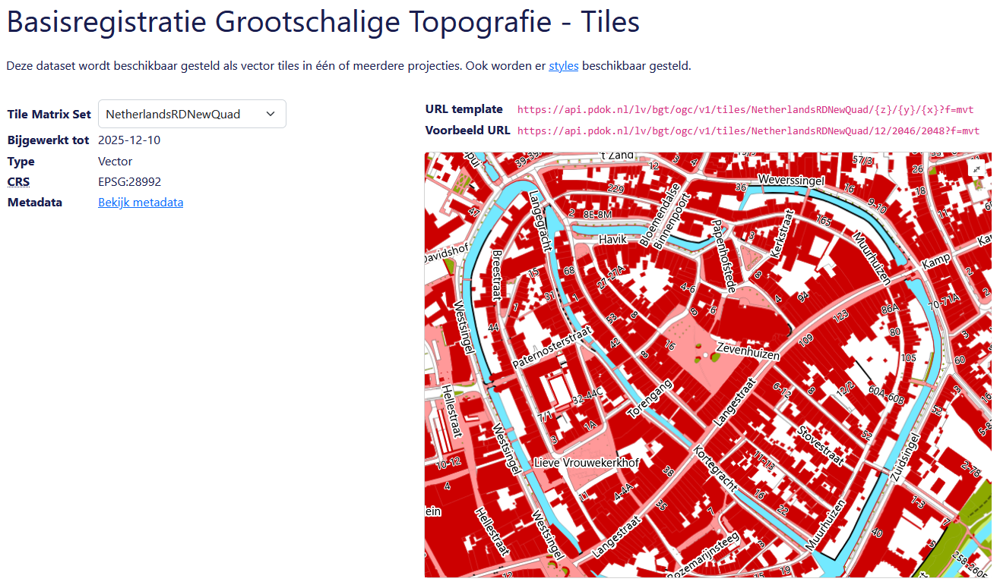
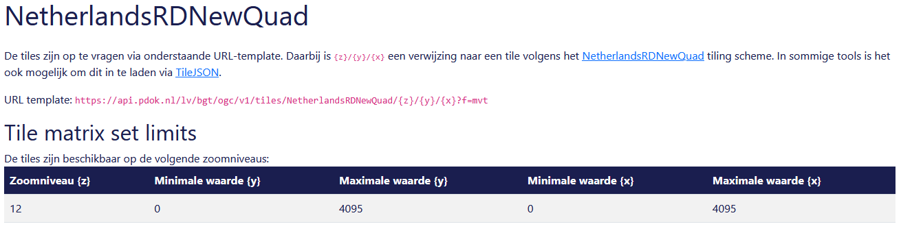
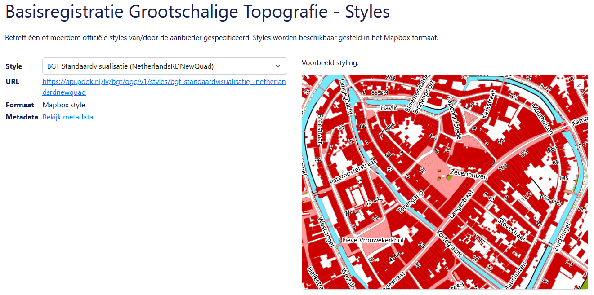
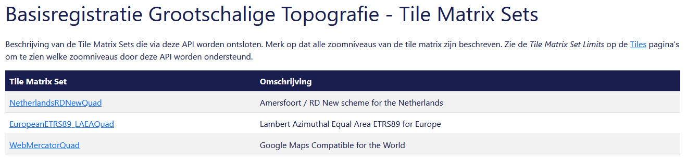
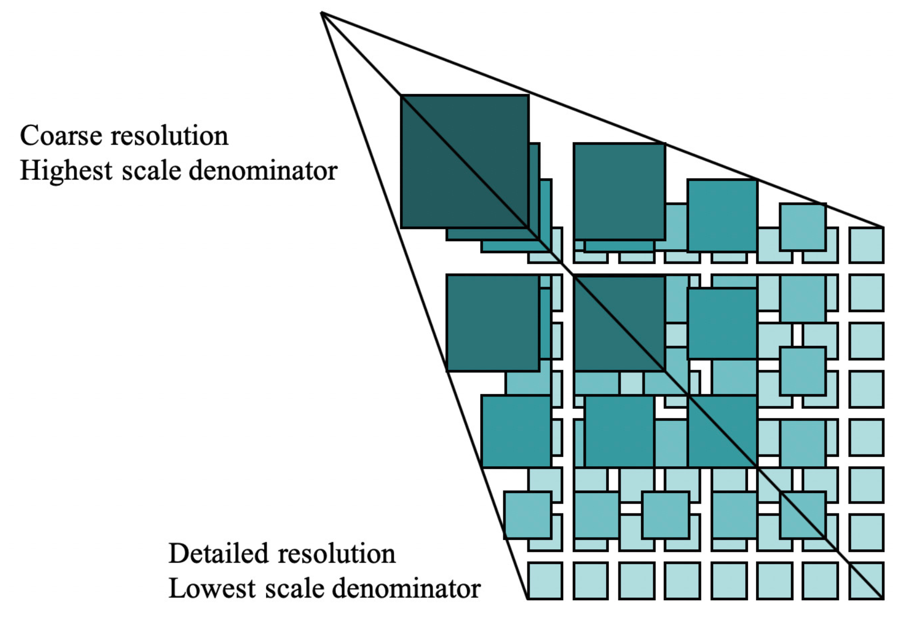

# Verken OGC API - Tiles in de browser

Laten we eerst in de browser verkennen wat je allemaal met OGC API - Tiles kunt doen. We doen dit met behulp van de landing page van de BGT OGC API. We gaan één voor één de onderdelen af, demonstreren de mogelijkheden en bekijken voorvertoningen van de data. 

## api.pdok.nl

**:arrow_right: Ga naar <https://api.pdok.nl>**

Je vind hier een overzicht van alle API’s van PDOK.  

**:arrow_right: Scan de hele pagina eens.**

!!! question "Vraag"

    Zijn dit allemaal OGC API’s of ook andere soorten API’s?

**:arrow_right: Zoek de volgende API op en klik deze aan: *Basisregistratie Grootschalige Topografie (OGC API)***

## Landing page

Je bent nu op de landing page van de BGT OGC API terecht gekomen. 

De BGT (Basisregistratie Grootschalige Topografie) is een landelijke dataset, met objecten in de openbare ruimte die meestal door overheden beheerd worden, zoals wegen, water en groen. We gebruiken de OGC API van deze dataset als voorbeeld. De BGT is op dit moment de meest complete OGC API implementatie bij PDOK, want de BGT heeft alle bouwblokken die we bij PDOK hebben geïmplementeerd. 

??? info "Wat is de Basisregistratie Grootschalige Topografie?"

    De Basisregistratie Grootschalige Topografie is een landsdekkende dataset met *grootschalige* topografie. Dit zijn geografische objecten bedoeld om te gebruiken op een groot schaalniveau: schaal 1:500 tot 1:5000. *Grootschalig* zegt in dit geval dus niets over de omvang of reikwijdte van de dataset, hoewel het wel een grote dataset is. De BGT bevat onder andere wegen, waterlichamen, groenvlakken en gebouwen. De BGT wordt bijgehouden door onder andere gemeenten, provincies en verschillende rijksoverheden. De BGT wordt onder andere gebruikt om het beheer en onderhoud van de openbare ruimte te ondersteunen. [Hier vind je meer informatie over de BGT.](https://www.digitaleoverheid.nl/overzicht-van-alle-onderwerpen/stelsel-van-basisregistraties/10-basisregistraties/bgt/) 

    De BGT is een basisregistratie. Dat wil zeggen dat wettelijk is vastgelegd hoe overheden de dataset moeten beheren (o.a. up to date houden) en gebruiken en wat de kwaliteit van de data is. Een basisregistratie heeft altijd één of meerdere bronhouders. Zij beheren de basisregistratie, maken daar afspraken over en zijn de eigenaar van de data. Er zijn nog meer basisregistraties. Een groot deel van de basisregistraties bevatten voornamelijk geodata. Bijvoorbeeld de BAG, de BRT en de BRK. [Hier vind je meer informatie over het stelsel van basisregistraties.](https://www.digitaleoverheid.nl/overzicht-van-alle-onderwerpen/stelsel-van-basisregistraties/10-basisregistraties/) 

De landing page is een voor mensen leesbare beschrijving en toegangspunt van de API. Voor mensen leesbaar? Jawel, want er is ook een beschrijving die vooral voor machines is gemaakt.  

!!! question "Vraag"

    Waar vind je de beschrijving die voor machines is bedoeld?

**:arrow_right: Bekijk de beschrijving voor machines ook eens.**

**:arrow_right: En ga daarna terug naar de HTML-weergave (de leesbare variant)**

Een landing page bevat een beschrijving van de dataset met eventueel verwijzingen naar andere bronnen, de trefwoorden en metadata. 

De BGT wordt beschikbaar gesteld als OGC API – Features en als OGC API – Tiles. Daarom bestaat de landing page uit 6 onderdelen. De landing page bestaat niet altijd uit 6 onderdelen. Een aantal onderdelen is altijd verplicht en zul je dus altijd tegenkomen. Maar een aantal onderdelen zie je alleen wanneer er een OGC API – Features is of een OGC API – Tiles. Is de dataset beschikbaar gesteld als features, dan is er een Collections pagina. Worden er ook tiles beschikbaar gesteld, dan is er ook een Tiles, Styles en Tile Matrix Sets pagina. 

Hieronder een handig overzicht van welke pagina bij welke API hoort. 

| Pagina                                          | Toelichting                                                       | Wanneer?                  |
|-------------------------------------------------|-------------------------------------------------------------------|---------------------------|
| [OpenAPI specification](#openapi-specification) | Beschrijving van de verschillende API calls die deze API aanbiedt | Altijd (OGC API - Common) |
| [Conformance](#conformance)                     | Aan welke OGC standaarden voldoet deze API?                       | Altijd (OGC API - Common) |
| [Collections](#collections)                     | Featuredata                                                       | OGC API – Features        |
| [Tiles](#tiles)                                 | Vector tiles (visualisatie)                                       | OGC API – Tiles           |
| [Styles](#styles)                               | Stijlen (opmaak)                                                  | OGC API – Styles          |
| [Tile Matrix Sets](#tile-matrix-sets)           | Opbouw van de tegels                                              | OGC API – Tiles           |

Laten we de verschillende pagina’s eens gaan verkennen.

## OGC API - Common onderdelen

### OpenAPI specification

**:arrow_right: Klik op de landing page op 'OpenAPI specification'**

Hier zie je de Swagger UI van deze API. Deze toont alle API calls die deze API ondersteunt. Daarmee toont de API specification dus alle mogelijkheden van de API, en hoe je deze mogelijkheden kunt benutten. De Swagger UI geeft voorbeeldrequests en je kunt zelf requests samenstellen. Die kun je direct in de browser testen. Je krijgt direct het antwoord. 

!!! info "Swagger UI"

    Swagger UI is een veelgebruikte manier voor het documenteren van API's op een dusdanige manier dat dit voor mensen leesbaar is. Lees meer op <https://swagger.io/>

Waarom heet deze pagina 'OpenAPI specification'? Omdat deze API aan de specificatie van de OGC API voldoet, voldoet deze API automatisch ook aan de 'OpenAPI specification'. 

!!! info "OpenAPI specification"

    De OpenAPI specification is een standaard voor het formeel beschrijven van API's op een manier die leesbaar is voor machines. Een OpenAPI specificatiedocument (deze pagina) is een YAML- of JSON-document en de OpenAPI standaard schrijft voor welke informatie dit document moet bevatten. Lees meer op <https://swagger.io/specification/>

Laten we meteen gebruik maken van de Swagger UI en zelf eens iets testen. 

**:arrow_right: Klap** 'GET `/api` This document' **open**:

Dit is de API call die je nodig hebt om de OpenAPI specification (deze pagina dus) op te vragen. 

**:arrow_right: Klik op *Try it out***

**:arrow_right: Klik op *Execute***

Je krijgt nu het `curl` commando dat is afgevuurd en het resultaat (response) te zien:

Er is één parameter meegegeven: geef het resultaat als json. En we krijgen de specificatie inderdaad netjes te zien als json-document. 

Daaronder zie je nog de mogelijke response calls: de codes en wat die codes betekenen. 

!!! question "Wat is het versienummer van deze specifieke API?"

??? success "Antwoord"

    Het versienummer van de BGT OGC API is 1.0.0. Dacht je dat het 3.0.0 was? Dit is het versienummer van de gebruikte OpenAPI specification: `"OpenAPI"`. Het versienummer van deze specifieke API vind je in `"info"."version"`

Je hebt nu in het kort gezien wat je met de OpenAPI specification (de Swagger UI) kunt doen. Developers kunnen hiermee snel werkende API-calls samenstellen die ze in applicaties kunnen gebruiken, om op die manier de API te implementeren. 

!!! info "OpenAPI specification Swagger UI"

    We gaan hier in [één van de volgende onderdelen](<../features/Bevraag OGC API - Features met curl.md>) van deze leermodule nog veel meer gebruik van maken. 

**:arrow_right: Ga weer terug naar de landing page (klik bovenaan in de breadcrumb op BGT)**

### Conformance

**:arrow_right: Klik op de landing page op 'Conformance'**

De Conformance pagina toont welke OGC-standaarden deze API implementeert. We kunnen hier dus precies zien aan welke bouwblokken en versies van de OGC API-standaarden de BGT OGC API voldoet. 

We zien ook dat sommige standaarden nog niet vastgesteld zijn, en nog in concept zijn. 

**:arrow_right: Ga weer terug naar de landing page**

## OGC API - Features onderdelen

### Collections

We verkennen deze pagina nu niet. We doen dit in het onderdeel [OGC API - Features](../features/Introductie.md). 

## OGC API - Tiles onderdelen

### Tiles

**:arrow_right: Klik op de landing page op 'Tiles'**

OpenAPI specification en Conformance waren alleen maar beschrijvingen, maar nu gaan we gelukkig echt data bekijken! 

Met OGC API - Tiles kunnen vector tiles beschikbaar gesteld worden, maar ook andere soorten tiles zoals luchtfoto's. We richten ons nu specifiek op **vector tiles**.

De BGT dataset wordt in meerdere kaartprojecties beschikbaar gesteld als vector tiles. Dat wil zeggen dat de data wordt aangeboden als kaarttegels. Een client haalt de data tegel voor tegel op. Die tegels zijn geoptimaliseerd om compact te zijn en tegelijkertijd een goede weergave van de data te geven. Dit is een efficiënte manier van bekijken van geodata. 

!!! info "*Vector* Tiles?"

    Van oudsher zijn kaarttegels afbeeldingen. Een Web Map Service (WMS) ontsluit bijvoorbeeld kaarttegels als `png` of `jpeg` afbeeldingen. Afbeeldingen laden heel snel in, sneller dan vector-geodata zelf. Een nadeel is echter dat de tegels door de server gerenderd moeten worden. Een gebruiker of ontwikkelaar kan zelf ook geen stijl kiezen. En bij ver inzoomen worden de afbeeldingen pixelig. Bovendien draaien labels niet mee bij draaien of pannen. Vector Tiles lossen dit op: door vectordata te versimpelen en in tegels op te knippen kan deze snel gerenderd worden. Vector Tiles bieden de flexibliteit van vectordata en de snelheid van rastertegels. 

    Zie ook [Raster of vectordata?](<../achtergrondinformatie/Wat is geo-informatie.md/#raster-of-vectordata>).

Op deze pagina vind je de verschillende Tile Matrix Sets. Voor elke projectie is een eigen Tile Matrix Set. Een Tile Matrix Set is een opdeling van de wereld in een grid in een bepaalde kaartprojectie. Kort gezegd bepaalt een kaartprojectie hoe je de aarde, een ellipsoïde, op een plat vlak projecteert. 

{ width="250" }{ width="250" }{ width="250" }

!!! info "Coördinaatreferentiesystemen en kaartprojecties"

    Kijk voor meer informatie over dit onderwerp bij [Achtergrondinformatie](<../achtergrondinformatie/Wat is geo-informatie.md/#wat-zijn-coordinaatreferentiesystemen>)

**:arrow_right: Kijk en klik eens rond op deze pagina**

!!! question "Vraag"

    Hoe kun je zien in welke Tile Matrix Sets de BGT OGC API wordt aangeboden? En welke drie zijn dit?

??? success "Antwoord"

    Via het dropdownmenu. Deze dataset wordt in de volgende drie Tile Matrix Sets aangeboden:

    * NetherlandsRDNewQuad
    * EuropeanETRS89_LAEAQuad
    * WebMercatorQuad

Aan de rechterkant zie je een voorbeeldweergave van de gekozen Tile Matrix Set. Er is minimaal verschil te zien tussen de verschillende Sets. Op dit schaalniveau (zoomlevel) is het verschil ook verwaarloosbaar. Maar op kleinere schaalniveaus, dus verder uitgezoomd, maakt de gekozen kaartprojectie wel degelijk veel verschil. De vormen en groottes van landen kunnen heel erg vertekend zijn. *(in deze voorbeeldweergave kun je niet in- of uitzoomen)*

Wanneer kies je welke kaartprojectie? Oftewel, wanneer heb je welke Tile Matrix Set nodig? Dat wordt bepaald door het doeleinde van jouw applicatie, het geografische gebied dat je wilt tonen en de geldende standaarden. In Nederland is de RD New-projectie de standaard. Gebruik dan de NetherlandsRDNewQuad Tile Matrix Set. Maar sommige software kan alleen overweg met Web Mercator-projectie. Gebruik dan de WebMercatorQuad Tile Matrix Set. 

We richten ons voor nu even op de NetherlandsRDNewQuad Tile Matrix Set van de BGT. 

**:arrow_right: Selecteer de NetherlandsRDNewQuad met het dropdownmenu.**

Wellicht heb je gemerkt dat ook de URL template en Voorbeeld URL verandert als je een andere Tile Matrix Set kiest.

De URL template is: `https://api.pdok.nl/lv/bgt/ogc/v1/tiles/NetherlandsRDNewQuad/{z}/{y}/{x}?f=mvt` 

Deze URL kun je gebruiken om de tiles van deze set in te laden in een client.

!!! question "Vraag"

    Waar staan `{z}`, `{y}` en `{x}` voor, denk je?

??? success "Antwoord"

    Z, Y en X zijn normaal gesproken coördinaten, maar in deze context klopt dat niet helemaal. De combinatie `{z}/{y}/{x}` duidt een specifieke kaarttegel (tile) aan. `{z}` staat voor het zoomlevel, `{y}` en `{x}` voor de tegel binnen het zoomlevel. [Zie verderop voor meer informatie over hoe Tile Matrix Sets precies werken.](<#tile-matrix-sets>)

Een client kan de parameters `{z}/{y}/{x}` vervangen door de id van de tegels waar de gebruiker naar wil kijken, op basis van de `viewport`. Een voorbeeld van wat een client dan opvraagt zie je bij *Voorbeeld URL*  (onder *URL template*)

We verdiepen ons nog even verder in de NetherlandsRDNewQuad set van deze dataset. 

**:arrow_right: Klik op 'Bekijk metadata'**

Je komt nu op de pagina terecht die voor de BGT de NetherlandsRDNewQuad Tile Matrix Set beschrijft. Je ziet hier nogmaals de URL template. En je ziet een tabel. 

!!! question "Vraag"

    In hoeveel zoomniveaus is de BGT OGC API - Tiles beschikbaar? En welke zoomniveaus zijn dat? 

??? success "Antwoord"

    De tiles van de BGT OGC API - Tiles zijn alleen beschikbaar in zoomlevel 12. Dit betekent in sommige clients dat je in andere zoomlevels niets te zien krijgt. In andere clients krijg je ook op andere zoomlevels level 12 te zien. Maar dit kan leiden tot rare visuele effecten of traagheid. 
    
    De NetherlandsRDNewQuad Tile Matrix Set zelf ondersteunt wel alle andere zoomniveaus. Maar de BGT OGC API - Tiles heeft er dus maar één. Zoals je eerder hebt gelezen, is de BGT bedoeld voor *grootschalige* topografie, en dus voor een specifiek schaalniveau. 

We hebben nu de voorbeeldweergave bekeken van de kaarttegels in NetherlandsRDNewQuad. Ook heb je geleerd hoe je kunt zien in welke zoomniveaus een dataset beschikbaar wordt gesteld. En bovenal weet je nu welke URL je nodig hebt, als je daadwerkelijk de tiles in een client wilt bekijken of wil implementeren in jouw applicatie. 

:material-lightbulb: Een dataset kan volgens in één of meerdere Tile Matrix Sets beschikbaar gesteld worden. Een Tile Matrix Set is er voor één projectie. Een API bevat niet per se alle zoomniveaus van een Set.

**:arrow_right: Ga weer terug naar de landing page**

### Styles

**:arrow_right: Klik op de landing page op 'Styles'**

Hier vind je de verschillende visualisaties (stijlen) die aangeboden worden voor deze dataset. Een stijl toont de data in kaarttegel op een bepaalde manier. De stijl bepaalt de kleuren, lijndiktes, labels, symbolen, etcetera. Eigenlijk alles wat in de legenda te zien is. 

**:arrow_right: Kijk en klik eens rond op deze pagina**

!!! question "Vraag"

    Hoe kun je zien in welke Styles de BGT OGC API wordt aangeboden?

??? success "Antwoord"

    Dit kun je zien met het dropdownmenu. 

Aan de rechterkant zie je een voorbeeldweergave van de gekozen stijl. 

**:arrow_right: Probeer eens wat verschillende stijlen uit en ontdek de verschillen** 

Tussen de verschillende Tile Matrix Sets zie je niet zoveel verschil, [hadden we al eerder geconcludeerd](<#verschil-tussen-tile-matrix-sets>).

Een Style is altijd gekoppeld aan één Tile Matrix Set. In het geval van de BGT bieden we twee stijlen aan. Elke stijl bieden we echter aan voor elke Tile Matrix Set, waarmee het totaal aantal stijlen uitkomt op 6. 

Via deze weg worden officiële stijlen aangeboden. Deze zijn gemaakt door de aanbieder van de dataset en zijn via het `styles` endpoint beschikbaar. Je kunt echter ook zelf stijlen maken en via een client, in combinatie met de dataset, opvragen. Op die manier kun je de Tiles gebruiken zoals jij wilt. De mogelijkheden zijn eindeloos, je kunt bijvoorbeeld labels weg laten, of objecten zoals wegen, gebouwen of water een andere kleur geven of helemaal weglaten. Zie ook [Analyseer een voorbeeldkaart](<Analyseer een voorbeeldkaart.md>) en [Casus - Maak een kaart met OGC API - Tiles](<Casus - Maak een kaart met OGC API - Tiles.md>). 

Laten we ons eens richten op de `BGT Achtergrondvisualisatie (NetherlandsRDNewQuad)` stijl.

**:arrow_right: Klik deze stijl aan in het dropdownmenu.** 

!!! question "Vraag"

    Hoe kun je deze stijl in een eigen applicatie implementeren of in een client inladen?

??? success "Antwoord"

    Met de URL `https://api.pdok.nl/lv/bgt/ogc/v1/styles/bgt_achtergrondvisualisatie__netherlandsrdnewquad`. Je bent er dan nog niet helemaal, want een applicatie heeft de JSON-weergave nodig.

Je kunt er zelf `f=json` achteraan plakken, maar er is nog een manier om de volledige URL te vinden. 

!!! question "Vraag"

    Hoe kun je via deze pagina doorklikken naar de volledige URL van de JSON-weergave van de BGT Achtergrondvisualisatie (NetherlandsRDNewQuad) stijl?

??? success "Antwoord"

    1. Klik op **Bekijk metadata** 2. Klik op **Bekijk Mapbox Style**

    OF: 

    1. Klik op de URL `https://api.pdok.nl/lv/bgt/ogc/v1/styles/bgt_achtergrondvisualisatie__netherlandsrdnewquad` 2. Klik op **JSON** rechtsboven. 

Via de URL `https://api.pdok.nl/lv/bgt/ogc/v1/styles/bgt_achtergrondvisualisatie__netherlandsrdnewquad` kun je ook de automatisch gegenereerde legenda bekijken. 

**:arrow_right: Bekijk de JSON-weergave van de stijl eens**

* In `layers` worden de kaartlagen binnen deze stijl gedefinieerd. Een kaartlaag is bijvoorbeeld `"water waterdeel fill0"`. Hier wordt bepaald welke kleuren het water en de omlijning van het water moeten krijgen. 
* In `sources` wordt de bron voor de stijl gedefinieerd: de BGT OGC API - Tiles. Als het goed is, komt deze URL je bekend voor... 

We hebben nu de voorbeeldweergaves bekeken van de verschillende officiële stijlen die aangeboden worden. Ook heb je geleerd welke URL je nodig hebt als je een stijl wilt gebruiken in een client of wilt implementeren in jouw applicatie. 

:material-lightbulb: Een dataset kan in meerdere stijlen worden aangeboden. Een stijl is gekoppeld aan één Tile Matrix Sets. 

:material-lightbulb: Is er geen officiële stijl die jou bevalt, dan kun je ook zelf een stijl maken. 

**:arrow_right: Ga weer terug naar de landing page**

### Tile Matrix Sets

**:arrow_right: Klik op de landing page op 'Tile Matrix Sets'**

Hier vind je een beschrijving van de eerder genoemde Tile Matrix Sets. Een Tile Matrix Set is gekoppeld aan één kaartprojectie. Dat is omdat een kaartprojectie een eigen dekkingsgebied met een eigen nulpunt, eenheid en projectie van de aardbol heeft. Eén Tile Matrix is een matrix van tegels. Een Tile Matrix Set is een samenstelling van matrices. Voor elk zoomniveau is er een matrix. Een Tile Matrix Set is er voor één kaartprojectie. 

Zoals je in onderstaande afbeelding kunt zien, heeft elke tegel in de matrix een X- en Y-coördinaat, waarmee de tegel wordt aangeduid. 

Een Tile Matrix Set bestaat uit meerdere Tile Matrices; voor elk zoomlevel één. Het hoogste zoomlevel heeft slechts één tegel. Hoe lager het zoomlevel, des te meer tegels. Op die manier vormt het een piramide. 

Zoals je kunt zien, zijn er voor de BGT OGC API drie Tile Matrix Sets. Inmiddels komen deze jou wel bekend voor.

Van elke set worden alle zoomlevels beschreven. Zoals we echter eerder al hadden gezien, wordt niet elk zoomniveau ook daadwerkelijk aangeboden in deze API. 

We richten ons voor nu weer even op de `NetherlandsRDNewQuad` Tile Matrix Set.

**:arrow_right: Klik op 'NetherlandsRDNewQuad'**

Je krijgt nu een tabel te zien waarin elk zoomniveau beschreven wordt. In totaal zijn er dus 16 zoomlevels in deze Tile Matrix Set. Je ziet dat elke tegel 256x256 cellen groot is. En zoals je kunt zien, heeft het hoogste zoomlevel één tegel. Het laagste zoomlevel heeft veel meer tegels. Daarin kun je dus weer die piramidevorm herkennen. 

!!! question "Vraag"

    Hoeveel kaarttegels heeft zoomlevel 16?

??? success "Antwoord"

    4.294.967.296. Dat is namelijk wat je krijgt als je de `matrix width` (65536) vermenigvuldigt met de `matrix height` (ook 65536). 

**:arrow_right: Bekijk ook eens welke verschillen er bijvoorbeeld zijn met de 'WebMercatorQuad' Tile Matrix Set.**

We hebben dus bij Tile Matrix Sets een formele beschrijving gevonden van de drie Tile Matrix Sets die aangeboden worden voor deze API. Dit geeft wat meer inzicht in hoe vector tiles precies werken. 

:material-lightbulb: Een Tile Matrix Set is een piramidevorm bestaande uit zoomlevels en voor elk zoomlevel een matrix. 

**:arrow_right: Ga weer terug naar de landing page**

We hebben nu alle pagina's van de landing page van de BGT OGC API bekeken. Laten we even kort terugblikken. 

## Samenvatting
In dit onderdeel heb je in de browser de landing page (HTML weergave) van een OGC API verkend. We bekeken stuk voor stuk de verschillende pagina's van de landing page. Met deze landing page worden de verschillende bouwblokken van de OGC API geïmplementeerd.

Hopelijk heb je hiermee een beeld van wat een OGC API allemaal kan en hoe je snel kunt zien wat voor data er in een OGC API zit, specifiek voor OGC API - Tiles. We deden dat aan de hand van de dataset Basisregistratie Grootschalige Topografie. We hebben de volgende onderdelen van de OGC API besproken:

| Onderdeel             | Toelichting                                                                                          |
|-----------------------|------------------------------------------------------------------------------------------------------|
| OpenAPI specification | Swagger UI die de mogelijkheden van de API toont.                                                    |
| Conformance           | Overzicht van de standaarden waaraan deze API voldoet.                                               |
| Tiles                 | URL's van de tilesets van deze API en de verschillende projecties waarin de dataset wordt aangeboden |
| Styles                | URL's en voorbeeldweergaves van de stijlen die PDOK beschikbaar stelt.                               | 
| Tile Matrix Sets      | Beschrijving van de Tile Matrix Sets: zoomniveaus en pixelgroottes van de tegels.                    |
