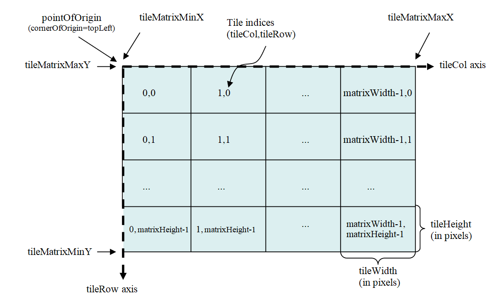

# Verken OGC API - Tiles in de browser

Laten we eerst in de browser verkennen wat je allemaal met OGC API - Features kunt doen. We doen dit met behulp van de landing page. We gaan één voor één de onderdelen af, demonstreren de mogelijkheden en bekijken voorvertoningen van de data. 

## api.pdok.nl

- **Ga naar <https://api.pdok.nl>**

Je vind hier een overzicht van alle API’s van PDOK.  

- **Scan de hele pagina eens.**

!!! question "Vraag"

    Zijn dit allemaal OGC API’s of ook andere soorten API’s?

- **Zoek de volgende API op en klik deze aan: *Basisregistratie Grootschalige Topografie (OGC API)***

## Landing page

Je bent nu op de landing page van de BGT OGC API terecht gekomen. De BGT (Basisregistratie Grootschalige Topografie) is een landelijke dataset, met objecten in de openbare ruimte die meestal door overheden beheerd worden, zoals wegen, water en groen. We gebruiken de OGC API van deze dataset even als voorbeeld. 

De landing page is een voor mensen leesbare beschrijving en toegangspunt van de API. Door mensen leesbaar? Ja wel, want er is ook een beschrijving die vooral voor machines is gemaakt.  

!!! question "Vraag"

    Waar vind je de beschrijving die voor machines is bedoeld? Bekijk deze ook eens.

- **En ga daarna terug naar de HTML-weergave (de leesbare variant)**

Een landing page bevat een beschrijving van de dataset met eventueel verwijzingen naar andere bronnen, de trefwoorden en metadata. 

De BGT wordt beschikbaar gesteld als OGC API – Features en als OGC API – Tiles. Daarom bestaat de landing page uit 6 onderdelen. De landing page bestaat niet altijd uit 6 onderdelen. Een aantal onderdelen is altijd verplicht en zul je dus altijd tegenkomen. Maar een aantal onderdelen zie je alleen wanneer er een OGC API – Features is of een OGC API – Tiles. Is de dataset beschikbaar gesteld als features, dan is er een Collections pagina. Worden er ook tiles beschikbaar gesteld, dan is er ook een Tiles, Styles en Tile Matrix Sets pagina. 

Hieronder een handig overzicht van welke pagina bij welke API hoort. 

| Pagina | Toelichting | Wanneer? |
| ----------- | ----------- | ----------- |
| [OpenAPI specification](#openapi-specification)  | Beschrijving van de verschillende API calls die deze API aanbiedt  | Altijd (OGC API - Common)  |
| [Conformance](#conformance) | Aan welke OGC standaarden voldoet deze API? | Altijd (OGC API - Common) |
| [Collections](#collections) | Featuredata | OGC API – Features |
| [Tiles](#tiles) | Vector tiles (visualisatie)  | OGC API – Tiles |
| [Styles](#styles) | Stijlen (opmaak) | OGC API – Tiles |
| [Tile Matrix Sets](#tile-matrix-sets) | Opbouw van de tegels | OGC API – Tiles |

Laten we de verschillende pagina’s eens gaan verkennen.

## OGC API - Common onderdelen

!!! warning "TO DO"

### OpenAPI specification
Hier zie je de Swagger UI van deze API, die alle mogelijkheden toont. 

### Conformance
Toont aan welke standaarden deze API voldoet. 

## OGC API - Features onderdelen

### Collections
Zie:  [Features](../features/Introductie.md)

## OGC API - Tiles onderdelen

### Tiles
Hier vind je de Tile Matrix Sets die worden aangeboden voor deze dataset. Een Tile Matrix set is een opdeling van de wereld in een grid volgens een bepaalde projectie. 

### Styles
Hier vind je de verschillende visualisaties (stijlen) die aangeboden worden voor deze dataset. 

### Tile Matrix Sets
Hier vind je een beschrijving van de eerder genoemde Tile Matrix Sets: zoomniveaus en pixelgroottes van de tegels.

## Samenvatting
In dit onderdeel hebben we de volgende onderdelen van de OGC API besproken:

| Onderdeel | Toelichting |
| --------- | ----------- |
| OpenAPI specification | Swagger UI die de mogelijkheden van de API toont. |
| Conformance | Aan welke standaarden de API voldoet. |
| Tiles | URL's van de tilesets van deze API en de verschillende projecties waarin de dataset wordt aangeboden |
| Styles | URL's en voorbeeldweergaves van de stijlen die PDOK beschikbaar stelt. | 
| Tile Matrix Sets | Beschrijving van de Tile Matrix Sets: zoomniveaus en pixelgroottes van de tegels. 
